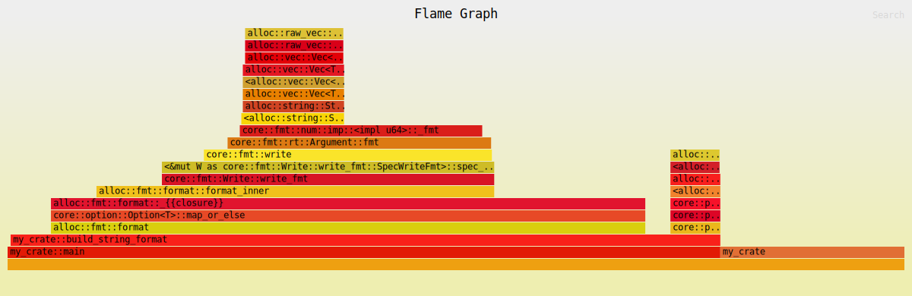
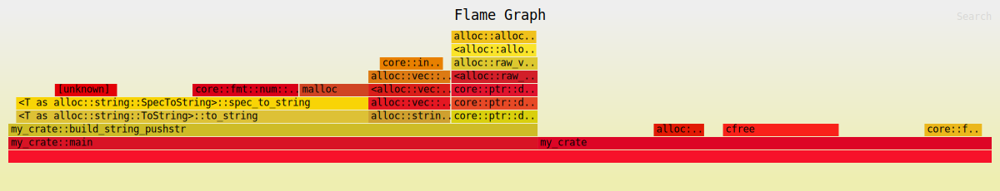
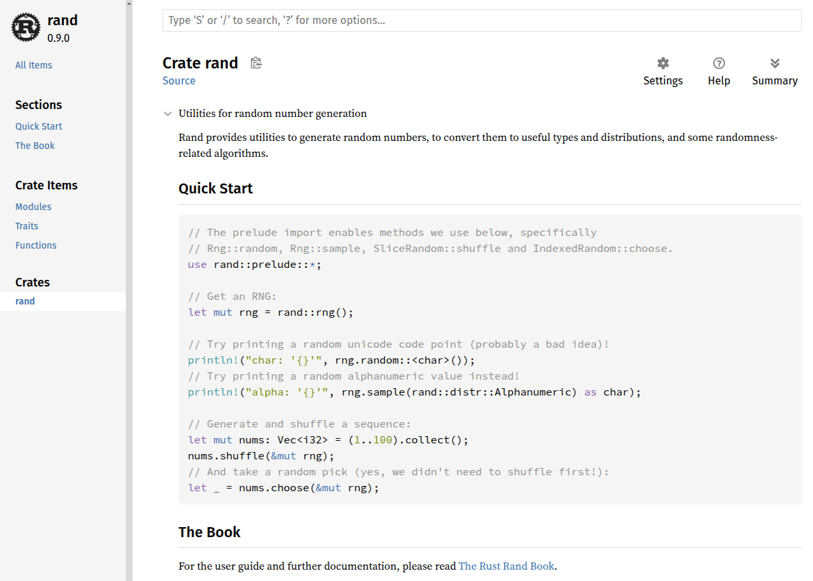
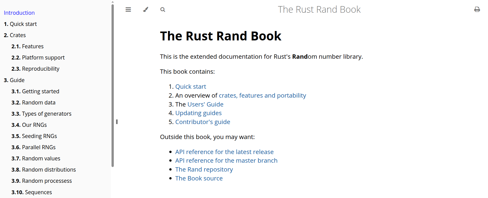
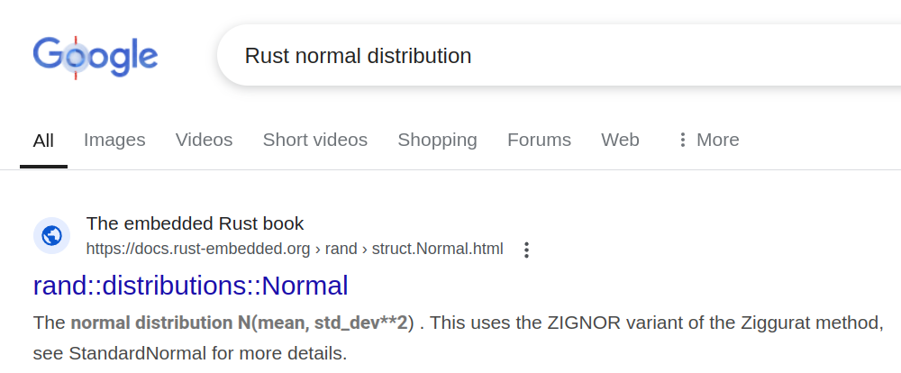
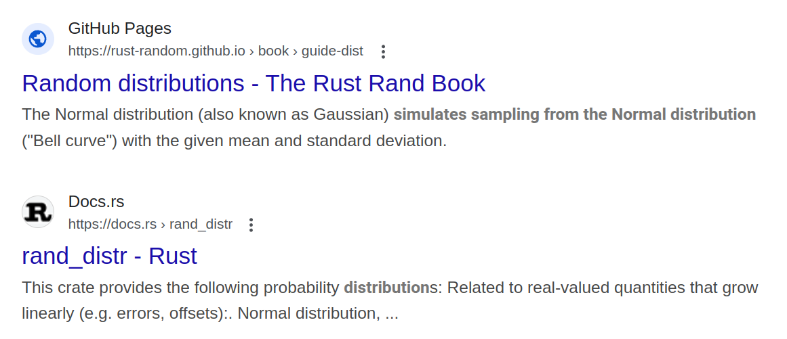

<style>
@import url('https://fonts.googleapis.com/css2?family=Noto+Sans+Mono:wght@100..900&family=Noto+Sans:ital,wght@0,100..900;1,100..900&display=swap');
section {
    font-family: "Noto Sans";
}
code {
    font-family: "Noto Sans Mono";
}
</style>

<!-- _class: communism invert  -->

## Intro to Rust Lang

# The Rust Ecosystem


---


# Today: The Rust Ecosystem

- The Rust Toolchain: `rustup`, `clippy`, `rustfmt`
- Performance and Analysis: Criterion, Flamegraphs
- Reading Documentation
    - `rand`
    - `time` vs `chrono`
    - `anyhow` vs `thiserror`


---


# **The Rust Toolchain**


---


# Toolchains

* A toolchain is defined as a set of software tools used to build and develop software within a specific ecosystem
* A Rust toolchain is a complete installation of the Rust compiler (rustc) and related tools (like `cargo`)
    * Defined by release channel / version, and the host platform triple
    * `stable-x86_64-pc-windows-msvc`, `beta-aarch64-unknown-linux-gnu`


---


# **`rustup`**


---


# `rustup`

`rustup` is a _toolchain multiplexer_.

* Rust has several toolchains, which you manage via `rustup`
* `rustup` consolidates them as a single set of tools installed in `~/.cargo/bin`
* Similar to Ruby's `rbenv`, Python's `pyenv`, or Node's `nvm`


---


# `rustup` Channels

* There are 3 different channels
    * Stable: `rustc` and `cargo` release every 6 weeks
    * Beta: the next stable release
    * Nightly: release made every night, based on the `master` branch


---


# Stability without Stagnation

* Rust cares _a lot_ about the stability of your code
* At the same time, we all want to experiment with new features
* You should _never_ need to worry about breaking your code after updating Rust
* But you should also be able to opt-in to newer "unstable" features!

<!--
https://doc.rust-lang.org/book/appendix-07-nightly-rust.html
-->


---


# The Rust Train

Here is a high-level diagram of Rust's release cycle.

```
nightly: * - - * - - * - - * - - * - - * - * - *
                     |                         |
beta:                * - - - - - - - - *       *
                                       |
stable:                                *
```

* This is called the “train model”
* Every six weeks, a release “leaves the station”
* Still has to take a "journey" through the beta channel before it "arrives" as a stable release


---


# Unstable Features

We can use features under development by enabling _unstable features_.

* You can only use unstable features on nightly
* Allows you to access cool new things in Rust
    * Example: [`try_blocks`](https://doc.rust-lang.org/beta/unstable-book/language-features/try-blocks.html) with `#![feature(try_blocks)]`
    * Example: [`downgrade` on `RwLock`](https://doc.rust-lang.org/std/sync/struct.RwLockWriteGuard.html#method.downgrade) with `#![feature(rwlock_downgrade)]`

<!--
Connor's PR to Rust :D https://github.com/rust-lang/rust/pull/128219
-->


---


# `rustup` Usage

Here are some basic `rustup` commands to remember:

* `rustup update`
    - Updates your Rust toolchains to the latest versions
* `rustup default set <stable/beta/nightly>`
    - Sets the default rust toolchain
* `rustup override set <stable/beta/nightly>`
    - Overrides the toolchain for the specific directory


---


# **Clippy**


---


# Clippy

Clippy is a collection of lints that can catch common mistakes when writing Rust, improving the quality of your code.

* _We have asked you to use clippy for your homeworks!_


---


# Clippy Lint Levels

Clippy offers many different lint levels.

*  `clippy::all`: all lints that are on by default
    - `clippy::correctness`: code that is outright wrong or useless
    - `clippy::suspicious`: code that is most likely wrong or useless
    - `clippy::style`: code that should be written in a more idiomatic way
    - `clippy::complexity`: code that does something simple in a complex way
    - `clippy::perf`: code that can be written to run faster
* And more...
* You can even make your own lints!

<!--
You don't have to know all of these things, we're just showing this so you know that there _are_ a lot of things!
-->


---


# `clippy` Usage

* Already installed if using `rustup` (default profile)
* To run all lints, run `cargo clippy`
    * To run a specific lint, run `cargo clippy::___`
* To automatically apply suggestions, run `cargo clippy --fix`
* To run lints on tests and other files, run `cargo clippy --all-targets`

<!--
When you initially install `rustup`, you should choose the default profile. If you don't want to, then you already know why you want a different profile...
-->


---


# Clippy Source Code Usage

You can also configure lint levels directly in your source code.

```rust
fn main() {
    #[allow(unused_variables)]
    let not_used = 42;

    println!("Hello, World!");
}
```

<!--
This is a very basic example, look online for more information!
-->


---


# **`rustfmt`**


---


# `rustfmt`

`rustfmt` is a formatting tool that checks adherence to Rust's strict formatting standards.

* Already installed if using `rustup` (default profile)
* To format one file: `rustfmt file.rs`
* To format whole project: `cargo fmt`
* To only *check* format: `cargo fmt -- --check`

<!--
It's pretty rare that you would use `rustfmt` by itself, usually you are running `cargo fmt` for everything.
-->


---


# Configuring `rustfmt`

You can configure format options with a `rustfmt.toml` file

```
indent_style = "Block"
reorder_imports = false
```

* There are many configuration [options](https://rust-lang.github.io/rustfmt/?version=v1.8.0&search=) for `rustfmt`
* **You probably shouldn't create your own unique formatting style**


---


# Consistent Formatting

* The default Rust style is defined in the [Rust Style Guide](https://doc.rust-lang.org/style-guide/index.html)
    * It is **strongly recommended** that developers use this style
* Consistent formatting makes code more readable
    * Also makes it easier to collaborate with others

<!--
This is a subtle thing, but when jumping into an unknown codebase, having consistent formatting of code across every single Rust repository lowers the barrier to entry (much more than you probably think).

This is one of the reasons it is much easier to start contributing to a code base over something like a C or C++ codebase. When jumping into a C or C++ codebase, a significant fraction of the time there will be custom macros and/or templates that you have to learn before you can even understand the code. TLDR you are basically learning a new language every time you jump into a C/C++ codebase.
-->


---


# **Performance and Analysis**


---


# Performance Profiling

Suppose we want to see how fast or slow our code runs.

```rust
pub fn fibonacci(n: u64) -> u64 {
    match n {
        0 => 1,
        1 => 1,
        n => fibonacci(n-1) + fibonacci(n-2),
    }
}
```

* How do we test/profile the _performance_ of our code?


---


# Performance Profiling: Timer

A simple solution is to just use a timer!

```rust
use std::time::Instant;
use std::hint::black_box;

fn main() {
    let start_time = Instant::now();

    let _ = black_box(fibonacci(30));

    let elapsed = start_time.elapsed();
    println!("Elapsed: {:.2?}", elapsed);
}
```

```
Elapsed: 14.00ms
```


---


# Problem: Statistical Significance

When we run this code multiple times, we could get different results...

```
Elapsed: 14.30ms
Elapsed: 11.59ms
Elapsed: 8.48ms
Elapsed: 10.35ms
Elapsed: 20.95ms
```

* How do we control our environment?
    * Compiler optimizations can skew results, the OS scheduler and other noise can create performance variations
    * Seeing a number go up/down is one thing, whether it's statistically significant is another

<!--
This is an overexaggeration, we ran other things at the same time on the same computer to make these
numbers vary wildly.
-->


---


# **Criterion**


---


# Criterion

Criterion is a statistics-driven micro-benchmarking library written in Rust.

* Collects detailed statistics, providing strong confidence that changes to performance are real, not measurement noise
* Produces detailed charts and provides thorough understanding of your code’s performance behavior
* Make sure to read the (very well-written) [library docs](https://docs.rs/criterion/latest/criterion/) and [user guide](https://bheisler.github.io/criterion.rs/book/index.html)!


---


# `criterion`

Add `criterion` as a development dependency:

```toml
[dev-dependencies]
criterion = "0.5.0"

[[bench]]
name = "my_benchmark"
harness = false
```

* `name = "my_benchmark"` declares that there is a benchmark file located at `my_crate/benches/my_benchmark.rs` (not in `src/` directory)


<!--
Don't worry too much about the `harness = false`.
-->


---


# Example: Simple `criterion` Benchmark

Create a benchmark file at `my_crate/benches/my_benchmark.rs`:

```rust
use criterion::{black_box, criterion_group, criterion_main, Criterion};
use my_crate::fibonacci;
```

* Import `criterion` items
* Import the function we want to bench (in this case, `my_crate::fibonacci`)

<!--
Note we import the crate because we consider our crate an external crate when writing things like benchmarks and integration tests we're benchmarking as an external crate.
This is because Cargo compiles each benchmark under `/benches` as if each was a separate crate from the main crate
-->

---


# Example: Simple `criterion` Benchmark

Next, create a benchmark using the `Criterion` object:

```rust
pub fn criterion_benchmark(c: &mut Criterion) {
    c.bench_function("fib 20", |b| b.iter(|| fibonacci(black_box(20))));
}

criterion_group!(benches, criterion_benchmark);
criterion_main!(benches);
```

<!--
If you are interested in how exactly those two macros at the bottom work, go read the documentation!
-->


---


# Example: Simple `criterion` Benchmark

```rust
pub fn criterion_benchmark(c: &mut Criterion) {
    c.bench_function("fib 20", |b| b.iter(|| fibonacci(black_box(20))));
}
```

* `black_box` stops the compiler from optimizing away our entire function
    * The compiler is allowed to replace `fibonacci(20)` with a constant


---


# `criterion`

Run the benchmark with `cargo bench`:

```
$ cargo bench

Benchmarking fib 20: Warming up for 3.0000 s
Benchmarking fib 20: Collecting 100 samples in estimated 5.0329 s (475k iterations)
Benchmarking fib 20: Analyzing

fib 20                  time:   [10.404 µs 10.413 µs 10.422 µs]
Found 10 outliers among 100 measurements (10.00%)
  10 (10.00%) high mild
```

<!--
Some details omitted.
-->


---


# Fibonacci Improvements

Our Fibonacci could definitely be improved...

```rust
pub fn fibonacci(n: u64) -> u64 {
    match n {
        0 => 1,
        1 => 1,
        n => fibonacci(n-1) + fibonacci(n-2),
    }
}
```

* What's the complexity of the algorithm?
    * Exponential!


---


# Fibonacci Improvements

Let's write a second version for comparison:

```rust
pub fn fibonacci(n: usize) -> usize {

    fn fib_helper(from: (usize, usize), n: usize) -> usize {
        if n == 0 {
            from.0
        } else {
            fib_helper((from.1, from.0 + from.1), n - 1)
        }
    }

    fib_helper((0, 1), n)
}
```

<!--
This is from our homework solutions!
-->


---


# Fibonacci Improvements

Upon rerunning `cargo bench`, `criterion` compares it with our previous run:

```
$ cargo bench

Benchmarking fib 20: Warming up for 3.0000 s
Benchmarking fib 20: Collecting 100 samples in estimated 5.0000 s (2.2B iterations)
Benchmarking fib 20: Analyzing

fib 20                  time:   [2.2469 ns 2.2633 ns 2.2841 ns]
                        change: [-99.978% -99.978% -99.978%] (p = 0.00 < 0.05)
                        Performance has improved.
```

* `change: [-99.978% -99.978% -99.978%] (p = 0.00 < 0.05)`
    * This is a statistically significant improvement!

<!--
Some details omitted.
-->


---


# **Flamegraphs**


---


# Flamegraphs

Suppose you want to know _where_ your program is spending time.

* We want to know which functions take the most time
* We could add timers for every single function call
    * Manually adding timers is error-prone, misses deeper call stacks
* That's why we have `flamegraph`s!


---


# Example: Concatenating Strings

Suppose we have the following function, and we want to know where most of the time is spent:

```rust
fn build_string(n: usize) -> String {
    let mut s = String::new();

    for i in 0..n {
        s += &format!("{}", i);
    }

    s
}

build_string(5); // produces "01234"
build_string(15); // produces "01234567891011121314"
```


---


# Flamegraph

We can generate flamegraphs for our code with `cargo flamegraph`:




---


# Flamegraph Analysis


* Flamegraphs are generated by _sampling_ the call stack many times
* Flamgegraphs display the call stack from bottom to top
    * The width of a block is the relative time spent in that function


---


# Flamegraph Usage

It's more informative to have a side-by-side comparison:

```rust
fn build_string_format(n: usize) -> String {
    let mut s = String::new();
    for i in 0..n {
        s += &format!("{}", i);
    }
    s
}

fn build_string_pushstr(n: usize) -> String {
    let mut s = String::with_capacity(n * 2);
    for i in 0..n {
        s.push_str(&i.to_string());
    }
    s
}
```

<!--
Make sure students understand the differences and similarities between the two functions
-->


---


# Flamegraph

Here is the flamegraph for `build_string_format`:


<!--
Note that these were generated with `cargo flamegraph --skip-after my_crate::main --min-width 5`.
This basically chops off a bunch of stuff below `main` and tidies up the graph.
Also, the function was called 1000000 times to get better readings. If you only run it once, it is
likely that the sampling doesn't get enough information.
-->


---


# Flamegraph

And here is the flamegraph for `build_string_pushstr`:



* This one is faster!

<!--
KEY OBSERVATIONS:
- format! approach has wider + more blocks dedicated to memory allocation and string formatting operations
    `alloc::raw_vec::RawVecInner`, `alloc::string::String`, `core::fmt`
    - markedly taller call chain than push_str, more time spent in overhead functions than main algorithm
- push_str shows fewer allocations and less time spent in string manipulation operations
    - narrower sections for memory operations because pre-allocation
        reduces the number of reallocations needed
    - more time in the main algorithm, as opposed to overhead functions
-->


---


# **Reading Rust Documentation**


---


# Reading Rust Documentation

Reading the documentation of third-party libraries is super important!

* When we are unfamiliar with a tool, the first thing we need to do is read through documentation
* Rust's `rustdoc` tool provides a way for developers to write documentation consistently between packages
    * _All of our homework writeups were generated with `rustdoc`!_


---


# `rustdoc`

Usually, you use `rustdoc` via `cargo doc`. Here are some useful commands:

* `cargo doc --open`: Generates docs and opens it in a browser
* `cargo doc --document-private-items`: Generates documentation for private items like modules and functions
* `cargo doc --no-deps`: Does not generate docs for any dependencies
* `cargo doc --test`: Runs documentation tests


---


# Rust Documentation

All Rust library documentation has the same structure!

* By making documentation consistent, it shortens the time needed to get familiar with a library
* Because Rust has _excellent_ first-party tooling for generating documentation, Rust library writers tend to invest in writing _excellent_ documentation, guides, and tutorials

<!--
This is a much more important detail than it might seem at first. Many people do not understand that documentation is sometimes _even more_ important than the code it describes.
-->


---


# **`rand`**


---


# `rand`

Let's look at an example of a popular third-party crate, [`rand`](https://docs.rs/rand/latest/rand/).

* Rust does not have a random module in the standard library (unlike Python)
* Instead, the de-facto crate for dealing with randomness in Rust is `rand`!
* Use `rand` for:
  * Generating / sampling random numbers
  * Creating probability distributions
  * Providing random algorithms (like vector shuffling)

<!--
Why do we not have a random module in the standard library?

https://www.reddit.com/r/rust/comments/rgueuz/why/

Also, if you scroll down the comments, you'll find an example of randomness using the random state from the HashMap collection
-->


---


# `rand`?

* How do we use `rand`?
* We should really be asking "how do we learn how to use `rand`"?
* Google is our friend!
    * Search "Rust rand"

<!--
Maybe google isn't actually your friend, but you get the point. Choose whatever search engine you would like!
-->


---


# Docs.rs


* Docs.rs has documentation for essentially every third-party Rust library
* When publishing your own crate, the documentation gets pushed to Docs.rs


---





---


# Anatomy of `rustdoc`


- Navigation Bar (on the left)
- Search Bar (at the top)
    - Press "s" to search
- Settings (at the top right)
- Help menu (at the top right)
    - Press "?" for pop-up
    - Lots of cool tricks!


---


# `rand` Docs

Let's take a quick look at the actual documentation!

https://docs.rs/rand/latest/rand/


---


# `rand`: Quick Start

```rust
// The prelude import enables methods we use below...
use rand::prelude::*;

// Get an RNG:
let mut rng = rand::rng();

println!("char: '{}'", rng.random::<char>());
println!("alpha: '{}'", rng.sample(rand::distr::Alphanumeric) as char);

// Generate and shuffle a sequence:
let mut nums: Vec<i32> = (1..100).collect();
nums.shuffle(&mut rng);
// And take a random pick (yes, we didn't need to shuffle first!):
let _ = nums.choose(&mut rng);
```

<!--
Some comments omitted.
Source: https://docs.rs/rand/latest/rand/
 -->


---


# The Rust Rand Book

If we click on the link under the Quick Start, we are taken to [The Rust Rand Book](https://rust-random.github.io/book/).




---


# Aside: mdBook

* **mdBook** is a command line tool to create books with Markdown
* Used to make the official Rust Book
* Commonly used to make higher-level tutorials
    * Rust documentation structure can't cover everything


---


# The Rust Rand Book

The Rust Rand Book covers the higher-level concepts that might not be easily understandable in the `rustdoc` format.

- Core concepts of randomness
- Kinds of RNGs
- Seeding strategies
- Cryptographic vs non-cryptographic randomness
- Performance considerations
- Understanding the design and architecture of `rand`


---


# `rand` Lower-level Documentation

If we want to know the lower-level specific details about `rand`, then we need to read through the actual documentation.

* Specific RNG implementations and their guarantees
    - `ThreadRng`, `StdRng`, `SmallRng`, etc.
    - Security properties
    - Performance characteristics
* Detailed distribution implementations
    - `Uniform`, `Bernoulli`, `Alphanumeric`
    - Parameter configurations / constructors
    - Sampling methods


---


# Normal Distribution?

`rand` provides some basic probability distributions for us.

* `Uniform`, `Bernoulli`, `Alphanumeric`
* Where are the others?
* What about a Normal / Gaussian distribution?


---


# Google is not your friend?



* This is actually not correct...
    * Make sure you are looking at Docs.rs!

<!--
Again, you are free to use whatever search engine you prefer.
-->


---


# Google can _help_!



<!--
Just like any tool, make sure you use it correctly! Do your due diligence.
-->


---


# `rand_distr`

[`rust-random`](https://github.com/rust-random) breaks functionality into multiple crates. [`rand_distr`](https://docs.rs/rand_distr/latest/rand_distr/) is one of them!

```rust
use rand_distr::Normal;

let normal = Normal::new(2.0, 3.0).unwrap(); // mean 2, standard deviation 3
let v = normal.sample(&mut rand::rng());
println!("{} is from a N(2, 9) distribution", v)
```


---


# `rand_distr`

```rust
use rand_distr::Normal;

let normal = Normal::new(2.0, 3.0).unwrap(); // mean 2, standard deviation 3
let v = normal.sample(&mut rand::rng());
println!("{} is from a N(2, 9) distribution", v)
```

* `rand_distr` complements `rand` by providing more probability distributions
* Crates that you use will often depend on each other
* Anyone can create a type that implements `Distribution`, integrating it into the `rand` "ecosystem"
    * Example: [`zipf`](https://docs.rs/zipf/latest/zipf/) distribution

<!--
Crates that you use will often depend on each other, and super important crates like rand will often have quite a lot of crates depending on it!
-->


---


# Aside: Large Language Models

Large Language Models have proven that they can boost developer productivity.

* Due to Rust's strict guardrails and a "if it compiles it works" mentality, LLMs are actually quite good at helping with small amounts of Rust code
* However, LLMs are generally quite bad at the types of hard problems that Rust aims to solve
    * Complex software systems, concurrent and parallel programs, etc.
* Generally not that much training data (compared to Python or Javascript)
* Leverage LLMs for basic syntax and boilerplate!


---


# **Rust Time**

* Time for Rust!


---


# Time?

How do we keep time in Rust? There are several options:

* `std::time`: Basic system time functionality
* `time`: Some more time functionality (dates, months, parsing, formatting)
* `chrono`: Even more functionality (UTC time zones, Gregorian calendar)


---


# How do you choose which `time` to use?

* Google is your friend!


---


# Google is your friend!

https://www.google.com/search?q=Rust+chrono+vs+time


---


# Answer: It Depends!

You should read through the documentation of each to figure out which is the best for you.

- `std::time`: https://doc.rust-lang.org/std/time
- `time`: https://docs.rs/time/latest/time/
- `chrono`: https://docs.rs/chrono/latest/chrono/

<!--
IMPORTANT: Actually go through the crate-level docs for each of these!

Note that you don't always want to use the most feature-full libraries! Simplicity >>> Complexity w.r.t. maintainability.
-->


---


# **Error Handling**


---


# Error Handling

* In lecture 5, we talked about how to handle errors on your own
    * Hopefully you know what `Result<T, E>` is...
* Creating `MyError` types for `Result<T, MyError>` everywhere can create a lot of boilerplate and become cumbersome
* It is usually easier and faster to use a third-party library that can help you manage errors better!


---


# Error Handling Libraries

* `anyhow`
    - "I don't want to care about error types"
* `thiserror`
    - "I want to easily define errors for my library"
* `snafu`
    - "I want BOTH!"


---


# `anyhow`

You can think about `anyhow` as a library that provides type-erased errors.

```rust
use anyhow::Result;

fn get_cluster_info() -> Result<ClusterMap> {
    let config = std::fs::read_to_string("cluster.json")?;
    let map: ClusterMap = serde_json::from_str(&config)?;
    Ok(map)
}
```

* Remember how painful it was to define a proper error type?
* `anyhow` provides `anyhow::Error`, a trait object based error type for easy idiomatic error handling in Rust applications
* Allows you to use `?` wherever you want (a better `Box<dyn Error>`)

<!--
Don't worry too much about the `serde_json`, basically it is a **deserializer** that can read in a structure like JSON and convert it into a proper rust struct (in this case, a `ClusterMap` - whatever that is)
-->


---


# `anyhow`: Attach context

You can add a `with_context` to attach a context to any errors.

```rust
use anyhow::{Context, Result};

fn main() -> Result<()> {
    // <-- snip -->
    it.detach().context("Failed to detach the important thing")?;

    let content = std::fs::read(path)
        .with_context(|| format!("Failed to read instrs from {}", path))?;
    // <-- snip -->
}
```

```
Error: Failed to read instrs from ./path/to/instrs.json
Caused by:
    No such file or directory (os error 2)
```

---


# Summary: [`anyhow`](https://docs.rs/anyhow/latest/anyhow/)

* `anyhow` is good for type erasure in binaries
* `anyhow` is also good for attaching dynamic context to errors


---


# `thiserror`

`thiserror` provides a single, convenient derive macro for the standard library’s `std::error::Error` trait.

```rust
use thiserror::Error;

#[derive(Error, Debug)]
pub enum DataStoreError {
    #[error("data store disconnected")]
    Disconnect(#[from] io::Error),
    #[error("the data for key `{0}` is not available")]
    Redaction(String),
    #[error("unknown data store error")]
    Unknown,
}
```

<!--
`thiserror` is literally just that single derive macro!
-->


---


# `thiserror`: Format Strings

```rust
#[derive(Error, Debug)]
pub enum Error {
    #[error("invalid rdo_lookahead_frames {0} (expected < {max})", max = i32::MAX)]
    InvalidLookahead(u32),
}
```

```rust
#[derive(Error, Debug)]
pub enum Error {
    #[error("first letter must be lowercase but was {:?}", first_char(.0))]
    WrongCase(String),

    #[error("invalid index {idx}, expected at least {} and at most {}",
                                                .limits.lo, .limits.hi)]
    OutOfBounds { idx: usize, limits: Limits },
}
```

<!--
These are just example use cases. `thiserror` is a relatively simple crate to use!
-->


---


# `thiserror`: To and `From`

You can use `thiserror` to unify different error types!

```rust
#[derive(Error, Debug)]
pub enum MyError {
    Io(#[from] io::Error),
    Glob(#[from] globset::Error),
}
```

```rust
#[derive(Error, Debug)]
pub struct MyError {
    msg: String,
    #[source]  // optional if field name is `source`
    source: anyhow::Error,
}
```


---


# Summary: [`thiserror`](https://docs.rs/thiserror/latest/thiserror/)

* `thiserror` is good for creating error types in libraries
* Use `thiserror` for libraries and `anyhow` for binaries
* Use `snafu` when you need both!


---


# Aside: `snafu`

`snafu` is like a combination of both `anyhow` and `thiserror`.

* Less mature, but picking up a lot of traction
* Look at the [docs](https://docs.rs/snafu/latest/snafu/) if you are interested!


---

# Homework - Ownership Quiz

* On Gradescope
* From chapter 4 of the experimental Brown Rust Book
* Make sure to read the book! 

--- 


# Next Lecture: Closures and Iterators


Thanks for coming!

<br>

_Slides created by:_
Connor Tsui, Benjamin Owad, David Rudo,
Jessica Ruan, Fiona Fisher, Terrance Chen
