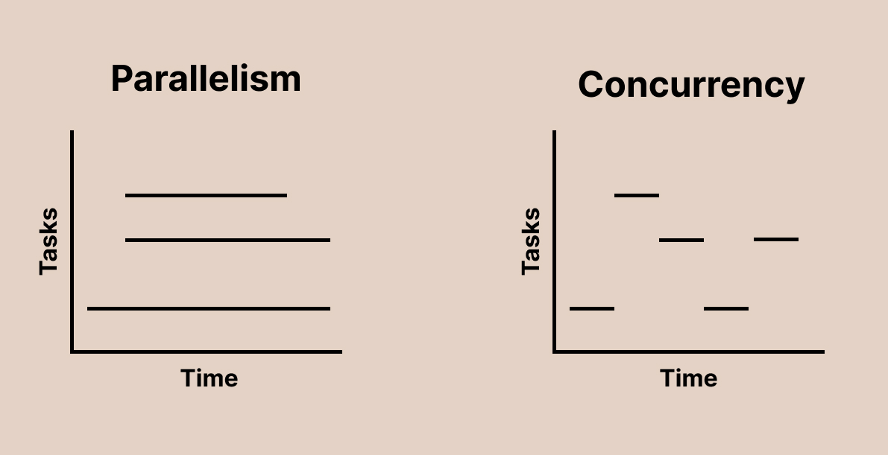
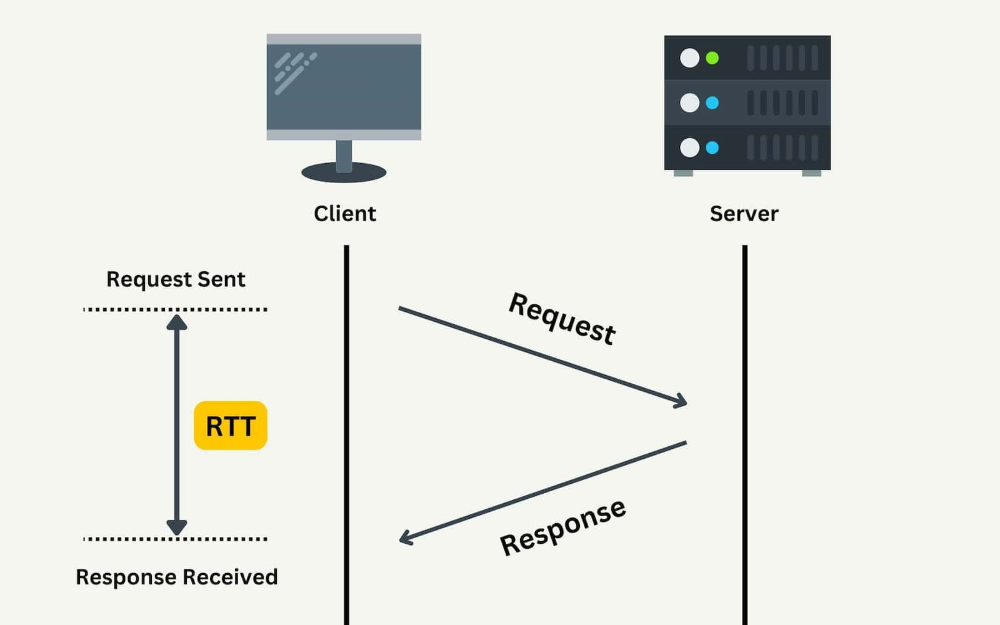

<style>
@import url('https://fonts.googleapis.com/css2?family=Noto+Sans+Mono:wght@100..900&family=Noto+Sans:ital,wght@0,100..900;1,100..900&display=swap');
section {
    font-family: "Noto Sans";
}
code {
    font-family: "Noto Sans Mono";
}
</style>

<!-- _class: communism invert  -->

## Intro to Rust Lang

# Concurrency


---


# Recap: Parallelism vs Concurrency

* **Concurrency**
    - A **problem** of handling many tasks at once
* **Parallelism**
    - A **solution** to working on multiple tasks at the same time
* Today we're talking about how Rust handles concurrency with `async`


---





---


# Concurrency

Today, we'll be talking about asynchronous programming in Rust.

* Asynchronous programming is a _solution_ to concurrency
* When we say something is **asynchronous**, we generally also mean it is **concurrent**
* Rust approaches asynchronicity differently than other languages
* Rust provides the keywords `async` and `.await` to help write and reason about asynchronous code

<!--
Remember that parallelism is a solution to concurrency. Async is yet another solution.
-->


---


# Concurrency is Complicated

* Asynchronous execution in _any_ language is complicated
* Asynchronicity and parallelism are not mutually exclusive
    * This can make reasoning about concurrency **even harder**!
    * _You can have concurrency and parallelism at the same time in Rust, and we'll see an example of this soon_


---


# Rust's Concurrency is Even More Complicated!

Due to the high complexity of Rust's rules and features, `async` is _even harder_ to use in Rust compared to other languages.

* Asynchronous execution is still evolving both as a feature in Rust and as a programming paradigm in general
* The Rust team has [prioritized](https://blog.rust-lang.org/2025/04/08/Project-Goals-2025-March-Update/) bringing the Async Rust experience closer to parity with synchronous Rust
    * _Lots of exciting work incoming soon!_


---


# Today

* It would be quite challenging to teach you what you need to know about `async`/`.await` in Rust in one lecture
* Instead, we will use `tokio` as a practical medium to learn how to use `async`
* There are **many** online resources dedicated to Async Rust (_see speaker note_)
* We will give you a sneak peek of `async`, and hopefully in the future you will be able to teach yourself how to use it!

<!--
The rust book has a new chapter about async and await and it is quite well writte:
https://doc.rust-lang.org/book/ch17-00-async-await.html

This should probably be the first thing you read if you want to learn more about this.

Then there is the tokio tutorial that this lecture is based on: https://tokio.rs/tokio/tutorial

And then there is Jon Gjengset's livestream on async/await: https://www.youtube.com/watch?v=ThjvMReOXYM

There's a lot more still if you want more! Reach out to us for more recommendations.
-->


---


# **Tokio**


---


# What is Tokio?

What is Tokio?

> Tokio is an asynchronous runtime for the Rust programming language. It provides the building blocks needed for writing network applications. It gives the flexibility to target a wide range of systems, from large servers with dozens of cores to small embedded devices.

- https://tokio.rs/


---


# What is Tokio?

At a high level, Tokio provides a few major components:

* A **multi-threaded runtime** for **executing asynchronous** code
* An asynchronous version of the standard library
* A large ecosystem of libraries

<!--
Taken directly from https://tokio.rs/tokio/tutorial

Bolded words are interesting words that people _shouldn't_ understand yet.

A lot of words to break down! We'll only be talking about the first point today,
but hopefully by the end of the lecture everyone will be able to figure out what the last two points really mean on their own
-->


---


# Why do we need Tokio?

* Making your program asynchronous allows it to scale much better
    * Reduces the cost of doing many things at the same time
* However, asynchronous Rust code does not run on its own
    * You must choose an _asynchronous runtime_ to execute it
* The Tokio library is the most widely used runtime

<!--
Remember that the definition of concurrency is literally "doing many things at the same time"

"most widely used" might be a bit of an understatement, it surpasses all other runtimes in usage combined
-->


---


# Tokio and the Rust Ecosystem

Tokio is arguably one of the most important libraries in the Rust ecosystem.

* Many _major_ Rust libraries built on top of Tokio
* There are large companies relying on Tokio in production

<!--
See https://github.com/tokio-rs for all crates under the Tokio umbrella

Many major libraries on top of it, MUCH more minor/smaller libraries as well!

See the landing page on https://tokio.rs/ for some of the companies who use Tokio (includes AWS, Azure, Facebook, Discord)
-->


---


# When not to use Tokio

Tokio is useful for many projects, but there are some cases where this isn't true.

* Tokio is designed for IO-bound applications, not CPU-bound
* It is important to note that Tokio is **NOT** the only asynchronous runtime
* We'll come back to this point later

<!--
We will come back to this slide later in the lecture! There are other reasons

Please remember: today we are talking about Tokio idioms, which are not necessarily the same as Rust Async idioms

"not stable" is somewhat of an oversimplification of io_uring. TLDR a very powerful idea in theory, but in practice lots of security vulnerabilities, unstable APIs, and generally a lot more work needed before it becomes production ready
-->


---


# Mini-Redis

We are going to create a miniature [Redis](https://redis.io/) client and server.

* We'll start with the basics of asynchronous programming in Rust
* Implement a subset of Redis commands (`GET` and `SET` key-value pairs)
* If you want to do the actual tutorial, follow along [here](https://tokio.rs/tokio/tutorial)

<!--
Redis is a in-memory key-value store. Think of a `HashMap<Key, Value>`.

We will be demoing code for TWO programs, the server and the client
-->


---


# Starter Code

Set up a new crate called `my-redis` and add some dependencies.

```sh
$ cargo new my-redis
$ cd my-redis
```

<br>

###### `Cargo.toml`
```
[dependencies]
tokio = { version = "1", features = ["full"] }
mini-redis = "0.4
```

<!--
We're just showing this code so everyone understands the setup
(crate called `my_redis`, and we take a dependency on `mini-redis`)
-->


---


# Starter Code

###### `src/main.rs`
```rust
use mini_redis::{client, Result};

#[tokio::main]
async fn main() -> Result<()> {
    // Open a connection to the mini-redis address.
    let mut client = client::connect("127.0.0.1:6379").await?;

    // Set the key "hello" with value "world".
    client.set("hello", "world".into()).await?;

    // Get key "hello".
    let result = client.get("hello").await?;

    println!("got value from the server; result={:?}", result);
    Ok(())
}
```

<!--
Note that 6379 is the actual dedicated redis port: https://en.wikipedia.org/wiki/List_of_TCP_and_UDP_port_numbers
-->


---


# Running our Client

Start the server:

```sh
$ cargo install mini-redis

# Run the mini server
$ mini-redis-server
```

Run the client:

```sh
$ cargo run
got value from the server; result=Some(b"world")
```


---


# Lecture Done!


Thanks for coming!

<br>

_Slides created by:_
Connor Tsui, Benjamin Owad, David Rudo,
Jessica Ruan, Fiona Fisher, Terrance Chen

<!--
Not really...
-->


---


# Breaking it down

Okay, let's actually break this down. There isn't much code, but a lot is happening.

```rust
use mini_redis::{client, Result};

#[tokio::main]
async fn main() -> Result<()> {
    let mut client = client::connect("127.0.0.1:6379").await?;

    client.set("hello", "world".into()).await?;

    let result = client.get("hello").await?;

    println!("got value from the server; result={:?}", result);

    Ok(())
}
```

<!--
Comments omitted for slide real estate
-->


---


# What's the Difference?

What's going on here?

```rust
let mut client = client::connect("127.0.0.1:6379").await?;
```

* The `client::connect` function is provided by the `mini-redis` crate
* Establishes a TCP connection with the remote address and returns a handle
* The only indication that this is asynchronous is the `.await` operator

<!--
Notice how this looks basically the same as synchronous Rust code...
-->


---


# What is Synchronous Programming?

* Most programs are executed in the same order in which they are written
    * _Execute first line of code, then second line, etc._
* We call this **synchronous** programming
* When a program encounters an operation that cannot be completed immediately, it will **block** until the operation completes
    * For example, establishing a TCP connection over the network

<!--
TCP connection requires an exchange with a peer over the network, so if the peer is on the other side of the world,
the speed of light becomes a bottleneck and it could take time for the connection to be established.
In synchronous programming, the thread that executes this blocks / waits for it to finish.
-->


---


# What is Asynchronous Programming?

* In asynchronous programming, operations that cannot complete immediately are _suspended_
* The thread executing is **not blocked** and can instead run other things
* When the operation completes, it becomes _unsuspended_ and the thread continues processing it where it left off
* _Note that something will need to "remember" the task's state after pausing so it can resume later_

---


# Sync vs Async


* In synchronous programming, we **wait/block** on the response
* In asynchronous programming, we can do other stuff _while_ we are waiting

<!--
In this illustration, we are talking about asynchronous execution with respect to process A, not BOTH processes. Also note that process A only needs 1 processor/core to execute in both the synchronous and asynchronous models.

Imagine that while you wait for the connection, you could't do anything else on your computer!
For example, imagine while you are watching a youtube video you can't do anything else!
-->


---




<!--
This is an illustration of network latency
-->


---


# Asynchronous Programming in Practice

* In our example, we only have one task (a single `client::connect`)
* Usually, asynchronous programs have _many_ tasks running at the same time
* This results in much more complicated programs
    * Track all of the state necessary to suspend/resume work

<!--
This is essentially what the operating system is doing with synchronous threads, but at the kernel level. Asynchronous programs have to do this at the user level, which makes it significantly harder (not that kernel programming isn't hard -_-).

Also note that we are using the word "task" here instead of "thread". This is intentional, and we'll explain this more in depth later.
-->


---


# `async`

In Rust, functions that perform asynchronous operations are labeled with the `async` keyword.

```rust
use mini_redis::Result;
use mini_redis::client::Client;
use tokio::net::ToSocketAddrs;

//  vvvvv
pub async fn connect<T: ToSocketAddrs>(addr: T) -> Result<Client> {
    // <-- snip -->
}
```


---


# `async`

```rust
//  vvvvv
pub async fn connect<T: ToSocketAddrs>(addr: T) -> Result<Client> { ... }
```

* The `async fn` definition looks like a regular synchronous function!
* The compiler transforms the `async fn` at **compile-time** into a routine
    * You can think of this routine as a low-level state machine

<!--
When you write an `async fn` or `async` block, the Rust compiler turns it into a state machine object that implements the `Future` trait.
This `Future` object holds all of the necessary state (local variables) to pause at an `.await` point and resume later.
You can think of this object as a compiler-intrinsic stack frame that isn't necessarily on the stack, and has self-referencing pointers into itself (similar to a stack pointer, but not really).
Executors like Tokio manage these `Future` objects.
-->


---


# `.await`

```rust
//                                                vvvvvv
let mut client = client::connect("127.0.0.1:6379").await?;
```

* When we call `.await` on an `async fn`, we _yield_ control back to the thread
* The executing thread is then allowed to go work on other tasks as the current `connect` task is processed in the background
* Once the connection has been established in `connect`, the thread can resume working on this task

<!--
You might wonder how exactly the thread knows that it can "come back" and resume working on this task.

There is a very specific mechanism that is WAY beyond the scope of this lecture in which the underlying state machine is able to signal the executor that the current task can be waken up.
See https://docs.rs/futures/latest/futures/task/struct.Waker.html
-->


---


# Calling `async` Functions

Async functions are similar to normal Rust functions. However, calling these functions does not result in the function body executing.

```rust
async fn say_world() { // An asynchronous function that prints "world".
    println!("world");
}

#[tokio::main]
async fn main() {
    let op = say_world();

    println!("hello");

    op.await;
}
```

<!--
Can you guess what the behavior of this program is?
-->


---


# Calling `async` Functions

```rust
async fn say_world() { println!("world"); }

#[tokio::main]
async fn main() {
    // Calling `say_world()` does not execute the body of `say_world()`.
    let op = say_world();

    println!("hello"); // This `println!` comes first.

    op.await; // Calling `.await` on `op` starts executing `say_world`.
}
```

```
hello
world
```


---


# `async` is Lazy

* Other languages implement `async/await` (notably JavaScript and C#)
* However, Rust async operators are **lazy**
    * Async code will not run without being `.await`ed
* This results in dramatically different runtime semantics

<!-- 
In comparison, async in Javascript is not lazy. Async functions begin executing the moment they are called until they reach the first await. 
-->

---


# Asynchronous `main` Function

You may have noticed something different about our `main` function.

```rust
#[tokio::main]
async fn main() { ... }
```

* It is labeled `async fn`
* It is annotated with `#[tokio::main]`


---


# Asynchronous Runtimes

Asynchronous functions (`async fn`) must be **executed** by a **runtime**.

* A runtime provides components needed for running asynchronous programs
    - Task scheduler
    - I/O event handlers
    - Timers
* A runtime must be started by an actual `fn main` function


---


# `#[tokio::main]`

The `#[tokio::main]` function is a macro that transforms the `async fn main()` into a synchronous `fn main()`.

```rust
#[tokio::main]
async fn main() {
    println!("hello");
}

/// The above gets transformed into:
fn main() {
    let mut rt = tokio::runtime::Runtime::new().unwrap();
    rt.block_on(async {
        println!("hello");
    })
}
```

<!--
The `block_on` function is where the magic starts happening
-->


---


# Back to the Server

Let's go back to implementing the Redis server. We want to:

* Accept inbound TCP sockets in a loop
* Process each socket
    * Read the command
    * Print to `stdout`
    * For now, respond with an "unimplemented" error


---


# Accept TCP Connections

```rust
use tokio::net::{TcpListener, TcpStream};
use mini_redis::{Connection, Frame};

#[tokio::main]
async fn main() {
    // Bind the listener to the address.
    let listener = TcpListener::bind("127.0.0.1:6379").await.unwrap();

    loop {
        // The second item contains the IP and port of the new connection.
        let (socket, _) = listener.accept().await.unwrap();
        process(socket).await;
    }
}
```


---


# Process Sockets

Now we can write the asynchronous `process` function:

```rust
async fn process(socket: TcpStream) {
    let mut connection = Connection::new(socket);

    // Read the request.
    if let Some(frame) = connection.read_frame().await.unwrap() {
        println!("GOT: {:?}", frame);

        // Respond with an error.
        let response = Frame::Error("unimplemented".to_string());
        connection.write_frame(&response).await.unwrap();
    }
}
```

<!--
Don't worry too much about the syntax here, all you really need to understand is that we are reading some data and responding with some other data.
-->


---


# Server and Client

If we run both the server and client programs:

Server:

```
GOT: Array([Bulk(b"set"), Bulk(b"hello"), Bulk(b"world")])
```

Client:

```
Error: "unimplemented"
```


---


# Server Problem

Our server has a small problem...

```rust
#[tokio::main]
async fn main() {
    let listener = TcpListener::bind("127.0.0.1:6379").await.unwrap();

    loop {
        let (socket, _) = listener.accept().await.unwrap();
        process(socket).await;
    }
}
```

* _Other than the fact that it only returns "unimplemented" errors_
* Sockets are processed one at a time!

<!--
Ask if students can see the problem?

In our example, we have very simple GET and SET requests, but imagine if we got a request to run `very_expensive_computation()`: then the entire server would halt because of this one connection!
-->


---


# Limited Concurrency

```rust
loop {
    let (socket, _) = listener.accept().await.unwrap();
    process(socket).await;
}
```

* When a connection is accepted:
    * The server `process`es the `socket` until completion
    * Goes back to listening
* We are `process`ing sequentially
* Ideally, we want to process many requests concurrently


---


# More Concurrency

If we want to process connections concurrently, we will need to `spawn` new tasks.

* We can spawn a new concurrent task for each socket
* This allows the executor to process each connection concurrently!


---


# `tokio::spawn`

`tokio::spawn` spawns a new task on the `tokio` runtime.

```rust
loop {
    let (socket, _) = listener.accept().await.unwrap();

    // A new task is spawned for each inbound socket. The socket is
    // moved to the new task and processed there.
    tokio::spawn(async move {
        process(socket).await;
    });
}
```

* Now our server can accept many concurrent requests!


---


# Tasks

You may have noticed we have been using the word "Task".

* A Tokio task is an asynchronous _green thread_
* We create Tokio tasks by passing an `async` block/scope to `tokio::spawn`
* Tokio tasks are _very_ lightweight
    * Can spawn millions of tasks without much overhead!

<!--
Green thread: user-space thread

A single tokio task requires only a single allocation an 64 bytes of memory!
-->


---


# Tasks vs Threads

When we talk about Tokio:

* **Tasks** are lightweight units of execution managed by the Tokio scheduler
    * Tasks can be paused and resumed
* **Threads** are heavyweight units of execution managed by the operating system's scheduler
    * You _cannot_ spawn millions of threads without any overhead
* The tokio runtime runs on top of OS threads
    * Many tasks can exist on one thread

<!--
Each thread you spawn has a corresponding kernel stack that will be significantly larger than the amount of space needed for a task. A single tokio task requires only a single allocation an 64 bytes of memory!
-->


---


# Tasks and Threads

Recall that Tokio is a **multi-threaded runtime** for **executing** asynchronous code.

* When tasks are spawned, the Tokio scheduler will ensure that the task executes once it has work to do (when it needs to resume)
* The scheduler might decide to execute the task on a different thread than the one it was originally spawned on
* Tokio implements a **work-stealing** scheduler
* **Important: Not all asynchronous runtimes do this!**

<!--
Work-stealing means that work can be stolen from one thread that has a lot of work and given to another thread that might not have that much work.

More on the implications of this later in the lecture...
-->


---


# `std::thread::spawn`


Recall that we usually had to `move` variables and values into closures for `std::thread::spawn`.


```rust
let v = vec![1, 2, 3];

thread::spawn(|| {
    println!("Here's a vector: {:?}", v);
});
```

```
note: function requires argument type to outlive `'static`
 --> src/main.rs:6:5
  |
6 | /     thread::spawn(|| {
7 | |         println!("Here's a vector: {:?}", v);
8 | |     });
  | |______^
```


---


# `T: 'static` Bound

More precisely:

* The closure that we pass to `thread::spawn` needs a `'static` bound
* The closure cannot contain references to data owned elsewhere
* Tokio tasks require the exact same `T: 'static` bound for the same reason


---


# `'static` Bound


```rust
#[tokio::main]
async fn main() {
    let v = vec![1, 2, 3];

    tokio::task::spawn(async {
        println!("Here's a vec: {:?}", v);
    });
}
```

* Here is the asynchronous version of the same code, and we will get a similar error


---


```
error[E0373]: async block may outlive the current function, but it borrows `v`, which is owned by the current function
 --> src/main.rs:7:23
  |
7 |       task::spawn(async {
  |  _______________________^
8 | |         println!("Here's a vec: {:?}", v);
  | |                                        - `v` is borrowed here
9 | |     });
  | |_____^ may outlive borrowed value `v`
  |

note: function requires argument type to outlive `'static`
 --> src/main.rs:7:17
  |
7 |       task::spawn(async {
  |  _________________^
8 | |         println!("Here's a vector: {:?}", v);
9 | |     });
  | |_____^

help: to force the async block to take ownership of `v` (and any other
      referenced variables), use the `move` keyword
  |
7 |     task::spawn(async move {
8 |         println!("Here's a vec: {:?}", v);
9 |     });
  |
```


---


# `async move`

The solution is similar to the synchronous `thread::spawn` example: Add `move`!

```rust
#[tokio::main]
async fn main() {
    let v = vec![1, 2, 3];

    //                       vvvv
    tokio::task::spawn(async move {
        println!("Here's a vec: {:?}", v);
    });
}
```


---


# `Send` Bound

Since Tokio is a multi-threaded runtime, it also requires a `Send` bound.

* Because tasks can execute on multiple threads, the runtime needs to be able to `Send` the task between threads
* This is a huge (and almost controversial) topic that we won't get into

<!--
See speaker notes on next slide for more detail on what this problem is in the first place.
The reason it is "controversial" is because many people believe that the default async runtime behavior shouldn't be multi-threaded as this can create a lot of complexity in code. The only reason this is really a problem is because Tokio happens to be the most used runtime (and there aren't really many other runtimes that can compete with respect to performance and ease of use right now).
-->


---


# The `Send` Bound Error

If you see this error (or something similar):

```
error: future cannot be sent between threads safely
   --> src/main.rs:6:5
    |
6   |     tokio::spawn(async {
    |     ^^^^^^^^^^^^ future created by async block is not `Send`
    |
```

* RUN AWAY!!!
* If you can't run away, then that is a good time to dive deeper into how `async` and `Future`s work under the hood
    * _See the speaker notes for a high-level overview_

<!--
If you're reading this on PDF, go to the HTML (or source code) to see everything!

TLDR (this list is missing a bunch of stuff but you should get the idea):
- Data in tasks must implement the Send trait
- If you get this error, look for non-Send types held across `.await` points
    - Usually, these would be Rc, RefCell, and references to thread-local data, or `MutexGuard`

Copied from a previous slide for context:
When you write an `async fn` or `async` block, the Rust compiler turns it into a state machine object that implements the `Future` trait.
This `Future` object holds all of the necessary state (local variables) to pause at an `.await` point and resume later.
You can think of this object as a compiler-intrinsic stack frame that isn't necessarily on the stack, and has self-referencing pointers into itself (similar to a stack pointer, but not really).
Executors like Tokio manage these `Future` objects.

On a multi-threaded executor, if one thread is busy, an idle thread might "steal" a paused `Future` from the busy thread and resume it.
This means the entire `Future` object itself is being sent **between** threads.
This means all of the "local variables" stored inside the `Future` object need to be sent between threads.
Because of this potential transfer, Rust requires that any `Future` spawned onto a multi-threaded executor must implement the `Send` trait to guarantee thread safety.

If your `async` code captures or holds onto non-`Send` data (like `Rc` or `RefCell`) across an `.await` point, the compiler-generated `Future` object containing that data will not be `Send`.
Attempting to spawn this non-`Send` `Future` will result in a compile-time error.
-->


---


# Shared State

We still have a major flaw...

```rust
#[tokio::main]
async fn main() {
    let listener = TcpListener::bind("127.0.0.1:6379").await.unwrap();
    let mut db = HashMap::new(); // <-- What do we do with this?

    loop {
        let (socket, _) = listener.accept().await.unwrap();

        tokio::spawn(async move {
            process(socket).await; // How do we pass `db` to each task?
        });
    }
}
```


---


# Shared State

```rust
let listener = TcpListener::bind("127.0.0.1:6379").await.unwrap();
let mut db = HashMap::new(); // <-- What do we do with this?

loop {
    let (socket, _) = listener.accept().await.unwrap();

    tokio::spawn(async move {
        process(socket).await; // How do we pass `db` to each task?
    });
}
```

* When we process a request, we want to _share_ the database among tasks
    * It's not super useful to reset the database for every connection


---


# Shared State: `Arc<Mutex<T>>`

We can use an `Arc<Mutex<T>>` to allow shared ownership and mutual exclusion!

```rust
let db = Arc::new(Mutex::new(HashMap::new()));

loop {
    let (socket, _) = listener.accept().await.unwrap();
    // Clone the handle to the hash map.
    let db = db.clone();

    tokio::spawn(async move { process(socket, db).await; });
}
```

* This `Mutex` is the standard library synchronous (blocking) mutex
* See the [tutorial](https://tokio.rs/tokio/tutorial/shared-state#update-process) for the `process` code

<!--
# On using std::sync::Mutex and tokio::sync::Mutex

Note that std::sync::Mutex and not tokio::sync::Mutex is used to guard the HashMap. A common error is to unconditionally use tokio::sync::Mutex from within async code. An async mutex is a mutex that is locked across calls to .await.

A synchronous mutex will block the current thread when waiting to acquire the lock. This, in turn, will block other tasks from processing. However, switching to tokio::sync::Mutex usually does not help as the asynchronous mutex uses a synchronous mutex internally.

As a rule of thumb, using a synchronous mutex from within asynchronous code is fine as long as contention remains low and the lock is not held across calls to .await.
-->


---


# Server Complete!

Our server is essentially done!

* Supports concurrent connections
    - Spawns an asynchronous task for each connection
* Supports concurrent requests and commands
    - Backing database synchronized with a `Mutex`

<!--
This might not seem that impressive, but think about how much engineering it takes to do this in other languages...
-->


---


# What else can we do?

* There are _many_ more things we can do to improve our client and server:
    * Use a better database
        * Reducing contention with sharding
        * Persistent storage (file I/O)
    * Multi-node servers (distributed systems)
    * Proxy caching
    * Connection Pooling
* If you are interested in this kind of software engineering, make sure to read the rest of the [Tokio tutorial](https://tokio.rs/tokio/tutorial)!

<!--
All of the things that we can improve on are the upper-level systems electives here at CMU!
-->


---


# Recap: When not to use Tokio

Tokio is useful for many projects, but there are some cases where this isn't true.

* Tokio is designed for IO-bound applications, not CPU-bound
* No benefit in sequential / low-concurrency programs
* Reading _many_ files can also have degrading performance
    * _Operating systems do not provide [stable](https://unixism.net/loti/index.html) asynchronous file APIs_
* It is important to note that Tokio is **NOT** the only asynchronous runtime

<!--
This is a more detailed repeat of the slide earlier in the lecture.
-->


---


# Summary: Tokio

* Rust allows us to write concurrent asynchronous code similar to how we would write synchronous code
* Asynchronous code requires an asynchronous runtime to work
* Tokio is a multi-threaded, work-stealing, high-performance `async` runtime
* We can _easily_ engineer massively parallel and concurrent servers with Tokio


---


# The End!


We've reached the end of our prepared content!


---


# **Why Rust?**

* Déjà vu?


---


# Why Rust?

Let's briefly go back to the very beginning of the semester.

* What is Rust?
* What are the biggest advantages of Rust?
* What are some issues that Rust has?
* Who is Rust for?

<!--
Keen observers will be aware that one bullet point is missing. I removed it because it overlaps quite a lot with the other points.
-->


---


# What is Rust?

* A language empowering everyone to build reliable and efficient software
* From the official rust [website](https://www.rust-lang.org/), Rust is:
    - Fast
    - Reliable
    - Productive

<!--
Hopefully by now, you actually believe these things to be true!
-->


---


# Rust's Advantages

* Rust is fast
* Rust is memory safe
* Rust enables fearless concurrency
* Rust is modern


---


# Rust's Pitfalls

* Rust is hard
* Rust is young


---


# Who is Rust for?

* Rust targets complex programs while providing stability and security
* Rust is not a magic silver bullet
* Rust is _not_ for everyone
* Rust is arguably the best tool for the specific problems it is trying to solve!

<!--
Many people view Rust as an ideology, which is a huge problem. Rust is just a tool, and we have to be careful that we are not pushing the idea that Rust is the solution to everything.

That being said, it is a very, very good tool for what it tries to solve (complex computer systems). Really, we are comparing Rust to the existing tools that have been around for decades (cough cough C/C++).
-->


---


# The Future of Rust

We believe that Rust is the future of computer systems.

* We _do not_ mean that people will _eventually_ start using Rust
* Many companies (large and small) have _already_ placed their bets on Rust
    * "Exponential growth" of Rust in big tech
    * Many startups methodically choosing Rust to build their foundation
* Rust will continue to grow, and many more people will continue to adopt it

<!--
By future, we don't mean that people will _eventually_ start to pick up Rust in a decade and begrudgingly force themselves to write Rust code. This is happening _right now_. Companies of all sizes (startups to the tech giants including Microsoft and Google) are actively developing and pursuing Rust development.

Rust has had "exponential growth" at Microsoft: https://youtu.be/phvKOfk7keg?si=ry3Nr2IfaZFgF_wn&t=2967,
and they have said that 2025 is the year of Rust at Microsoft.

Also note that the linux project has adopted Rust (the first language other than C to be integrated into Linux). It has been a bumpy road, but there is real achievement there too.
-->

---

# Fish 4.0

* Completely rewritten in Rust by [Feb 27, 2025](https://fishshell.com/blog/new-in-40/)


<!-- 
The reason that the team decide to port to Rust. (excerpted from https://github.com/fish-shell/fish-shell/pull/9512)

- Nobody really likes C++ or CMake, and there's no clear path for getting off old toolchains. Every year the pain will get worse.
- C++ is becoming a legacy language and finding contributors in the future will become difficult, while Rust has an active and growing community.
- Rust is what we need to turn on concurrent function execution.
- Being written in Rust will help fish continue to be perceived as modern and relevant. 
-->

---

# Zed

* A code editor built from scratch in Rust. (not a ... Vscode fork ...)


---


# Course Goals

We wanted all students to:

* Be able to read, write, and reason about Rust code
* Become an intermediate to advanced Rust developer
* Be confident that you can use Rust going forward!

<!--
We hope that we were able to achieve our goals, enabling you to achieve your own goals more easily!

Terrance: When I took this course

-->


---


# Why Rust?

We hope that you all can answer this question now!


---


# **Thanks for taking Rust StuCo!**


<br>

_Rust StuCo (98-008) has been created by:_
Connor Tsui, Benjamin Owad, David Rudo,
Jessica Ruan, Fiona Fisher, Terrance Chen

<!-- Include this section if still missing instructor candidates -->

<!-- 
---


# Looking for Instructors and TAs!

- If you have achieved the course goals, you are qualified to teach this course!
    - _This **just** means completing the homeworks, nothing more_
- We will train you in whatever you are unsure of
- 3-hour commitment every week
- If you are interested in teaching this course, please let us know! -->
