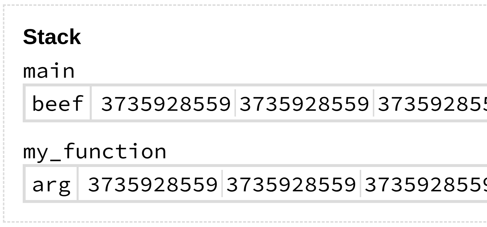
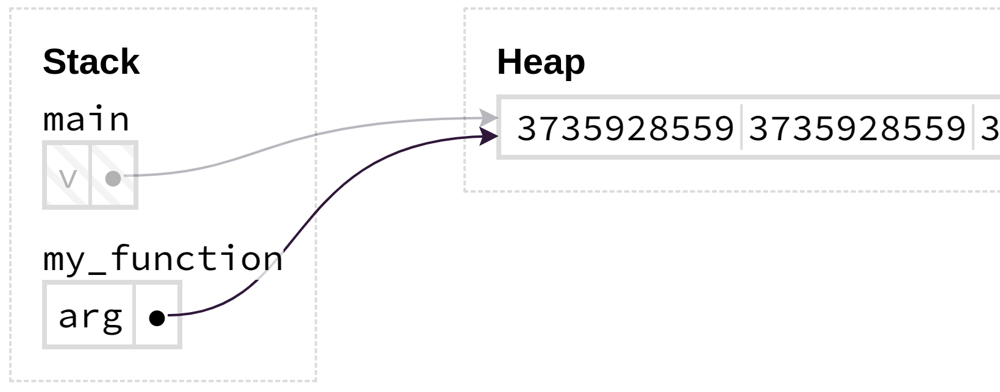

<style>
@import url('https://fonts.googleapis.com/css2?family=Noto+Sans+Mono:wght@100..900&family=Noto+Sans:ital,wght@0,100..900;1,100..900&display=swap');
section {
    font-family: "Noto Sans";
}
code {
    font-family: "Noto Sans Mono";
}
</style>

<!-- _class: communism invert  -->

## Intro to Rust Lang

# Ownership Revisited

<!--
Many images in this lecture were generated with https://cel.cs.brown.edu/aquascope/
-->


---


# Ownership Revisited

Today, we'll provide another way of thinking about ownership:

* Not just avoiding compile errors, but uncovering:
    * How the borrow checker works
    * The purpose of the borrow checker
* How do we write safer code by working _with_ the borrow checker?

<!--
Instead of _against_ the borrow checker
-->


---


# The Rules

At the beginning of this course, we learned two sets of rules...

* Ownership rules
* Borrowing rules


---


# Rules of Ownership

* Each value in Rust has an _owner_
* A value can only have one owner at a time
* When the owner goes out of scope, the value will be _dropped_


---


# Rules of Borrowing

* At any given time, you may have either
    * One mutable (exclusive) reference to data
    * Any number of immutable (shared) references to the same data
* There can never be dangling references


---


# The Catch

Getting code to compile is one thing. Understanding why is another...

* Sometimes we follow the rules blindly
    * When we break the rules, we may not fully understand why it is a problem in the first place
* The compiler can be overly cautious
    * Rejects code that seems safe
    * Makes us prove safety, even when we "know" it's safe


---


# Today's Objective

Today we're going to address these questions:

* How do ownership rules prevent memory safety issues?
* What makes the borrow checker reject seemingly safe code?

<!-- Speaker note:
First, we have to understand what makes a program unsafe.
Why do we have these rules in the first place?
What sorts of behavior is the compiler trying to prevent?
-->


---


# Defining Safety

What is safety?

* Safety is the absence of _undefined behavior_


---


# Defining Unsafe

However, undefined behavior / unsafety can mean many things.


* Definition in the [Rust Reference](https://doc.rust-lang.org/reference/behavior-considered-undefined.html) is much longer...

<!-- Speaker note:
Undefined behavior can encapsulate a lot of things,
so we'll simplify it and say that
-->


---


# Defining Unsafe

Simplification for today: **Unsafety ⇒ Invalid Memory Access**


<!-- Speaker note:
Our program is unsafe if we make an invalid memory access
Double asterisk, see Rust Reference for full definition
-->


---


# Unsafety ⇒ Invalid Memory Access

Memory access can be unsafe if we access memory that is:

* Deallocated
    * Ownership rules prevent this
* Overwritten by "someone else"
    * Borrowing rules prevent this

<!-- Speaker note:
The "someone else" will be further explained in Parallelism lecture, but it is also possible
that "someone else" can overwrite in a single-threaded context (vector mutation example)
-->


---


# Unsafety ⇒ Invalid Memory Access

Memory access can be unsafe if we access **deallocated** or **overwritten** memory.

* Immutable global variables are trivially safe
    * `static` variables are read-only and valid for program's lifetime
* Today, we'll focus on _local_ variables

<!--
Immutable global variables are by definition never be deallocated and never written to.
-->


---


# Local Variables

Local variables live in a function's **stack frame**.

The stack frame:
* Contains everything needed for the function to run
* Is allocated on function call
* Is deallocated on function return


---


# The Stack: Local Variables


Here is a representation of `main`'s stack frame.

```rust
fn main() {
    let x = 1;
}
```


---


# The Stack: Local Variables


Now we call `my_function`, constructing its stack frame.

```rust
fn main() {
    let x = 1;
    my_function(x);
}

fn my_function(arg: i32) {
    let y = 2;
    let z = 3;
}
```

<!-- For `my_function`'s stack frame, we
- Copy `x` to create `arg`
- Create the locals `y`, `z`
Emphasize the copying of `x`
-->


---


# **The Heap**


---


# Big Data


What if instead of an integer on the stack (`x = 1`)...

```rust
fn main() {
    let x = 1;
    my_function(x);
}
```

---


# Big Data


We have a 15 GB array?

```rust
fn main() {
    let beef =
        [0xDEADBEEF; HUGE_NUMBER];

    my_function(beef);
}
```

* 15 GB = your Google Drive storage 

<!--
Just to be super clear, we would actually need 2^31 64-bit integers to occupy 16 GB, but
this gets the point across.
-->


---


# Big Data



```rust
fn my_function(arg: [u32; HUGE_NUMBER]) {
    <-- snip -->
}
```

When we call `my_function`, we need to:

* Allocate enough space in the stack frame
* Copy all 15 GB of `0xDEADBEEF`'s...


---


# Big Data

Imagine being required to recreate `beef` on every single stack frame.

```rust
let beef = [0xDEADBEEF; 2_000_000_000];

my_function(beef);
my_function(beef);
my_function(beef);
my_function(beef);
my_function(beef);
my_function(beef);
my_function(beef);
my_function(beef);
my_function(beef);
my_function(beef);
```

* Unsustainable!

<!--Speaker note:
If we call this function 10 times, we're copying 10 Google Drives! Unsustainable!

Just 1 of these is likely going to cause you to run out of RAM (16 GB RAM is standard
nowadays, but many laptops have only 8 GB of memory).

Make it clear that this is not a recursive function, it's just super expensive to do this every function call.

To transition to next slide, emphasize that
this inefficiency is not just with function calls.
What if we resize our vector?
-->


---


# Motivating the Heap

We probably want to keep our `beef` array around for longer than a single function call.

* We can say that it is **long-lived** data
* We want other functions to use this array, instead of just a single stack frame
* How do we persist this data across function calls?


---


# The Stack?


Instead of storing our array buffer on the stack...


---


# The Heap


Instead of storing our array buffer on the stack...

Let's put it on the **heap**!


---


# The Heap


* If the data lives in the heap...
* The **pointer** lives on the stack


---


# `Box<T>`

The simplest form of heap allocation is `Box<T>`.

Moving a value from stack to heap:
```rust
let val: u8 = 5;
let boxed: Box<u8> = Box::new(val);
```

* Can access value by dereferencing box as `*boxed`
* Value is automatically dropped when `boxed` goes out of scope


---


# `Box<T>`

Let's put our `beef` array in a `Box`:

```rust
fn main() {
    // Renamed to `v`.
    let v = Box::new([0xDEADBEEF; HUGE_NUMBER]);
    my_function(v);
}

fn my_function(arg: Box<[u32]>) {
    <-- snip -->
}
```

* In reality, this allocates `beef` on the stack and then copies it to the heap
    * Use `Vec<T>` and convert to a boxed slice instead!

<!-- Speaker note:
If students ask about type annotation of `arg`:
    * `v` is coerced from a fixed-size array `Box<[u32; HUGE_NUMBER]>` to a boxed slice `Box<[u32]>`
If students ask when we'd use `Box`, seeing as this is not recommended:
    * We usually use `Box` when defining recursive types, like tree nodes that have nodes for children. Rust needs to know the size of every type at compile time, but recursive types have an unknown, potentially infinite size. `Box` is used to break the infinite size problem, since its size is always a fixed pointer size
-->


---


# The Heap



When we call `my_function`, we can copy the _pointer_ into `arg`!

```rust
let v =
    Box::new([0xDEADBEEF; HUGE_NUMBER]);

my_function(beef);
```


---


# The Heap


**Before:** 15 GB per array

**After:** 15 GB + 8 bytes per pointer

```rust
let v =
    Box::new([0xDEADBEEF; HUGE_NUMBER]);

my_function(beef);
my_function(beef);
my_function(beef);
my_function(beef);
my_function(beef);
my_function(beef);
my_function(beef);
my_function(beef);
my_function(beef);
my_function(beef);
```


---


# Recap: Stack vs. Heap


Variable placement:

* **Stack-allocated:** Data lives on the stack
* **Heap-allocated:** Data lives on the heap, the **pointer** on stack


---


# Recap: Stack vs. Heap

| Comparison     | Stack                  | Heap                                |
|----------------|------------------------|-------------------------------------|
| Manages        | Scalar data + Pointers | Dynamically-sized / long-lived data |
| Allocated on   | Function call          | Programmer request                  |
| Deallocated on | Function return        | ???                                 |

<!-- Scalar data being integers and floating points -->


---


# Motivating Ownership

Recall that accessing **deallocated** memory is unsafe.


---


# Motivating Ownership

When is memory deallocated?

* Stack: deallocated when the function returns
    * Valid, unless dangling pointer ✅
        * We'll discuss more in the upcoming Lifetimes lecture...
* Heap: deallocated when ???
    * ⚠️
    * How can we be confident that heap memory is deallocated safely?

<!--
Let's put that question on hold for a few slides...
-->


---


# Motivating Ownership


Recall the behavior of local variables on the stack:

* Local variable lives in the function's **stack frame**
* Allocated on function call
* Deallocated on function return
    * Sound familiar?


---


# Motivating Ownership


What if we say that data is **"owned"** by the stack frame?

* One stack frame (owner) per variable
* Data is dropped on function return
* Very similar to our previous model of ownership!


<!-- Speaker notes:
We draw inspiration from stack memory!
Why are stack deallocations safe?
Well, do you notice that in stack allocations,
each value on the stack has an "owner"?
Each value is allocated when we enter the function,
and each value is deallocated when we exit the function?
You can think of it as the value being "owned" by the function,
    and it's valid when we're in the function,
    and dropped when we exit the function!

What if we take this idea of ownership for stacks,
    and apply it to the heap?
Before, in C-land, heap memory is laissez-faire for the programmer.
Now we impose the following rules:
-->


---


# Rules of Ownership

Under this alternate ownership model, owners are stack frames:

* Each value in Rust has an _owner_
    * Owner is the _stack frame_
* A value can have only one owner at a time
    * Variables can only be in one stack frame
* When the owner goes out of scope, the value will be _dropped_
    * When the function returns, the stack frame is cleaned up!


---


# Ownership of Closures

Let's re-examine **closures** again using this new ownership model:

* What does the `move` keyword really do?
* Why are captured values dropped when they are?


---


# Ownership of Closures

When is `my_str` dropped? Who has ownership of it?

```rust
let my_str = String::from("x");

let take_and_give_back = move || { my_str };

assert_eq!(take_and_give_back(), "x");
```

* In `take_and_give_back`, `my_str` is dropped the first time the closure is called
    * Can only be called once

<!-- Speaker note:
    Q: Bonus points if you can tell us which Traits this closure implements:
    (FnOnce only)
-->


---


# Closure Internals

When we create a closure...

```rust
let do_nothing_closure = |_x| {};
```

Think of it as a struct with an associated function:

```rust
struct Closure;

impl Closure {
    //          vvvvv Notice the immutable reference to `self`!
    pub fn call(&self, _x: &str) -> () {}
}
```


---


# Closure Internals

The `move` keyword tells the closure to take ownership of values from its environment.

```rust
let take_and_give_back = move || { my_str };

// The `move` keyword tells compiler to put `my_str` in this `Closure`.
struct Closure {
    my_str: String,
}

impl Closure {
    //          vvvv Notice the owned `self` type!
    pub fn call(self) -> String {
        return self.my_str;
    }
}
```

<!--
Make sure to spend time on this! If students do not understand this, they are not going to
understand the entire section.

Normally you wouldn't do `return self.my_str;` and instead just do `self.my_str`, but this makes it
clear what is happening
-->


---


# Closure Internals

Then our code is equivalent to

```rust
let my_str = String::from("x");

let take_and_give_back = Closure { my_str };
//                                 ^^^^^^ `my_str` is moved!

let my_returned_str: String = take_and_give_back.call();
```

* What happens when we `call` on the `Closure`?
    * _Think about the stack frames_


---


# Closure Example


First, `my_str` is moved into our `Closure`.

```rust
let my_str = String::from("x");

let take_and_give_back =
    Closure { my_str };
```

---


# Closure Example


Next, we call our closure, which gives ownership of `my_str` to `Closure::call`'s stack frame.

```rust
let my_str = String::from("x");

let take_and_give_back =
    Closure { my_str };

let my_returned_str =
    take_and_give_back.call();
```


---


# Closure Example


`Closure::call` gives ownership back to `main`'s stack frame...

```rust
pub fn call(self) -> String {
    // Gives ownership back!
    return self.my_str;
}
```


---


# Closure Example


* `Closure`'s `my_str` is invalidated
* `my_str` is moved out of `Closure`'s "body"
    * This is why it can only be called once!


---


# Recap: Closure Internals

* New way of thinking about ownership
    * Owners are stack frames
* A closure is really a function that stores ("captures") values in a struct
    * Ways to capture values:
        * **Taking ownership:** Store the value in the struct, via `move` keyword
        * **Borrowing:** Store a reference to the value in the struct


---


# **Motivating Borrowing Rules**

* Recall that accessing **overwritten** memory is unsafe

<!--
So we just explained another way to think about ownership rules.
Is there another way to think about borrowing rules?
-->


---


# Vector Pop


Suppose we want to write this code.

```rust
let mut v = vec![1, 2, 3, 4];

let x = &v[3]; // Get a reference to the last element

v.pop(); // Remove the last element in `v`

println!("{}", x); // What is `x`?
```

* What do you think the compiler will say?

<!--
Explain this code directly:
Suppose we have a `Vec`, and we take a reference `x` to its last element, remove the last element, and print `x`.

Ask audience!!
-->


---


# Vector Pop


```
error[E0502]: cannot borrow `v` as mutable because it is also borrowed as immutable
 --> src/main.rs:6:5
  |
4 |     let x = &v[3]; // Get a reference to the last element
  |              - immutable borrow occurs here
5 |
6 |     v.pop(); // Remove the last element in `v`
  |     ^^^^^^^ mutable borrow occurs here
7 |
8 |     println!("{}", x); // What is `x`?
  |                    - immutable borrow later used here
```

* `x` is invalid! `&v[3]` could now be any value ⇒ undefined behavior
* We cannot mutate a value that someone else is borrowing


---


# Vector Push


What if instead of removing the last element, we _add_ an element to the end?

```rust
let mut v = vec![1, 2, 3, 4];

let x = &v[3]; // Get a reference to the last element

v.push(5); // Instead of popping, let's push!

println!("{}", x); // What is `x`?
```

* Surely nothing will happen to `x` this time?

<!--Speaker note: Ask audience!!-->


---


# Vector Push

Why isn't this okay???

```
error[E0502]: cannot borrow `v` as mutable because it is also borrowed as immutable
 --> src/main.rs:6:5
  |
4 |     let x = &v[3]; // Get a reference to the last element
  |              - immutable borrow occurs here
5 |
6 |     v.push(5); // Instead of popping, let's push!
  |     ^^^^^^^^^ mutable borrow occurs here
7 |
8 |     println!("{}", x); // What is `x`?
  |                    - immutable borrow later used here
```


---


# Vector Layout


Recall that vectors are _dynamic arrays_.

* _This is technically a `String`, but recall that `String` is implemented with a `Vec<u8>`_


---


# Mutating Vectors


* What if pushing `5` onto `v` triggers a resize?
* Resizing means:
    * Allocate new memory for `v`
    * Copy data to new location
    * **Deallocate old memory location**
* `x` would no longer point to valid memory!


---


# Mutating Vectors

```
error[E0502]: cannot borrow `v` as mutable because it is also borrowed as immutable
 --> src/main.rs:6:5
  |
4 |     let x = &v[3]; // Get a reference to the last element
  |              - immutable borrow occurs here
5 |
6 |     v.push(5); // Instead of popping, let's push!
  |     ^^^^^^^^^ mutable borrow occurs here
7 |
8 |     println!("{}", x); // What is `x`?
  |                    - immutable borrow later used here
```

Even though this error may seem unreasonable, the borrow checker is actually preventing you from making a hard-to-find mistake!

<!--
Ask students how easy you can make this mistake in other languages (namely C++)
-->


---


# We Know Better...

What if you knew that this `push` doesn't resize?

* You as the programmer have vetted the implementation of `push`
* You can _guarantee_ that resizing only happens with more elements


<!--
What if you, as the programmer, knew that this push doesn't resize?
    e.g. vector is power of 2

You can calm the compiler with a special keyword, `unsafe`
We will talk about `unsafe` in the later weeks.
-->


---


# Sneak Peek: `unsafe`

You can use an `unsafe` block to tell the compiler that you know better.

```rust
let mut v: Vec<i32> = vec![1, 2, 3, 4];
// SAFETY: We know that `v` has 4 elements, so adding `3 * size_of::<i32>()`
// cannot overflow (wrap around the address space).
let p: *const i32 = unsafe { v.as_ptr().add(3) };

v.push(5);

// SAFETY: We have checked that a resize will never happen with only
// 5 elements, so this dereference is safe.
let elem: i32 = unsafe { *p };
println!("{}", elem);
```

* Think of `unsafe` blocks as "trust me bro" blocks
* We will talk about `unsafe` in a few weeks!


---


Note that this is what the `unsafe` code should _really_ look like:

```rust
let mut v: Vec<i32> = vec![1, 2, 3, 4];

// SAFETY: We know that `v` has 4 valid elements, which means that the pointers at
// offsets +1, +2, and +3 are all valid pointers that point to values of type `i32`.
// This also means it cannot be the case that adding `3 * size_of::<i32>()` to
// `v.as_ptr()` overflows, otherwise that last element could not even exist in the
// first place. With these two guarantees, we fulfill `add`'s safety contract.
let p: *const i32 = unsafe { v.as_ptr().add(3) };

v.push(5);

// SAFETY: We showed above that `p` was a valid pointer to an `i32` value. We have
// also checked in the code of `Vec::push` that a resize and reallocation
// **cannot** happen when there are only 5 elements. So since there is no
// reallocation, and `v` is still in scope (so the memory has not been freed), this
// dereference of `p` to an `i32` value is valid.
let elem: i32 = unsafe { *p };

println!("{}", elem);
```


---


# `unsafe` vs. Borrow Checking

You should _never_ resort to using `unsafe` just to get past the borrow checker.

* `unsafe` should be used sparingly and intentionally
* You must understand _why_ you need to bypass the borrow checker
* Therefore, you _must_ understand the borrow checker!


---


# The Borrow Checker

The Borrow Checker prevents you from writing unsafe code.

This leads to some questions:

* How do I know if my program is unsafe?
    * How did the borrow checker conclude this?
* How can I tell if my program is safe even if the borrow checker rejects it?


---


# Unveiling the Borrow Checker

> "His blade works so smoothly that the ox does not feel it." - The Dextrous Butcher

* Understand the borrow checker, and you'll speak its language fluently:
    * "My program is unsafe, and here's how I'll fix it"
    * And occasionally...
        * "My program is actually safe, let me tell you why"

<!-- Work so smoothly the borrow checker does not feel it :-) -->


---


# **Permissions**

<!--
This section is supposed to be a preview of what students will actually read in the Brown Rust
Book. Make sure to tell them that it is okay if they do not fully understand everything in this
section, as it is not easy to understand quickly (just like Rust)!
-->


---


# Permissions of Places

Denote the left side of assignments as **places**.

```rust
let x = &v[3];
//  ^ place
```

* The borrow checker checks the permissions of **places**


---


# Permissions of Places


Places include:

* Variables, like `a`
* Dereferences of places, like `*a`
* Array accesses of places, like `a[0]`
* Fields of places, like `a.0`, `a.field`
* Any combination of the above, like `*a.x[i].y`


---


# Permissions of Variables

When declared, a variable has the permissions:
* Read: can be copied
* Write: can be mutated (if declared with `mut`)
* Own: can be moved or dropped


---


# References and Permissions

* Variables have the permissions Read (**R**), Write (**W**), and Own (**O**)
* Using references can _temporarily remove these permissions_


---


# Example: Immutable References

Let's revisit our vector pop example.

<style>
    .container {
        display: flex;
        gap: 16px;
    }
    .col {
        flex: 1;
    }
</style>

<div class = "container">
<div class = "col">

```rust
let mut v = vec![1, 2, 3, 4];
```

</div>
<div class = "col">

| Place | R | W | O  |
|-------|---|---|----|
| v     | ? | ? | ?  |

</div>
</div>


---


# Example: Immutable References

<div class = "container">
<div class = "col">

```rust
let mut v = vec![1, 2, 3, 4];
```

</div>
<div class = "col">

| Place | R | W | O  |
|-------|---|---|----|
| v     | ? | ? | ?  |

</div>
</div>

We declare `v`, giving it:

- ?
- ?


---


# Example: Immutable References


<div class = "container">
<div class = "col">

```rust
let mut v = vec![1, 2, 3, 4]; // <-
```

</div>
<div class = "col">

| Place | R      | W | O      |
|-------|--------|---|--------|
| v     | **+R** | ? | **+O** |

</div>
</div>

We declare `v`, giving it:

- R, O due to variable declaration
- ?


---


# Example: Immutable References


<div class = "container">
<div class = "col">

```rust
let mut v = vec![1, 2, 3, 4]; // <-
```

</div>
<div class = "col">

| Place | R  | W      | O  |
|-------|----|--------|----|
| v     | +R | **+W** | +O |

</div>
</div>

We declare `v`, giving it:

- R, O due to variable declaration
- W because `mut`


---


# Example: Immutable References


<div class = "container">
<div class = "col">

```rust
let mut v = vec![1, 2, 3, 4];

let x = &v[3]; // <-
```

</div>
<div class = "col">

| Place | R | W | O  |
|-------|---|---|----|
| v     | R | W | O  |
| x     | ? | - | ?  |

</div>
</div>

When we create a reference `x` to `v`, we:

- ?


---


# Example: Immutable References

<div class = "container">
<div class = "col">

```rust
let mut v = vec![1, 2, 3, 4];

let x = &v[3]; // <- x gets R, O
```

</div>
<div class = "col">

| Place | R      | W | O      |
|-------|--------|---|--------|
| v     | R      | W | O      |
| x     | **+R** | - | **+O** |

</div>
</div>

When we create a reference `x` to `v`, we:

- Give `x` R, O due to variable declaration
    * We can think of `v` "giving" R to `x`
    * `x`'s permissions are for the _reference_, not the data it is referring to


---


# Example: Immutable References

<div class = "container">
<div class = "col">

```rust
let mut v = vec![1, 2, 3, 4];

let x = &v[3]; // <-
```

</div>
<div class = "col">

| Place | R | W  | O  |
|-------|---|----|----|
| v     | R | W? | O? |
| x     | R | -  | O  |

</div>
</div>

Creating a reference `x` to `v` also changes the permissions of `v`:

- ?
- ?


---


# Example: Immutable References

<div class = "container">
<div class = "col">

```rust
let mut v = vec![1, 2, 3, 4];

let x = &v[3]; // <- v loses W
```

</div>
<div class = "col">

| Place | R | W  | O     |
|-------|---|----|-------|
| v     | R | W? | **-** |
| x     | R | -  | O     |

</div>
</div>

Creating a reference `x` to `v` also changes the permissions of `v`:

- Removes W
- ?


---


# Example: Immutable References

<div class = "container">
<div class = "col">

```rust
let mut v = vec![1, 2, 3, 4];

let x = &v[3]; // <- v loses W, O
```

</div>
<div class = "col">

| Place | R | W     | O |
|-------|---|-------|---|
| v     | R | **-** | - |
| x     | R | -     | O |

</div>
</div>

Creating a reference `x` to `v` also changes the permissions of `v`:

- Removes W
- Removes O


---


# Example: Immutable References

<div class = "container">
<div class = "col">

```rust
let mut v = vec![1, 2, 3, 4];

let x = &v[3];

println!("{}", *x); // <-
```

</div>
<div class = "col">

| Place | R | W | O |
|-------|---|---|---|
| v     | R | - | - |
| x     | R | - | O |
| *x    | R | - | - |

</div>
</div>

We can access what our reference `x` is referring by dereferencing it as `*x`.

* `*x`'s permissions are different from `x`'s!
* Can only dereference if `*x` has R permissions
* `*x` can only have R if `v` has R


---


# Example: Immutable References

<div class = "container">
<div class = "col">

```rust
let mut v = vec![1, 2, 3, 4];

let x = &v[3];

println!("{}", *x); // <-
```

</div>
<div class = "col">

| Place | R | W | O |
|-------|---|---|---|
| v     | R | - | - |
| x     | R | - | O |
| *x    | R | - | - |

</div>
</div>

We can no longer mutate `v`, since we created a reference `x` to it.

When does `v` regain W, O? Either:

* All references become unused (Case 1)
* Mutate `v` before _any_ reference is used (Case 2)
    * Revokes permissions of references

<!--
(Only if time!)

Before 2018: Rust used a more restrictive model called "lexical lifetimes,"
where the borrow's lifetime lasted until the end of the lexical scope in which
the reference was declared. A yucky workaround was creating extra scopes with
curly braces to end borrows early

After 2018: Non-lexical lifetimes (NLL) were introduced!
Instead of using lexical scopes to determine lifetimes, the compiler analyzes
the control flow to determine when the reference was last used, hence more
intuitive behavior

We'll talk more in the Lifetimes lecture, alongside more "Dark Ages" tales!
-->


---


# Example: Immutable References

<div class = "container">
<div class = "col">

```rust
let mut v = vec![1, 2, 3, 4];

let x = &v[3];

v.pop(); // <- v revokes x's permissions
```

</div>
<div class = "col">

| Place | R     | W      | O      |
|-------|-------|--------|--------|
| v     | R     | **+W** | **+O** |
| x     | **-** | -      | **-**  |
| *x    | **-** | -      | -      |

</div>
</div>

This `v.pop()` is safe (Case 2).

* `v` requests W before any references are used (Case 2)
    * `v` regains W, O, _revokes permissions of all references_
    * Temporarily: `x` loses R and O, `*x` loses R

<!--
This is technically both cases because line 2 is dead code...
-->


---


# Example: Immutable References

<div class = "container">
<div class = "col">

```rust
let mut v = vec![1, 2, 3, 4];

let x = &v[3];

println!("{}", *x); // Requires R on *x

// x and *x lose all permissions

v.pop(); // <- v regains W and O
```

</div>
<div class = "col">

| Place | R     | W      | O      |
|-------|-------|--------|--------|
| v     | R     | **+W** | **+O** |
| x     | **-** | -      | **-**  |
| *x    | **-** | -      | -      |

</div>
</div>

This `v.pop()` is also safe (Case 1)!

* `v` requests W after all references become unused (Case 1)
    * Permanently: `x` loses R and O, `*x` loses R
    * `v` regains W, O


---


# Example: Immutable References

However, we cannot access `*x` anymore, as its permissions have been revoked.

<div class = "container">
<div class = "col">

```rust
let mut v = vec![1, 2, 3, 4];

let x = &v[3];

v.pop(); // Revokes permissions!

// THIS DOES NOT COMPILE!!!
println!("{}", *x); // Requires R on *x
```

</div>
<div class = "col">

| Place | R     | W | O |
|-------|-------|---|---|
| v     | R     | W | O |
| x     | R     | - | - |
| *x    | **-** | - | - |

</div>
</div>

* This code causes an error because we don't have permissions on `*x`


---


# Recap: Immutable References


* Declaring a variable `v` gives it R, O permissions, W if `mut`
* Creating an immutable reference `x` to `v`
    * Gives `x` R, O permissions
    * Removes `v`'s W, O permissions
* Permissions are restored when either:
    * References become **unused**
    * We mutate `v` *before* any reference is used

<!-- Speaker note: "unused" will be clarified in Lifetimes lecture -->


---


# Mutable References

* **`x` and `*x` have different permissions**
    * Notice how revoking permissions removes R from `*x`, but _keeps_ R on `x`
    * We can create as many references as we want...
        * We just can't _access_ them without the correct permissions
* Mutable references further illustrate this


---


# Example: Mutable References

<div class = "container">
<div class = "col">

```rust
let mut v = vec![1, 2, 3, 4];

let x = &v[3]; // <-
```

</div>
<div class = "col">

| Place | R     | W     | O     |
|-------|-------|-------|-------|
| v     | R     | **-** | **-** |
| x     | R     | -     | O     |
| *x    | **R** | -     | -     |

</div>
</div>

Recall that when we create an immutable reference `x = &v[3]`:

* `v` loses W and O permissions
    * `v` gives `x` R
* `x` gains R and O permissions
* `*x` gains R permissions


---


# Example: Mutable References

<div class = "container">
<div class = "col">

```rust
let mut v = vec![1, 2, 3, 4];

let x = &mut v[3]; // <-
//      ^^^^
```

</div>
<div class = "col">

| Place | R  | W  | O |
|-------|----|----|---|
| v     | R? | -  | - |
| x     | R  | -  | O |
| *x    | R  | -? | - |

</div>
</div>

However, when `x` is a mutable reference:

- ?
- ?


---


# Example: Mutable References

<div class = "container">
<div class = "col">

```rust
let mut v = vec![1, 2, 3, 4];

let x = &mut v[3]; // <-
//      ^^^^
```

</div>
<div class = "col">

| Place | R     | W  | O |
|-------|-------|----|---|
| v     | **-** | -  | - |
| x     | R     | -  | O |
| *x    | R     | -? | - |

</div>
</div>

However, when `x` is a mutable reference:

- `v` loses _all_ permissions, including R
- ?

<!-- Speaker note:
Losing R is equivalent to "locking" other references from taking R
    => no more immutable references
-->


---


# Example: Mutable References

<div class = "container">
<div class = "col">

```rust
let mut v = vec![1, 2, 3, 4];

let x = &mut v[3]; // <-
//      ^^^^
```

</div>
<div class = "col">

| Place | R | W     | O |
|-------|---|-------|---|
| v     | - | -     | - |
| x     | R | -     | O |
| *x    | R | **W** | - |

</div>
</div>

However, when `x` is a mutable reference:

- `v` loses _all_ permissions, including R
- `*x` (_not_ `x`) gains W permissions

<!--
Prevents data races:
* `v` loses all access permissions *including* R, since the old
memory location may be invalidated. Remember our vector resizing example!
* The variable holding the reference / pointer is immutable (`x`),
so that we can't reassign it to point elsewhere while the value
it points to (*x) is being modified
-->


---


# Example: Mutable References

<div class = "container">
<div class = "col">

```rust
let mut v = vec![1, 2, 3, 4];

let x = &mut v[3]; // <-
//      ^^^^
```

</div>
<div class = "col">

| Place | R | W     | O |
|-------|---|-------|---|
| v     | - | -     | - |
| x     | R | -     | O |
| *x    | R | **W** | - |

</div>
</div>

- `v` loses _all_ permissions, including R
    * Prevents creation of other references (both mutable and immutable)
    * Avoids simultaneous **aliasing** and mutation
- `*x` (_not_ `x`) gains W permission
    * We can write to the data, but we can't reassign `x`

<!--Speaker note:
Aliasing: accessing same data through different variables

Removing R permission is like "locking" other references from taking R
Combined with "*x can only take R if v has R",
    => no more immutable references

Analogous to reader-writer locks
- the R permission is like the internal reader mutex
-->


---


# Recap: Mutable References

An immutable reference `x` of `v`:

* Removes W and O permissions for `v` (keeps R)
* `*x` can only take R if `v` has R

A mutable reference `x` to `v`:

* Removes _all_ permissions for `v` (including R)
    * Prevents creation of any other references
* `*x` (not `x`) gains W permission


---


# **Fixing Programs**


---


# Arrays and Slices

Suppose we have a vector of numbers:

```rust
let mut v = vec![1, 2, 3, 4];
```


---


# Arrays and Slices

We want to take this number `2`...

```rust
let mut v = vec![1, 2, 3, 4];
//                  ^
```


---


# Arrays and Slices

We want to take this number `2`...and add it to the number in the first index.

```rust
let mut v = vec![1, 2, 3, 4];
//               ^
```

<!--
Speaker note:
    Q: "What's ONE plus TWO, boys and girls???"
    A: Three, I hope!
-->


---


# Arrays and Slices


Here is a seemingly reasonable solution:

```rust
let mut v = vec![1, 2, 3, 4];

let slot1 = &mut v[0];

let slot2 = &v[1];

*slot1 += *slot2;
```


---

# Arrays and Slices: Problem

```
error[E0502]: cannot borrow `v` as immutable because it is also borrowed as mutable
  --> src/main.rs:9:18
   |
8  |     let slot1 = &mut v[0];
   |                      - mutable borrow occurs here
9  |     let slot2 = &v[1];
   |                  ^ immutable borrow occurs here
10 |     *slot1 += *slot2;
   |     ---------------- mutable borrow later used here
   |
   = help: use `.split_at_mut(position)` to obtain
           two mutable non-overlapping sub-slices
```

* Let's break down the permissions


---


# Arrays and Slices: Permissions

<div class = "container">
<div class = "col">

```rust
let mut v = vec![1, 2, 3, 4];

let slot1 = &mut v[0]; // <-

let slot2 = &v[1];

*slot1 += *slot2;
```

</div>
<div class = "col">

| Place  | R | W | O |
|--------|---|---|---|
| v      | - | - | - |
| *slot1 | R | W | - |

</div>
</div>

Recall that when we create a mutable reference `slot1 = &mut v[0]`:

* `v` loses all permissions
* `*slot1` gains R, W permissions


---


# Arrays and Slices: Permissions

<div class = "container">
<div class = "col">

```rust
let mut v = vec![1, 2, 3, 4];

let slot1 = &mut v[0];

let slot2 = &v[1]; // <-

*slot1 += *slot2;
```

</div>
<div class = "col">

| Place  | R | W | O |
|--------|---|---|---|
| v      | - | - | - |
| *slot1 | R | W | - |
| *slot2 | ? | ? | ? |

</div>
</div>

Recall that when we create an immutable reference `slot2 = &v[1]`:


* `v` loses W and O permissions (didn't have it anyways)
* `v` gives `x` R since `x` needs R on line 4
    * But `v` doesn't have R!


---


# Arrays and Slices: Permissions

<div class = "container">
<div class = "col">

```rust
let mut v = vec![1, 2, 3, 4];

let slot1 = &mut v[0];

let slot2 = &v[1]; // <-

*slot1 += *slot2; ❌
```

</div>
<div class = "col">

| Place  | R | W | O |
|--------|---|---|---|
| v      | - | - | - |
| *slot1 | R | W | - |
| *slot2 | - | - | - |

</div>
</div>

* Mutating `*slot1` requires R, W
    * `*slot1` has both ✅
* Reading `*slot2` requires R
    * `*slot2` doesn't have R ❌
    * `v` "gave" R to `*slot1`!

<!--Speaker note:
v regains R after slot1 becomes unused, BUT
slot1 becomes unused after reading *slot2
-->


---


# Arrays and Slices: Permissions

<div class = "container">
<div class = "col">

```rust
let mut v = vec![1, 2, 3, 4];

let slot1 = &mut v[0];

let slot2 = &v[1]; // <-

*slot1 += *slot2; ❌
```

</div>
<div class = "col">

| Place  | R | W | O |
|--------|---|---|---|
| v      | - | - | - |
| *slot1 | R | W | - |
| *slot2 | - | - | - |

</div>
</div>

The main issue here is that the single place `v` represents the _entire_ vector.

* Borrow checker does not see each index / element as a different place
* Borrow checker can't know that this code is safe
    * But we (as humans) do!


---


# Fixing a Safe Program

Solution 1: Don't use explicit references.

```rust
let mut v = vec![1, 2, 3, 4];

v[0] += v[1];

println!("{:?}", v);
```

* This works because we mutate only `v[0]`
    * _Program evaluation is right to left_


---


# Fixing a Safe Program

Solution 2: Drop into `unsafe` code.

`split_at_mut` uses `unsafe` under the hood:

```rust
let mut v = [1, 0, 3, 0, 5, 6];

let (left, right) = v.split_at_mut(2);

assert_eq!(left, [1, 0]);
assert_eq!(right, [3, 0, 5, 6]);
```

* Divides a mutable slice into two mutable slices at index `mid`
    * `left` contains `[0, mid)`
    * `right` contains `[mid, len)`
* We will talk about this in a few weeks!

<!-- Make sure to mention that here, `left` and `right` are now different places so we can get a
mutable reference to one and an immutable reference to the other. -->


---


# Sound vs. Complete

The borrow checker is **sound**, but not **complete**. This means that the borrow checker sometimes can't figure out if your program is safe.

* If you conclude it is actually safe:
    * After reasoning about stack frames
    * After reasoning about permissions
    * Repeating all steps several times
    * Consider _potentially_ using `unsafe`
    * And then tell yourself that you probably don't need to use `unsafe`

<!--
If you are wondering if you need unsafe, you probably don't need it.
Usually you can be pretty sure when you need it vs. when you don't.
-->


---


# Ownership Recap

* Ownership rules prevent access to deallocated memory
    * Think of owners as **stack frames**
* Borrow checker checks **permissions** of **places**
    * References temporarily remove permissions
* The borrow checker is your friend!


---


# Homework 8

* This homework is a Gradescope Quiz!
* 30 questions from the [Brown Rust Book](https://rust-book.cs.brown.edu/)
* Read through chapter 4 on ownership
    * Answer the quiz questions on the web page as you go through it
    * All answers will be revealed after you attempt!
* Each question is worth 5 points, so you don't need to do everything
* Focus on _understanding_ rather than the questions themselves


---


# Next Lecture: Lifetimes


Thanks for coming!

<br>

_Slides created by:_
Connor Tsui, Benjamin Owad, David Rudo,
Jessica Ruan, Fiona Fisher, Terrance Chen
