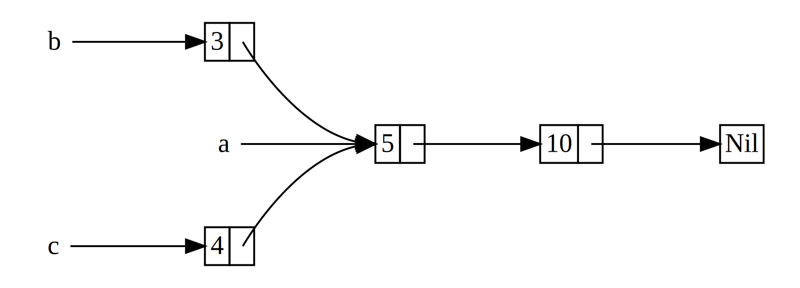

<style>
@import url('https://fonts.googleapis.com/css2?family=Noto+Sans+Mono:wght@100..900&family=Noto+Sans:ital,wght@0,100..900;1,100..900&display=swap');
section {
    font-family: "Noto Sans";
}
code {
    font-family: "Noto Sans Mono";
}
</style>

<!-- _class: communism invert  -->

## Intro to Rust Lang

# Smart Pointers and Trait Objects


---


# Today: Smart Pointers and Trait Objects

- Smart Pointers
    - `Box<T>`
    - The `Deref` trait
    - The `Drop` trait
    - `Rc<T>`
- Trait Objects


---


# **`Box<T>`**


---


# Pointers

What is a pointer?

* A _pointer_ is a general concept for a variable that contains an address in memory
* The address "points to" or "points at" some other data
* In Rust, the most common pointer is a reference (`&`)
* No overhead other than dereferencing


---


# Smart Pointers

What is a _smart pointer?_

* Data structures that act like a pointer
* Contain additional metadata and capabilities beyond dereferencing
* This concept is not unique to Rust (C++)


---


# Surprise!

We've actually seen several smart pointers, but we haven't called them as such.

- `String`
- `Vec<T>`
- `Box<T>`

<!--
String, for example, stores its capacity as metadata and has the extra ability to ensure its data
will always be valid UTF-8.
-->


---


# Let's Make a List


Let's say we wanted to make a recursive-style list:

```rust
enum List {
    Cons(i32, List),
    Nil,
}

fn main() {
    // List of [1, 2, 3]?
    let list = Cons(1, Cons(2, Cons(3, Nil)));
}
```

<!--
This should look familiar to people who have taken / are taking 15-150!
-->


---


# The Compiler's Suggestion

```
error[E0072]: recursive type `List` has infinite size
 --> src/main.rs:1:1
  |
1 | enum List {
  | ^^^^^^^^^
2 |     Cons(i32, List),
  |               ---- recursive without indirection
  |
help: insert some indirection (e.g., a `Box`, `Rc`, or `&`) to break the cycle
  |
2 |     Cons(i32, Box<List>),
  |               ++++    +
```

* The compiler is complaining because we've defined a type with _infinite size_


---


# Computing the Size of Types

Recall the `Message` enum we defined back in Week 3:

```rust
enum Message {
    Quit,
    Move { x: i32, y: i32 },
    Write(String),
    ChangeColor(i32, i32, i32),
}
```

* How does Rust compute the size of this type?
  * _How much space do we need to allocate for a `Message` instance?_
* Simply choose the largest of its variants + some tag bits


---


# Size of Recursive Types?


What happens when we try to determine the size of a recursive type?

```rust
enum List {
    Cons(i32, List),
    Nil,
}
```

* Infinite size!


---


# Indirection with `Box<T>`

The compiler gives an error with a helpful suggestion:

```
help: insert some indirection (e.g., a `Box`, `Rc`, or `&`) to break the cycle
  |
2 |     Cons(i32, Box<List>),
  |               ++++    +
```

* The suggestion is to use a `Box<List>`
* In the suggestion, "indirection" means we store a _pointer_ to a `List`
* Pointers have fixed size, so our enum is no longer of infinite size!


---


# A Finite `List`


```rust
enum List {
    Cons(i32, Box<List>),
    Nil,
}
```

* Now we have a finite size!


---


# A Finite `List`

```rust
enum List {
    Cons(i32, Box<List>),
    Nil,
}

let end = Nil;
let three = Cons(3, Box::new(end));
let two = Cons(2, Box::new(three));
let one = Cons(1, Box::new(two));

println!("{:?}", one);
```

```
Cons(1, Cons(2, Cons(3, Nil)))
```

* Pop Quiz: How would we make this generic?


---


# A Finite Generic `List<T>`

```rust
enum List<T> {
    Cons(T, Box<List<T>>),
    Nil,
}

let end = Nil;
let three = Cons(3.3, Box::new(end));
let two = Cons(2.2, Box::new(three));
let one = Cons(1.1, Box::new(two));

println!("{:?}", one);
```

```
Cons(1.1, Cons(2.2, Cons(3.3, Nil)))
```


---


# More about `Box<T>`

* `Box<T>` is a simple "smart" pointer to memory allocated on the heap*
* `Box<T>` fully owns the data it points to (just like `Vec<T>`)
  * It is a "smart" pointer because it frees the data it owns when dropped
* Low overhead (other than allocation)

<!--
Technically the compiler is allowed to store data of Boxes on the stack if it wants to
-->


---


# When to use `Box<T>`

* When you have a type of unknown size **at compile time** (like `List`)
* When you have a large amount of data and want to transfer ownership
  * Transferring ownership of a pointer is faster than a large chunk of data
* Trait Objects
  * Coming soon...

<!--
The reasoning for why transferring ownership is faster is that data
won't need to be copied to another stack for example, just the pointer.
-->


---


# Using Values in the `Box`

```rust
let x = 5;
let y = Box::new(x);

assert_eq!(5, x);
assert_eq!(5, *y);
```
* Just like a reference we can dereference a `Box<T>` to get `T`
* `Box<T>` implements the `Deref` trait which customizes the behavior of `*`


---


# **The `Deref` Trait**


---


# The `Deref` Trait

Implementing the `Deref` trait allows you to customize the behavior of the _dereference_ operator (`*`).

```rust
pub trait Deref {
    type Target: ?Sized;

    // Required method
    fn deref(&self) -> &Self::Target;
}
```

* Behind the scenes `*y` is actually `*(y.deref())`
  * Note that this does not recurse infinitely
* We can treat anything that implements `Deref` like a pointer!


---


# The `Deref` Trait on `Box<T>`

Here is the implementation of `Deref` for `Box<T>`.

```rust
impl<T: ?Sized, A: Allocator> Deref for Box<T, A> {
    type Target = T;

    fn deref(&self) -> &T {
        &**self
    }
}
```

* Don't worry about the generics, just focus on the `deref()` method!

<!--
This code is copied and pasted directly from the standard library
https://doc.rust-lang.org/std/boxed/struct.Box.html#impl-Deref-for-Box%3CT,+A%3E
-->


---


# `DerefMut`

There is also a mutable version of `Deref` called `DerefMut`.

```rust
pub trait DerefMut: Deref {

    // Required method
    fn deref_mut(&mut self) -> &mut Self::Target;

}
```

* Notice how `DerefMut` is a subtrait of `Deref`
* Only adds functionality to mutably dereference to the same `Target`


---


# Deref Coercion

Recall that we were able to coerce a `&String` into a `&str`. We can also coerce a `&Box<T>` into a `&T`!

```rust
fn hello_number(number: &i32) {
    println!("Hello, {number}!");
}

let m: Box<i32> = Box::new(42);

hello_number(&m);
```

```
Hello, 42!
```

* Deref coercion converts a `&T` into `&U` if `Deref::Target = U`


---


# Deref Coercion

We can also coerce several layers deep, so a `&Box<String>` can coerce to a `&str`.

```rust
fn hello(name: &str) {
    println!("Hello, {name}!");
}

let m: Box<String> = Box::new(String::from("Rust"));

hello(&m);
```

* Deref Coercion converts a `&Box<String>` into a `&String`
* Deref Coercion converts a `&String` into `&str`
  * `String` implements the `Deref` trait such that `Deref::Target = &str`


---


# Deref Coercion Rules

Rust is able to coerce mutable to immutable but not the reverse.

* From `&T` to `&U` when `T: Deref<Target=U>`
* From `&mut T` to `&mut U` when `T: DerefMut<Target=U>`
* From `&mut T` to `&U` when `T: Deref<Target=U>`
* For more information, consult the [Rustonomicon](https://doc.rust-lang.org/nomicon/dot-operator.html)


---

# `&Vec<T>` to `&[T]`

```rust
fn foo(s: &[i32]) {
    print(s[0])
}

// `Vec<T>` implements `Deref<Target=[T]>`.
let owned = vec![1, 2, 3];

// Here we coerce `&Vec<T>` to `&[T]`.
foo(&owned);

println!("{:?}", owned);
```

```
[1]
[1, 2, 3]
```

---

# `&mut Vec<T>` to `&mut [T]`

```rust
fn foo(s: &mut [i32]) {
    s[0] += 1;
}

// `Vec<T>` implements `DerefMut<Target=[T]>`.
let mut owned = vec![1, 2, 3];

// Here we coerce `&mut Vec<T>` to `&mut [T]`.
foo(&mut owned);

println!("{:?}", owned);
```

```
[2, 2, 3]
```


---


# Better Function Signatures

Try to encourage coercion in your function signatures:

```rust
fn foo(x: &Box<T>) { ... }
fn bar(x: &T) { ... }

fn baz(s: &String) { ... }
fn qux(s: &str) { ... }

fn corge(v: Vec<T>) { ... }
fn grault(v: &[T]) { ... }
```

* `bar`, `qux`, and `grault` are strictly more powerful!


---


# **The `Drop` Trait**


---


# The `Drop` Trait

Smart pointers implement both the `Deref` _and_ the `Drop` trait.

The `Drop` trait customizes what happens when a value is _about_ to go out of scope.

```rust
pub trait Drop {
    fn drop(&mut self);
}
```

* This allows for the RAII pattern (Resource Acquisition Is Initialization)
* Data cleans up after itself!

<!--
You see RAII a lot in modern C++ as well
-->


---


# The `Drop` Trait

Recall that values in Rust are dropped when they go out of scope.

```rust
pub trait Drop {
    fn drop(&mut self);
}
```

* Dropping a struct value will recursively drop all its fields by default
    * This mechanism allows for automatically freeing memory
* You can also provide a custom implementation of `Drop` on your types
    * Allows us to run user code _before_ values are dropped


---


# `Drop` Trait Example

```rust
struct CustomSmartPointer {
    data: String,
}

impl Drop for CustomSmartPointer {
    fn drop(&mut self) {
        println!("Dropping `CustomSmartPointer` with data \"{}\"", self.data);
    }
}
```

* This is a custom implementation that simply prints the data before dropping
* The data will still be freed automatically after
    * _After `CustomSmartPointer::drop` is called, `String::drop` will be called_


---


# `Drop` Trait Example

```rust
fn main(){
    let c = CustomSmartPointer { data: String::from("I'm Connor") };
    let d = CustomSmartPointer { data: String::from("I'm David") };

    println!("CustomSmartPointers created.");
}
```

```
CustomSmartPointers created.
Dropping `CustomSmartPointer` with data "I'm David"
Dropping `CustomSmartPointer` with data "I'm Connor"
```

* Notice how values are dropped in _reverse order_ of creation


---


# `Drop` Trait Usage

`Drop` trait implementations are typically not needed unless:

* You are manually managing memory
    * This likely involves using `unsafe` under the hood
* You need to do something special before a value is dropped
    * Might involve managing OS resources
    * Might involve signalling other parts of your codebase


---


# Manual Drop


What if we want to manually drop a value before the end of the scope?

```rust
let csm = CustomSmartPointer {
    data: String::from("some data"),
};

println!("CSM created.");

csm.drop();

println!("CSM dropped before the end of the scope");
```


---


# Manual Drop

```
error[E0040]: explicit use of destructor method
  --> src/main.rs:16:7
   |
16 |     c.drop();
   |     --^^^^--
   |     | |
   |     | explicit destructor calls not allowed
   |     help: consider using `drop` function: `drop(c)`
```

* Rust won't let you explicitly call the drop trait method


---


# Manual Drop

```rust
let csm = CustomSmartPointer {
    data: String::from("some data"),
};

println!("CSM created.");

std::mem::drop(csm);

println!("CSM dropped before the end of the scope");
```

* This code works since we use `std::mem::drop` instead
* What's the difference?


---


# `std::mem::drop`

Here is the actual source code of `std::mem::drop` in the standard library:

```rust
pub fn drop<T>(_x: T) {}
```

* Takes ownership of `_x`
* `_x` reaches the end of the scope and is dropped
* Calling this method drops the value!

<!--
This is beautiful!!
https://doc.rust-lang.org/src/core/mem/mod.rs.html#942
-->


---


# **`Rc<T>`**


---


# Rules of Ownership

Recall the rules of ownership.

* Each value in Rust has an _owner_
* A value can only have one owner at a time
* When the owner goes out of scope, the value will be _dropped_


---


# Rules were meant to be broken...

There are ways we can get past these rules in completely safe Rust, with a few minor caveats.

* There are cases where it makes sense for a value to have multiple owners
  * What is a well-known data structure where values have multiple things pointing at / to a value?
  * _Edges pointing to nodes?_
  * Graphs!
    * _And any graph-like data structures_


---


# Multiple Ownership with `Rc<T>`

To enable multiple ownership, you must use the `Rc<T>` type.

* Abbreviation for _reference counting_
* Keeps track of the number of references to a value
* When there are zero references, the value can safely be dropped


---


# Let's Make a List (again)


Let's go back to our `List`.

```rust
enum List {
    Cons(i32, Box<List>),
    Nil,
}

let a = Cons(5, Box::new(Cons(10, Box::new(Nil))));

let b = Cons(3, Box::new(a));
let c = Cons(4, Box::new(a));
```

* What's wrong with this code?
  * _Think about ownership_


---


# Single Ownership

```
error[E0382]: use of moved value: `a`
  --> src/main.rs:11:30
   |
9  |     let a = Cons(5, Box::new(Cons(10, Box::new(Nil))));
   |         - move occurs because `a` has type `List`,
   |           which does not implement the `Copy` trait
   |
10 |     let b = Cons(3, Box::new(a));
   |                              - value moved here
11 |     let c = Cons(4, Box::new(a));
   |                              ^ value used here after move

```


---


# Single Ownership

```
error[E0382]: use of moved value: `a`
  --> src/main.rs:11:30
   |
10 |     let b = Cons(3, Box::new(a));
   |                              - value moved here
11 |     let c = Cons(4, Box::new(a));
   |                              ^ value used here after move

```
* `Cons` needs to **own** the data it holds
* `a` was already moved into `b` when we try to create `c`
* We want both `b` and `c` to point to the same instance `a`

<!--
Cloning is expensive + then b and c refer to different tails---no cloning!
-->


---


# Shared Ownership?

Ideally, we want something like this:




---


# References?

We _could_ achieve this with references:

```rust
enum List<'a> {
    Cons(i32, &'a List<'a>),
    Nil,
}

let end = Cons(10, &Nil);
let a = Cons(5, &end);
let b = Cons(3, &a);
let c = Cons(4, &a);
```
* This is kind of ugly...
  * It is also tied to the current scope via lifetimes


---


# Shared List with `Rc<T>`

Let's use `Rc<T>` instead to enable shared ownership!

```rust
enum List {
    Cons(i32, Rc<List>),
    Nil,
}

let end = Rc::new(Cons(10, Rc::new(Nil)));

let a: Rc<List> = Rc::new(Cons(5, end));

let b = Cons(3, Rc::clone(&a));
let c = Cons(4, Rc::clone(&a));
```

* Note that `Rc::clone(&a)` is a cheap copy, not a deep clone


---


# `Rc<T>`


```rust
let end = Rc::new(
    Cons(10, Rc::new(Nil))
);

let a: Rc<List> =
    Rc::new(Cons(5, end));

let b = Cons(3, Rc::clone(&a));
let c = Cons(4, Rc::clone(&a));
```


---


# `Rc<T>` Reference Count

`Rc<T>` keeps track of the number of references to a value to ensure safety.

* When an `Rc` is cloned, it increments the reference count
* When an `Rc` is dropped, it decrements the reference count
* When the reference count reaches zero, the owned value is freed
  * No "references" can be invalid after freeing!

<!--
"References" in quotations because logically they are references but they are
not the same as Rust references.
-->


---


# When to use `Rc<T>`

* We want to allocate data on the heap
* We want multiple parts of our program to _read_ the data
* We don't know at compile-time which part will finish reading the data last
* Only use for single-threaded scenarios
    * `Rc<T>` is not thread safe
    * `Arc<T>` for multi-threaded (more on that soon)


---


# `Rc<T>` Example 1

Here's an annotated example of using `Rc<T>`.

```rust
fn main() {
    let plan = String::from("Plan to steal Connor's identity, do not distribute");

    let a = Rc::new(plan);
    // Ref count after creating a: 1

    let b = Rc::clone(&a);
    // Ref count after creating b: 2

    {
        let c = Rc::clone(&a);
        // Ref count after creating c: 3
    }
    // Ref count after dropping c: 2
}
// Ref count after dropping a and b: 0
```


---


# `Rc<T>` Example 2

Here is a similar example, but with `Rc::strong_count(&a)`.

```rust
fn main() {
    let a = Rc::new(Cons(5, Rc::new(Cons(10, Rc::new(Nil)))));
    println!("count after creating a = {}", Rc::strong_count(&a));

    let b = Cons(3, Rc::clone(&a));
    println!("count after creating b = {}", Rc::strong_count(&a));

    {
        let c = Cons(4, Rc::clone(&a));
        println!("count after creating c = {}", Rc::strong_count(&a));
    }

    println!("count after c goes out of scope = {}", Rc::strong_count(&a));
}
```


---


# `Rc<T>` Example 2

```
$ cargo run
count after creating a = 1
count after creating b = 2
count after creating c = 3
count after c goes out of scope = 2
```


---


# `Rc<T>` Recap

* Allows sharing data between multiple parts of your program
  * Read-only immutable references without lifetimes
* Should be used when the last user of the data is unknown
* Very low overhead for providing this capability
  * O(1) increment/decrement of counter
  * Potential allocation/de-allocation on heap
* Implemented using the `Drop` trait and `unsafe`!
  * Recommended watch: [Crust of Rust](https://www.youtube.com/watch?v=8O0Nt9qY_vo)


---


# `RefCell<T>` Spotted!

Another single-threaded smart pointer you might encounter is `RefCell<T>`.

* `RefCell` uses Rust’s lifetimes to implement “dynamic borrowing”
* Instead of enforcing reference rules at compile-time, enforce at _runtime_
    * Use `borrow()` to get a `&T`, or `borrow_mut()` to get a `&mut T`
* A common pattern in graph-like structures is `Rc<RefCell<T>>`
* Further reading: [Rust Book](https://doc.rust-lang.org/book/ch15-05-interior-mutability.html), [`std` docs](https://doc.rust-lang.org/std/cell/index.html), [Crust of Rust: Smart Pointers](https://www.youtube.com/watch?v=8O0Nt9qY_vo)

<!--
* Any number of immutable (shared) references to the same data (`borrow`)
* One mutable (exclusive) reference to data (`borrow_mut`)
-->


---


# **Trait Objects**


---


# What is Object-Oriented Programming?

OOP is a way of modeling programs.

* The concept of objects dates back to 1960 (Simula)
* Influenced Alan Kay's programming architecture
  * Objects pass messages to each other
  * [The computer revolution hasn't happened yet (1997)](https://www.youtube.com/watch?v=oKg1hTOQXoY)
* Nowadays, there are many competing definitions for OOP
* By some definitions Rust is object-oriented, by others it is not

<!--
"Alan Kay at OOPSLA 1997 - The computer revolution hasn't happened yet"
One of the more important talks in Computer Science History
-->


---


# Characteristics of Object-Oriented Languages

There is no real consensus about what features an OOP language must have.

A very simple definition is this:

> Object-oriented programs are made up of objects. An object packages both data and the procedures that operate on that data. The procedures are typically called methods or operations.
> _Design Patterns: Elements of Reusable Object-Oriented Software (1994)_

* If we used this definition, structs and enums would be considered objects!

<!--
The book Design Patterns: Elements of Reusable Object-Oriented Software by Erich Gamma, Richard Helm, Ralph Johnson, and John Vlissides (Addison-Wesley Professional, 1994), colloquially referred to as The Gang of Four book, is a catalog of object-oriented design patterns. It defines OOP this way:
-->


---


# Encapsulation

Another aspect associated with OOP is the idea of _encapsulation_.

* Implementation details of an object aren't accessible to code using the object
* We get this by default in Rust with the opt-in `pub` keyword


---


# Encapsulation and Privacy

```rust
pub struct AveragedCollection {
    list: Vec<i32>,
    average: f64,
}
```

* The struct is marked `pub`, but the fields are not


---


# Encapsulation and Privacy

```rust
impl AveragedCollection {

    pub fn add(&mut self, value: i32) { ... }

    pub fn remove(&mut self) -> Option<i32> { ... }

    pub fn average(&self) -> f64 { ... }

    fn update_average(&mut self) { ... } // Helper method for the above!

}
```

* We can choose what functionality to expose and what to keep private
* Keep invariants and contracts validated


---


# Inheritance

Most people will associate OOP with _inheritance_.


* Inheritance is a mechanism in which an object can inherit elements from another object's definition
* If you define OOP to require inheritance, then Rust is _not_ object-oriented
    * There is no way in vanilla Rust to "inherit" a parent's struct fields

<!--
Unless you use macros, but that is very cursed
-->


---


# Why Inheritance?

There are several reason why you might want inheritance:

* Enables to reuse an implementation for a different type
    * In Rust, you can have default trait method implementations (overridable)
* Enables a child type to be used in the same place as a parent type
    * This _can_ be called _polymorphism_
    * You can substitute multiple objects for each other at runtime

<!--
This could potentially be its own slide in the future;

# Polymorphism

To many people, polymorphism is synonymous with inheritance. But it’s actually a more general concept that refers to code that can work with data of multiple types. For inheritance, those types are generally subclasses.

Rust instead uses generics to abstract over different possible types and trait bounds to impose constraints on what those types must provide. This is sometimes called bounded parametric polymorphism.
-->


---


# Why Not Inheritance?

Inheritance has recently fallen out of favor as a programming design solution.

* You risk sharing more code than necessary
* Subclasses don't always need to share _every_ characteristic of their parent, but they _will_ with inheritance
* Arguably reduces and restricts flexibility and expression (in most cases)
* Can make a program hard to debug

<!--
Most languages only allow single inheritance as well, making it even less flexible
-->


---


# Rust Inheritance?

Rust structs cannot "inherit" anything from another struct...

* If we want to wrap another struct's functionality, we can use composition
* If we want to define interfaces, we can use traits
* If we want polymorphism...
    * Rust has something called _Trait Objects_

<!--
Composition is usually preferred in other languages nowadays too, not just with data types but also
composition of functions
--->


---


# Values of Different Types

Recall this example from week 4:

```rust
enum SpreadsheetCell {
    Int(i32),
    Float(f64),
    Text(String),
}

let row = vec![
    SpreadsheetCell::Int(3),
    SpreadsheetCell::Text(String::from("blue")),
    SpreadsheetCell::Float(10.12),
];
```

* What if we didn't know what types the values could be at compile-time?


---


# GUI Library

GUI stands for "Graphical User Interface". Suppose we want to create a library that draws components on a screen.

* For example, the user provides a `Button` or `TextField` or `SelectBox`
* The components need to have a user-provided `draw` method
* The library draws all components provided by calling `draw` on all of them


---


# The Python / C++ Way

In an inheritance-based language like Python or C++, we would:

* Create a `class` named `Component`
* `Component` would have a method called `draw`
* Other classes like `Button` and `SelectBox` would inherit from `Component`
* They can override the inherited `draw` method
* _Rust cannot do this_


---


# The Rust Way

Instead of defining a base class, we can define a trait in Rust.

```rust
pub trait Draw {
    fn draw(&self);
}
```

* Components that we want to draw must implement `Draw`
* But what if we want a collection of `Draw`able items?

<!--
We could have called the trait `Component` but we're naming it `Draw` to make the difference clear
-->


---


# Generics?

Can we use generics to create a collection of `Draw`able items?

```rust
pub struct Screen<T: Draw> {
    components: Vec<T>,
}

impl<T: Draw> Screen<T> {
    pub fn run(&self) {
        for component in &self.components {
            component.draw();
        }
    }
}
```

* What's wrong with this?


---


# Monomorphization

```rust
pub struct Screen<T: Draw> {
    components: Vec<T>,
}
```

Recall that Rust generics are implemented via monomorphization.

* We can fill in a _single_ type in place of `T: Draw`
* We cannot define a vector of "anything that implements `Draw`" like this
* We must use _Trait Objects_

<!--
Rust has bounded parametric polymorphism
-->


---


# Trait Objects

Trait objects allow us to store objects that implement a trait.

```rust
pub struct Screen {
    pub components: Vec<Box<dyn Draw>>,
}
```

* In this example, `Screen` holds a vector of `Draw` trait objects in `Box`es
* We use the `dyn` keyword to describe _any_ type that implements `Draw`
    * We have no idea what the original types were (type erasure)
* We must use a `Box` because the types have dynamic size at runtime


---


# The Real Rust Way

```rust
pub struct Screen {
    pub components: Vec<Box<dyn Draw>>,
}

impl Screen {
    pub fn run(&self) {
        for component in &self.components {
            component.draw();
        }
    }
}
```

* No generics!
* _Anyone_ who comes up with a type that implements `Draw` can use our library!


---


# Further Reading

If you are interested, here is some more content that explains this in more depth:

- [The Rust Book (Brown Edition)](https://rust-book.cs.brown.edu/ch18-02-trait-objects.html)
    - Goes into more depth
- [Crust of Rust: Dispatch and Fat Pointers](https://www.youtube.com/watch?v=xcygqF5LVmM)
    - Explains how trait objects work under the hood (dynamic dispatch)
    - _Applicable to understanding C++ objects as well!_


---


# Recap

- Smart Pointers
    - `Box<T>`
    - The `Deref` trait
    - The `Drop` trait
    - `Rc<T>`
- Trait Objects


---


# Next Lecture: Unsafe


Thanks for coming!

<br>

_Slides created by:_
Connor Tsui, Benjamin Owad, David Rudo,
Jessica Ruan, Fiona Fisher, Terrance Chen
