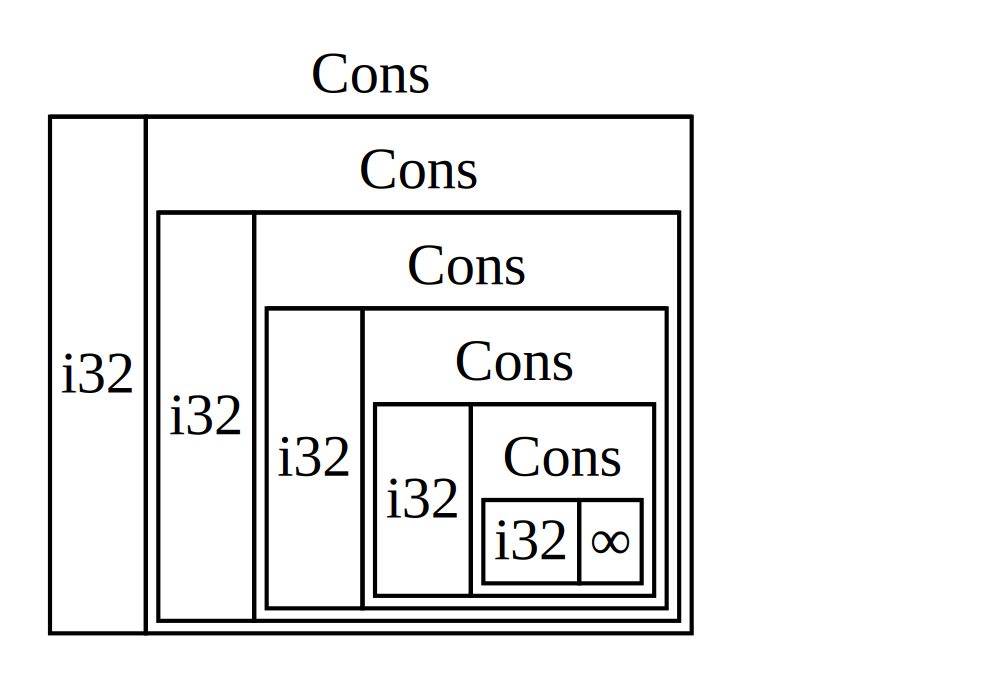

<style>
@import url('https://fonts.googleapis.com/css2?family=Noto+Sans+Mono:wght@100..900&family=Noto+Sans:ital,wght@0,100..900;1,100..900&display=swap');
section {
    font-family: "Noto Sans";
}
code {
    font-family: "Noto Sans Mono";
}
</style>

<!-- _class: communism invert  -->

## Intro to Rust Lang

# Smart Pointers and Trait Objects


---


# Today: Smart Pointers and Trait Objects

- Smart Pointers
- `Box<T>`
- The `Deref` trait
- The `Drop` trait
- Trait Objects


---


# Pointers

What is a pointer?

* A _pointer_ is a general concept for a variable that contains an address in memory.
* The address "points to" or "points at" some other data
* In Rust, the most common pointer is a reference (`&`)
* No overhead other than dereferencing


---


# Smart Pointers

What is a _smart pointer?_

* Data structures that act like a pointer
* Contain additional metadata and capabilities beyond dereferencing
* This concept is not unique to Rust (C++)


---


# Surprise!

We've actually seen several smart pointers, but we haven't called them as such.

* `String`
* `Vec<T>`
* `Box<T>`

<!--
String, for example, stores its capacity as metadata and has the extra ability to ensure its data
will always be valid UTF-8.
-->


---


# Let's Make a List


Let's say we wanted to make a recursive-style list:

```rust
enum List {
    Cons(i32, List),
    Nil,
}

fn main() {
    // List of [1, 2, 3]?
    let list = Cons(1, Cons(2, Cons(3, Nil)));
}
```

<!--
This should look familiar to people who have taken / are taking 15-150!
-->


---


# The Compiler's Suggestion

```
error[E0072]: recursive type `List` has infinite size
 --> src/main.rs:1:1
  |
1 | enum List {
  | ^^^^^^^^^
2 |     Cons(i32, List),
  |               ---- recursive without indirection
  |
help: insert some indirection (e.g., a `Box`, `Rc`, or `&`) to break the cycle
  |
2 |     Cons(i32, Box<List>),
  |               ++++    +
```

* The compiler is complaining because we've defined a type with _infinite size_


---


# Computing the Size of Types

Recall the Message enum we defined back in week 3:

```rust
enum Message {
    Quit,
    Move { x: i32, y: i32 },
    Write(String),
    ChangeColor(i32, i32, i32),
}
```

* How does Rust compute the size of this type?
  * _How much space do we need to allocate for a `Message` instance?_
* Simply choose the largest of its variants + some tag bits


---


# Size of Recursive Types?



What happens when we try to determine the size of a recursive type?

```rust
enum List {
    Cons(i32, List),
    Nil,
}
```

* Infinite size!


---


# Indirection with `Box<T>`

The compiler gives an error with a helpful suggestion:

```
help: insert some indirection (e.g., a `Box`, `Rc`, or `&`) to break the cycle
  |
2 |     Cons(i32, Box<List>),
  |               ++++    +
```

* The suggestion is to use a `Box<List>`
* In the suggestion, "indirection" means we store a _pointer_ to a `List`
* Pointers have fixed size, so our enum is no longer of infinite size!


---


# A Finite `List`


```rust
enum List {
    Cons(i32, Box<List>),
    Nil,
}
```

* Now we have a finite size!


---


# A Finite `List`

```rust
enum List {
    Cons(i32, Box<List>),
    Nil,
}

let end = Nil;
let three = Cons(3, Box::new(end));
let two = Cons(2, Box::new(three));
let one = Cons(1, Box::new(two));

println!("{:?}", one);
```

```
Cons(1, Cons(2, Cons(3, Nil)))
```

* Pop Quiz: How would we make this generic?


---


# A Finite Generic `List<T>`

```rust
enum List<T> {
    Cons(T, Box<List<T>>),
    Nil,
}

let end = Nil;
let three = Cons(3.3, Box::new(end));
let two = Cons(2.2, Box::new(three));
let one = Cons(1.1, Box::new(two));

println!("{:?}", one);
```

```
Cons(1.1, Cons(2.2, Cons(3.3, Nil)))
```


---


# More about `Box<T>`

* `Box<T>` is a simple "smart" pointer to memory allocated on the heap*
* `Box<T>` fully owns the data it points to (just like `Vec<T>`)
  * It is a "smart" pointer because it frees the data it owns when dropped
* Low overhead (other than allocation)

<!--
Technically the compiler is allowed to store data of Boxes on the stack if it wants to
-->


---


# When to use `Box<T>`

* When you have a type of unknown size **at compile time** (like `List`)
* When you have a large amount of data and want to transfer ownership
  * Transferring ownership of a pointer is faster than a large chunk of data
* Trait Objects
  * Coming soon...


<!--
The reasoning for why transferring ownership is faster is that data
won't need to be copied to another stack for example, just the pointer.
-->

---


# Using Values in the `Box`

```rust
let x = 5;
let y = Box::new(x);

assert_eq!(5, x);
assert_eq!(5, *y);
```
* Just like a reference we can dereference a `Box<T>` to get `T`
* `Box<T>` implements the `Deref` trait which customizes the behavior of `*`


---


# The `Deref` Trait

Implementing the `Deref` trait allows you to customize the behavior of the _dereference_ operator (`*`).

The deref trait is defined as follows:

```rust
pub trait Deref {
    type Target: ?Sized;

    // Required method
    fn deref(&self) -> &Self::Target;
}
```

* Behind the scenes `*y` is actually `*(y.deref())`
  * Note that this does not recurse infinitely
* We can treat anything that implements `Deref` like a pointer!


---


# The `Deref` Trait on `Box<T>`

```rust
impl<T: ?Sized, A: Allocator> Deref for Box<T, A> {
    type Target = T;

    fn deref(&self) -> &T {
        &**self
    }
}
```

* Don't worry about the generics, just focus on the `deref()` method!

<!--
This code is copied and pasted directly from the standard library
https://doc.rust-lang.org/std/boxed/struct.Box.html#impl-Deref-for-Box%3CT,+A%3E
-->


---


# Deref Coercion

Recall that we were able to coerce a `&String` into a `&str`. We can also coerce a `&Box<String>` into a `&str`!

```rust
fn hello(name: &str) {
    println!("Hello, {name}!");
}

let m: Box<String> = Box::new(String::from("Rust"));
hello(&m);
```

* Deref coercion converts a `&T` into `&U` if `Deref::Target = U`
* Example: Deref Coercion can convert a `&String` into `&str`
  * `String` implements the `Deref` trait such that `Deref::Target = &str`


---


# Deref Coercion Rules

Rust is able to coerce mutable to immutable but not the reverse.

* From `&T` to `&U` when `T: Deref<Target=U>`
* From `&mut T` to `&mut U` when `T: DerefMut<Target=U>`
* From `&mut T` to `&U` when `T: Deref<Target=U>`
* For more information, consult the [Rustonomicon](https://doc.rust-lang.org/nomicon/dot-operator.html)


---

# `&T` to `&U` Example

```rust
fn foo(s: &[i32]) {
    print(s[0])
}

// `Vec<T>` implements `Deref<Target=[T]>`.
let owned = vec![1, 2, 3];

// Here we coerce `&Vec<T>` to `&[T]`.
foo(&owned);

println!("{:?}", owned);
```

```
[1]
[1, 2, 3]
```

---

# `&mut T` to `&mut U` Example

```rust
fn foo(s: &mut [i32]) {
    s[0] += 1;
}

// `Vec<T>` implements `DerefMut<Target=[T]>`.
let mut owned = vec![1, 2, 3];

// Here we coerce `&mut Vec<T>` to `&mut [T]`.
foo(&mut owned);

println!("{:?}", owned);
```

```
[2, 2, 3]
```

* `DerefMut` also allows coercing to &[T]


---


# The `Drop` Trait

Smart pointers implement both `Deref` and the `Drop` trait.

The `Drop` trait customizes controls what happens when a value is about to go out of scope.

```rust
pub trait Drop {
    fn drop(&mut self);
}
```

* This allows for the RAII pattern (Resource Acquisition Is Initialization)
* Data cleans up after itself!


---


# The `Drop` Trait

Recall that values in Rust are dropped when they go out of scope.

```rust
pub trait Drop {
    fn drop(&mut self);
}
```

* Dropping a struct value will recursively drop all its fields by default
    * This mechanism allows for automatically freeing memory
* You can also provide a custom implementation of `Drop` on your types
    * Allows us to run user code when values are dropped

<!--
first bullet: RAII
your types -> specifically types declared in the crate per the orphan rule
-->

---


# `Drop` Trait Example

```rust
struct CustomSmartPointer {
    data: String,
}

impl Drop for CustomSmartPointer {
    fn drop(&mut self) {
        println!("Dropping `CustomSmartPointer` with data `{}`!", self.data);
    }
}
```

* This is a custom implementation that simply prints the data on drop
* The data will still be freed automatically
    * After `CustomSmartPointer::drop` is called, `String::drop` will be called


---


# `Drop` Trait Example

```rust
let c = CustomSmartPointer {
    data: String::from("my stuff"),
};

let d = CustomSmartPointer {
    data: String::from("other stuff"),
};

println!("CustomSmartPointers created.");
```

```
CustomSmartPointers created.
Dropping CustomSmartPointer with data `other stuff`!
Dropping CustomSmartPointer with data `my stuff`!
```
* Notice how values are dropped in _reverse order_ of creation

---


# `Drop` Trait Usage

`Drop` trait implementations are typically not needed unless:

* You are manually managing memory
    * This likely involves using `unsafe` under the hood
* You need to do something special before a value is dropped
    * Might involve managing OS resources
    * Might involve signalling other parts of your codebase


---


# Manual Drop


What if we want to manually drop a value before the end of the scope?

```rust
let csm = CustomSmartPointer {
    data: String::from("some data"),
};

println!("CSM created.");

csm.drop();

println!("CSM dropped before the end of the scope");
```


---


# Manual Drop

```
error[E0040]: explicit use of destructor method
  --> src/main.rs:16:7
   |
16 |     c.drop();
   |     --^^^^--
   |     | |
   |     | explicit destructor calls not allowed
   |     help: consider using `drop` function: `drop(c)`
```

* Rust won't let you explicitly call the drop trait method


---


# Manual Drop

```rust
let csm = CustomSmartPointer {
    data: String::from("some data"),
};
println!("CSM created.");

std::mem::drop(csm);

println!("CSM dropped before the end of the scope");
```

* This code works since we use `std::mem::drop` instead
* What's the difference?


---


# `std::mem::drop`

Here is the actual source code of `std::mem::drop` in the standard library:

```rust
pub fn drop<T>(_x: T) {}
```

* It takes ownership of `_x`, and then `_x` reaches the end of the scope and is dropped
    * Hence, calling this function drops it, on demand!

<!--
This is beautiful!!
https://doc.rust-lang.org/src/core/mem/mod.rs.html#942
-->


---


# **Object Oriented Programming**

* Well...
    * Not quite...


---


# What We Know So Far...

```rust
pub struct AveragedCollection {
    list: Vec<i32>,
    average: f64,
}

impl AveragedCollection {
    pub fn add(&mut self, value: i32) {
        self.list.push(value);
        self.update_average();
    }

    <-- snip -->
}
```
* Encapsulation within `impl` blocks and crates
* Public and private functions and methods with `pub`


---


# Inheritence?
Rust structs cannot "inherit" the implementations of methods or data fields from another struct...
* If we want to wrap another struct's functionality, we can use composition
* If we want to define interfaces, we can use traits
* If we want polymorphism...
    * Rust has something called "trait objects"

<!--
Composition is usually preferred in other languages nowadays too
--->

---


# Polymorphism

* Polymorphism != Inheritance
* Polymorphism == "Code that can work with multiple data types"
* In object oriented languages, polymorphism is usually expressed with classes
* Rust expresses polymorphism with generics and traits:
  * Generics are abstract over different possible types
  * Traits impose constraints on what behaviors types must have


---


# Trait Objects

Trait objects allow us to store objects that implement a trait.

```rust
pub trait Window {
    fn draw(&self);
}

pub struct LaptopScreen {
    pub windows: Vec<Box<dyn Window>>,
}
```

* In this example, `LaptopScreen` holds a vector of `Window` objects
* We use the `dyn` keyword to describe any type that implements `Window`
    * In a `Box`, since objects implementing `Window` could be of any size at runtime


<!--
key: Not size at compile time
Note that converting a type into a trait object _erases_ the original type
-->

---


# Trait Objects and Closures

Since closures implement the `Fn` traits, they can be represented as trait objects!

```rust
fn returns_closure() -> Box<dyn Fn(i32) -> i32> {
    Box::new(|x| x + 1)
}

fn main() {
    let closure = returns_closure();
    print!("{}", closure(5)); // prints 6
}
```

* We can use trait objects to return dynamic types
* Deref coercion happening in the background to keep ergonomics clean!


---


# Working With Trait Objects

```rust
struct ChromeWindow {
    width: u32,
    height: u32,
    evil_tracking: bool
}

struct FirefoxWindow {
    width: u32,
    height: u32,
}

impl Window for ChromeWindow { fn draw(&self) { ... } }
impl Window for FirefoxWindow { fn draw(&self) { .. } }
```

* Say we have **multiple** types that implement `Window`


---


# Working With Trait Objects: Dynamic Dispatch

```rust
impl LaptopScreen {
    pub fn run(&self) {
        // `windows` is of type Vec<Box<dyn Window>>
        for window in self.windows.iter() {
            window.draw();
        }
    }
}
```

* This is different than if `windows` was `Vec<ChromeWindow>`
  * The generic parameter (in `Vec`) is known at compile time.
* Trait objects allow for types to fill in for the trait object **at runtime**


---


# Generic Version

Why can't we implement this with generics?
<!--
Because we cannot create a 'LaptopScreen' with two different types of windows in it.
-->

```rust
pub struct LaptopScreen<T: Window> {
    pub windows: Vec<T>,
}

impl<T> LaptopScreen<T>
where
    T: Window,
{
    pub fn run(&self) {
        for window in self.windows.iter() {
            window.draw();
        }
    }
}
```

---

# Trait Objects: Mixing Objects

```rust
let screen = LaptopScreen {
    windows: vec![
        Box::new(ChromeWindow {
            width: 1280,
            width: 720,
            evil_tracking: true,
        }),
        Box::new(FirefoxWindow {
            <-- snip -->
        }),
    ],
};
screen.run();
```

* This is not possible with the version using generics


---


# Aside: Dynamically Sized Types

* `dyn Window` is an example of a dynamically sized type (DST)
* DSTs have to be in a `Box`, because we don't know the size at compile time
    * A `dyn Window` could be a `ChromeWindow` or `FirefoxWindow` object
    * How much space should we make on the stack?
* Pointers to DSTs are double the size (wide pointers)
    * If you're interested in more information, ask us after lecture!


---

# Smart Pointers

---

# What is a smart pointer?
* Wraps around some data and acts as a pointer to it.
  * While offering extra functionality and information.
* We've already seen some!
  * Box<T>, String, Vec<T>.
* Many kinds of smart pointer in Rust.
  * We will cover `Rc<T>` and `RefCell<T>`.

---

# **Motivation for `Rc<T>`**


---


# Let's Make a List (again)
Let's continue making the recursive-style list from the beginning of lecture with `Box<T>`.

```rust
enum List {
  Cons(i32, Box<List>),
  Nil,
}

fn main() {
  let a = Cons(5, Box::new(Cons(10, Box::new(Nil))));
  let b = Cons(3, Box::new(a));
  let c = Cons(4, Box::new(a));
}
```


---


# Cargo's Suggestion

```
   Compiling cons-list v0.1.0 (file:///projects/cons-list)
error[E0382]: use of moved value: `a`
  --> src/main.rs:11:30
   |
9  |     let a = Cons(5, Box::new(Cons(10, Box::new(Nil))));
   |         - move occurs because `a` has type `List`, which does not implement the `Copy` trait
10 |     let b = Cons(3, Box::new(a));
   |                              - value moved here
11 |     let c = Cons(4, Box::new(a));
   |                              ^ value used here after move

```
* `Cons` needs to **own** the data it holds
* We want both `b` and `c` to point to the same instance `a`
    * `a` was already moved into `b` when we create `c`

<!--
Cloning is expensive + then b and c refer to different tails---no cloning!
-->


---


# References?

```rust
enum List<'a> {
    Cons(i32, &'a List<'a>),
    Nil,
}

use crate::List::{Cons, Nil};

fn main() {
  let nil = Nil;
  let a = Cons(10, &nil);
  let b = Cons(5, &a);
  let c = Cons(3, &a);
  let d = Cons(4, &a);
}
```
* This can be fixed with references, but it's a little messy!

---


# Introducing `Rc<T>`!

```rust
enum List {
  Cons(i32, Rc<List>),
  Nil,
}

use crate::List::{Cons, Nil};
use std::rc::Rc;

fn main() {
  let a = Rc::new(Cons(5, Rc::new(Cons(10, Rc::new(Nil)))));
  let b = Cons(3, Rc::clone(&a));
  let c = Cons(4, Rc::clone(&a));
}
```
* Why does using `Rc<T>` instead of `Box<T>` fix the code?


---


# `Rc<T>`: Reference Counted
`Rc<T>` keeps track of the number of references to a value to ensure safety.
* When an `Rc` is cloned, increment reference count.
* When an `Rc` is dropped, decrement reference count.
* When the reference count reaches zero, free the memory.
* **Importantly:** `Rc::clone()` isn't a deep clone.
    * It just increments the counter.


---


# When to use `Rc<T>`

* To share one instance of allocated memory throughout the program
    * We can only access the data as read-only
    * We don't need to know what part of the program is going to use it last
* Only use for single-threaded scenarios
    * `Rc<T>` is not thread safe
    * `Arc<T>` for multi-threaded (more on that soon)


---


# `Rc<T>` Reference Counting Demonstrated


```rust
fn main() {
    let a = Rc::new(String::new("TODO: Steal Connor's identity"));
    // Ref count after creating a: 1

    let b = Rc::clone(&a);
    // Ref count after creating b: 2

    {
        let c = Rc::clone(&a);
        // Ref count after creating c: 3
    }
    // Ref count after dropping c: 2
}
// Ref count after dropping b and c: 0
```

---


# `Rc<T>` Recap

* Allows sharing ***immutable*** references without lifetimes
* Should be used when the last user of the data is unknown
* Very low overhead for providing this capability
  * O(1) increment/decrement of counter
  * Potential allocation/de-allocation on heap
* Implemented using the `Drop` trait and `unsafe`!

<!---
second line: Should be used when last user of the data is unknown
-->
---


# **`RefCell<T>` (and Interior Mutability)**


---


# First, `Cell<T>`

```rust
use std::cell::Cell;

let c1 = Cell::new(5i32);
c1.set(15i32);

let c2 = Cell::new(10i32);
c1.swap(&c2);

assert_eq!(10, c1.into_inner()); // consumes cell
assert_eq!(15, c2.get()); // returns copy of value
```
* A shareable, mutable container, where values can be moved in and out of the cell.
* Used for `Copy` types, (where copying or moving values isn’t too resource intensive).

---


# `RefCell<T>`

* Has sole ownership, like `Box<T>`.
* Allows borrow checker rules to be enforced at **runtime** (rather than compile time).
  * Interface with `.borrow()` or `borrow_mut()`.
  * Will `panic!` at runtime if borrowing rules are violated.
* Typically used when Rust's conservative compile-time checking "gets in the way".
* It is **not** thread safe!
  * Use `Mutex<T>` instead.


---


# Interior Mutability

```rust
fn main() {
  let x = 5;
  let y = &mut x; // cannot borrow immutable x as mutable
}
```

* It would be useful for a value to mutate itself in its methods but appear immutable to other code.
  * This is called *interior mutability*.
* Code outside the value's methods wouldn't be able to mutate it.
* This can be achieved with `RefCell<T>`.


---


# Interior Mutability with Mock Objects

```rust
pub trait Messenger {
    // Note this takes &self and not &mut self
    fn send(&self, msg: &str);
}

pub struct LimitTracker<'a, T: Messenger> {
    messenger: &'a T,
    value: usize,
    max: usize,
}
```

* `LimitTracker` tracks a value against a maximum value and sends messages based on how close to the maximum value the current value is.
* We want to mock a messenger for our limit tracker to keep track of messages *for testing* `LimitTracker`.


---


# Limit Tracker
```rust
impl<'a, T> LimitTracker<'a, T>
where
    T: Messenger,
{
    // --- snip ---
    pub fn set_value(&mut self, value: usize) {
        self.value = value;

        let percentage_of_max = self.value as f64 / self.max as f64;

        if percentage_of_max >= 1.0 {
            self.messenger.send("Error: You are over your quota!");
        } else if percentage_of_max >= 0.9 {
            self.messenger
                .send("Urgent warning: You've used up over 90% of your quota!");
        } // --- snip ---
    }
}
```
<!--
Important to point out the send method on messenger, which takes an IMMUTABLE reference to self.
-->

---


# Our Mock Messenger


```rust
struct MockMessenger {
  sent_messages: Vec<String>,
}

impl MockMessenger {
  fn new() -> MockMessenger {
    MockMessenger { sent_messages: vec![] }
  }
}

impl Messenger for MockMessenger {
  fn send(&self, message: &str) {
    self.sent_messages.push(String::from(message));
  }
}
```
---
# Our Mock Messenger
```
$ cargo test
   Compiling limit-tracker v0.1.0 (file:///projects/limit-tracker)
error[E0596]: cannot borrow `self.sent_messages` as mutable, as it is behind a `&` reference
  --> src/lib.rs:58:13
   |
58 |             self.sent_messages.push(String::from(message));
   |             ^^^^^^^^^^^^^^^^^^ `self` is a `&` reference, so the data it refers to cannot be borrowed as mutable
   |
help: consider changing this to be a mutable reference in the `impl` method and the `trait` definition
   |
2  ~     fn send(&mut self, msg: &str);
3  | }
...
56 |     impl Messenger for MockMessenger {
57 ~         fn send(&mut self, message: &str) {
   |

For more information about this error, try `rustc --explain E0596`.
error: could not compile `limit-tracker` (lib test) due to 1 previous error

```
* We shouldn't follow compiler instructions and change the `Messenger` trait just for testing purposes.


---


# Let's Use Interior Mutability

```rust
use std::cell::RefCell;

struct MockMessenger {
  sent_messages: RefCell<Vec<String>>,
}

impl MockMessenger {
  fn new() -> MockMessenger {
    MockMessenger {
      sent_messages: RefCell::new(vec![]),
    }
  }
}

impl Messenger for MockMessenger {
  fn send(&self, message: &str) {
    self.sent_messages.borrow_mut().push(String::from(message));
  }
}
```


---


# Managing Borrows at Runtime
*Recall:* `RefCell<T>` manages borrow checking at runtime, not compile time.
* Like `Rc<T>`, keeps track of references with a counter.
* To borrow immutably: use `.borrow`, which returns `Ref<T>`, which implements `Deref`
* To borrow mutably: use `.borrow_mut`, which returns `RefMut<T>`, which implements `DerefMut`
* Deref coercion applies: can be treated as standard references.

---

# Managing Borrows at Runtime


```rust
impl Messenger for MockMessenger {
  fn send(&self, message: &str) {
    let mut one_borrow = self.sent_messages.borrow_mut();
    let mut two_borrow = self.sent_messages.borrow_mut();

    one_borrow.push(String::from(message));
    two_borrow.push(String::from(message));
  }
}
```

---
# Managing Borrows at Runtime

```
$ cargo test
   Compiling limit-tracker v0.1.0 (file:///projects/limit-tracker)
    Finished `test` profile [unoptimized + debuginfo] target(s) in 0.91s
     Running unittests src/lib.rs (target/debug/deps/limit_tracker-e599811fa246dbde)

running 1 test
test tests::it_sends_an_over_75_percent_warning_message ... FAILED

failures:

---- tests::it_sends_an_over_75_percent_warning_message stdout ----
thread 'tests::it_sends_an_over_75_percent_warning_message' panicked at src/lib.rs:60:53:
already borrowed: BorrowMutError
note: run with `RUST_BACKTRACE=1` environment variable to display a backtrace


failures:
    tests::it_sends_an_over_75_percent_warning_message

test result: FAILED. 0 passed; 1 failed; 0 ignored; 0 measured; 0 filtered out; finished in 0.00s

error: test failed, to rerun pass `--lib`
```


---


# Checkpoint: What Makes Each Smart Pointer Unique


* `Rc<T>`: Allows multiple read-only owners of the same data.
* `Box<T>`: Allows immutable/mutable borrows that are checked at compile time.
* `RefCell<T>`: Allows immutable/mutable borrows that are checked at ***runtime***.


---


# Combining Smart Pointers: `Rc<RefCell<T>>`

```rust
#[derive(Debug)]
enum List {
  Cons(Rc<RefCell<i32>>, Rc<List>),
  Nil,
}
```

* Common type seen in Rust.
* Enables multiple owners of mutable data (with runtime checks).
* Extremely powerful, but comes with some overhead.


---

# `Rc<RefCell<T>>` List

```rust
let value = Rc::new(RefCell::new(5));

let a = Rc::new(Cons(Rc::clone(&value), Rc::new(Nil)));

let b = Cons(Rc::new(RefCell::new(3)), Rc::clone(&a));
let c = Cons(Rc::new(RefCell::new(4)), Rc::clone(&a));

*value.borrow_mut() += 10;

println!("a after = {:?}", a);
println!("b after = {:?}", b);
println!("c after = {:?}", c);
```
```
a after = Cons(RefCell { value: 15 }, Nil)
b after = Cons(RefCell { value: 3 }, Cons(RefCell { value: 15 }, Nil))
c after = Cons(RefCell { value: 4 }, Cons(RefCell { value: 15 }, Nil))
```
<!--
This demonstrates that this smart pointer combo can be used to create a data structure which can have multiple owners and also have interior mutability.
-->

---


# Let's Try Another List

```rust
enum List {
  Cons(i32, RefCell<Rc<List>>),
  Nil,
}

impl List {
  fn tail(&self) -> Option<&RefCell<Rc<List>>> {
    match self {
      Cons(_, item) => Some(item),
      Nil => None,
    }
  }
}
```
* This implementation allows modifying the list *structure* instead of list *values*.
* Now we have a function `tail` that gets the rest of our list.


---


# What Happens Here?

```rust
let a = Rc::new(Cons(5, RefCell::new(Rc::new(Nil))));

println!("a initial rc count = {}", Rc::strong_count(&a));
println!("a next item = {:?}", a.tail());

let b = Rc::new(Cons(10, RefCell::new(Rc::clone(&a))));

println!("a rc count after b creation = {}", Rc::strong_count(&a));
println!("b initial rc count = {}", Rc::strong_count(&b));
println!("b next item = {:?}", b.tail());

if let Some(link) = a.tail() {
  *link.borrow_mut() = Rc::clone(&b);
}

println!("b rc count after changing a = {}", Rc::strong_count(&b));
println!("a rc count after changing a = {}", Rc::strong_count(&a));

println!("a next item = {:?}", a.tail());
```


---


# A Reference Cycle

```
Exited with signal 6 (SIGABRT): abort program

a initial rc count = 1
a next item = Some(RefCell { value: Nil })
a rc count after b creation = 2
b initial rc count = 1
b next item = Some(RefCell { value: Cons(5, RefCell { value: Nil }) })
b rc count after changing a = 2
a rc count after changing a = 2
a next item = Some(RefCell { value: Cons(10, RefCell { value: Cons(5, RefCell...
```

* We see that at the end we have a reference cycle!
    * The lists continue to point to each other with no stopping point.


---


# Let's Look Closer
```rust
let a = Rc::new(Cons(5, RefCell::new(Rc::new(Nil))));
// a is Cons(5, Nil)

let b = Rc::new(Cons(10, RefCell::new(Rc::clone(&a))));
// b is Cons(10, a) = Cons(10, Cons(5, Nil))

if let Some(link) = a.tail() {
    // link is Nil (pointed to by a)
    *link.borrow_mut() = Rc::clone(&b);
    // link is now b = Cons(10, a)
}
// a = Cons(5, link) = Cons(5, b) = Cons(5, Cons(10, a))
// ^^^ reference cycle of a made!
```

* This can cause a memory leak!
  * `Rc<T>` only frees when the `strong_count` (e.g., reference count) is 0.


---
---

# Introducing`Weak<T>`

* Currently, `Rc<T>` counts the number of *strong references*
* Think of `strong_count` as the number of votes against it being dropped
* We want *weak references*, which don't have this voting power


# Mechanism of`Weak<T>`

* Creating a weak reference increments `weak_count`
* When you want to access a weak reference, you _upgrade_ it to a strong reference
* If the value has not been dropped, the upgrade succeeds, and `weak_count` is decremented in favor of `strong_count`
* Otherwise, the counts are unaffected


---


# Avoiding Reference Cycles with `Weak<T>`

* We know `Rc::clone` increases the `strong_count`.
* You can create a `Weak<T>` reference to a value with `Rc::downgrade`.
  * This increases the `weak_count` and can be nonzero when the `Rc` is freed.
* To ensure valid references, `Weak<T>` must be upgraded before any use.
  * Returns an `Option<Rc<T>>`.


---


# `Weak<T>` Trees

```rust
use std::cell::RefCell;
use std::rc::{Rc, Weak};

#[derive(Debug)]
struct Node {
  value: i32,
  parent: RefCell<Weak<Node>>,
  children: RefCell<Vec<Rc<Node>>>,
}
```
<!--
Main point is that parent is a weak<t> and children are rc<t>.
-->


---


# `Weak<T>` Trees In Action

```rust
fn main() {
  let leaf = Rc::new(Node {
    value: 3,
    parent: RefCell::new(Weak::new()),
    children: RefCell::new(vec![]),
  });

  println!("leaf parent = {:?}", leaf.parent.borrow().upgrade());

  let branch = Rc::new(Node {
    value: 5,
    parent: RefCell::new(Weak::new()),
    children: RefCell::new(vec![Rc::clone(&leaf)]),
  });

  *leaf.parent.borrow_mut() = Rc::downgrade(&branch);

  println!("leaf parent = {:?}", leaf.parent.borrow().upgrade());
} // Tree is effectively dropped even with parent references!
```


---


# Recap

- `Box<T>`
- The `Deref` trait
- The `Drop` trait
- Trait Objects
- Smart Pointers

---


# Next Lecture: Unsafe


Thanks for coming!

<br>

_Slides created by:_
Connor Tsui, Benjamin Owad, David Rudo,
Jessica Ruan, Fiona Fisher, Terrance Chen
