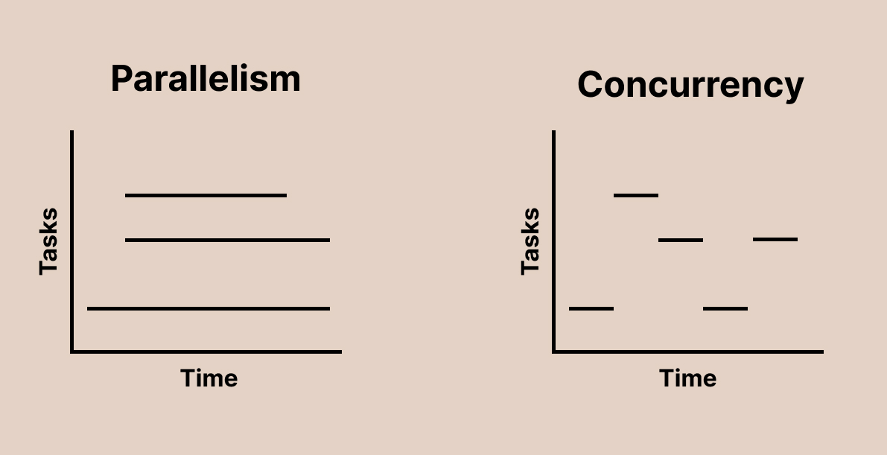

<!-- _class: communism communism2 invert  -->

## Intro to Rust Lang
# Parallelism

<br>

Benjamin Owad, David Rudo, and Connor Tsui

<!--  -->

---

# Parallelism vs. Concurrency

<div class="columns">
<div>

## Parallelism

- Work on multiple tasks at the same time
- Utilizes multiple processors/cores

</div>
<div>

## Concurrency

- Manage multiple tasks, but only do one thing at a time.
- Better utilizes a single processor/core

</div>
</div>
<center>

* These terms are used (and abused) interchangably

</center>

---

# Parallelism vs. Concurrency




---

# Parallelism vs. Concurrency
<div class="columns">
<div>

## Parallelism


</div>
<div>

## Concurrency


</div>
</div>

---

# Parallelism vs. Concurrency (Examples)
<div class="columns">
<div>

## Parallelism


- Have one processor work on loading the webpage, while another updates the progress bar
* Often used to divide tasks into smaller units that can run at the same time
  * e.g. Processing 100x100px regions of an image on each core
  * "Divide and conquer"
</div>
<div>

## Concurrency

* As we load a webpage, take a break sometimes to update the loading progress bar
* Often used to do other things while we wait for blocking I/O operations
  * e.g. Running garbage collection while we wait for a response over the network

</div>
</div>

---


# Today: Parallelism
- Threading
- Basic Synchronization
- Message Passing
- `Send` and `Sync`
- More Synchronization Primitives


---

# Terminology: Threads

* Dangerously overloaded term—can mean one of many things
* For this lecture, we define it as a "stream of instructions"
* **Key point:** Threads share the same resources

---

# Sharing Resources

```c
static int x = 0;

static void thread(void) {
  x++; // load instruction + store instruction (not atomic)
}
// <!-- snip -->
for (int i = 0; i < 20; ++i) {
  create_thread(thread);
}
```

* What is the value of `x` after we join on all 20 threads?
  * What is the next slide's title going to be?

<!-- Define atomic verbally -->
---

# Race Conditions
When multiple threads have access to the same data, things get complicated...

---

# The Bad Slide

| Thread 1      |   Thread 2    |
|---------------|---------------|
| %rax ←x (0)   |               |
|               | %rax ←x (0)   |
| %rax += 1 (1) |               |
|               | %rax += 1 (1) |
| x ← %rax (1)  |               |
|               | x ← %rax (1)  |

* Uh oh...

<!--
Is that working correctly? Look at the code—it's doing exactly what it is supposed to do. Maybe we weren't specific enough...
-->

---

# Synchronization

To make sure instructions happen in a reasonable order, we need to establish *mutual exclusion*, so that threads don't interfere with each other.

---


# Sharing Resources With Mutual Exclusion

```c
static int x = 0;
static mtx_t x_lock;

static void thread(void) {
  mtx_lock(&x_lock);
  x++; // load instruction + store instruction (not atomic)
  mtx_unlock(&x_lock);
}
// <!-- snip -->
```
- Only one thread can hold the mutex lock at a time

- This provides *mutual exclusion*--only one thread may access `x` at the same time.

---

# Back to Rust
* Rust's typechecker guarantees an absence of *data races*
  * (Unless you use unsafe)
* General race conditions are not prevented
* Deadlocks are still allowed

<!-- In my opinion, this is the single best reason to use this language -->

---

# Sharing Resources in Rust


Here's the C code from before, turned into Rust directly.

```rust
let mut x = 0;

for _ in 0..20 {
    thread::spawn(|| {
        x += 1;
    }); // Thread bodies are closures
}
```
* A sea of errors ensues, but the key idea is that this violates one of our rules.
  * We can't have multiple mutable references at the same time!

---

# Mutexes in Rust

Unlike in C, mutexes in Rust actually *wrap* values.

```rust
let x = Mutex::new(0);
let x_data = x.lock().unwrap();
```
* This allows the typechecker to verify that the lock is acquired before accessing a value (and eliminates a class of bugs)
* `x_data` is a `MutexGuard` type.
  * It has deref coercion, so one can operate on it just like it was the actual data
* When `x_data` is dropped, the mutex will be unlocked.
* `lock` may return an error if another thread panics


---

# Sharing Resources in Rust, with Mutexes!


Here's our code from before, with mutexes incorporated

```rust
let x = Mutex::new(0);

for _ in 0..20 {
    thread::spawn(|| {
        let mut data = x.lock().unwrap();
        *data += 1;
    });
}
```
* What is wrong now?
  * What if the main function ends? It owns `x`, so the thread references to `x` will be invalid...
* How can we have multiple owners?

---

# Multiple Mutable References

Recall `Rc<T>` from last lecture.
* `Rc<T>` works like `Box<T>`, providing a "spiritually heap-allocated" value.
* The difference is, `Rc<T>` has an internal reference count, and the heap allocated value will only be dropped when the reference count reaches zero.
* The only problem is, `Rc<T>` is not thread safe...

<!-- Make sure people know about reference counts -->

---

# `Arc<T>`

"Arc" stands for "Atomically Reference Counted". This means, it is thread-safe, at the cost of slightly slower operations.
* General advice: default to using `Rc<T>`, and switch to `Arc<T>` if you need to share ownership across threads.

---

# Sharing Resources in Rust, with Multiple Ownership!

```rust
let x = Arc::new(Mutex::new(0));

for _ in 0..20 {
    let x_clone = Arc::clone(&x);
    thread::spawn(move || {
        let mut data = x_clone.lock().unwrap();
        *data += 1;
    });
}
```
* Notice that we `move` each clone of `x` into each thread, taking ownership of it
* Each thread has a pointer to the mutex
  * The mutex is not deallocated until all of the `Arc`s pointing to it are dropped (and the reference count is zero)

---

# The Good Slide

```rust
let x = Arc::new(Mutex::new(0));
let mut handles = vec![];

for _ in 0..20 {
    let x_clone = Arc::clone(&x);
    handles.push(thread::spawn(move || {
        let mut data = x_clone.lock().unwrap();
        *data += 1;
    }));
}

for handle in handles { handle.join().unwrap(); } // Wait for all threads
println!("Final value of x: {}", *x.lock().unwrap());
```
* `x` is 20, *every time*.
  * And it is illegal for it to be anything else in safe Rust.

---

# Parallelism Checkpoint
Up until now, we have been talking about parallelism with *shared state*. Let's shift gears and talk about *message passing*.

---

# Message Passing

Rather than sharing state between threads, an increasingly popular approach to safe concurrency is message passing.
* In this approach, threads communicate with each other through channels
* Golang famously utilizes this approach


---

# Message Passing Example

```rust
let (tx, rx) = mpsc::channel();
```
* Channels have two halves, a transmitter and a receiver
* Connor writes "Review the ZFOD PR" on a rubber duck and it floats down the river (transmitter)
  * Ben finds the duck downstream, and reads the message (receiver)
* Note that communication is one-way here
* Note also that each channel can only transmit/receive one type
  * e.g. `Sender<String>`, `Receiver<String>` can't transmit integers

---

# Message Passing Example

```rust
let (tx, rx) = mpsc::channel();

thread::spawn(move || { // Take ownership of `tx`
    let val = String::from("review the ZFOD PR!");
    tx.send(val).unwrap(); // Send val through the transmitter
});

let received = rx.recv().unwrap(); // receive val through the receiver
println!("I am too busy to {}!", received);
```
* Note that, after we send `val`, we no longer have ownership of it!

---

# Message Passing Example
We can also use receivers as iterators!

```rust
let (tx, rx) = mpsc::channel();

thread::spawn(move || { // Take ownership of `tx`
    let val = String::from("review the ZFOD PR!");
    tx.send(val).unwrap(); // Send val through the transmitter
    tx.send("buy Connor lunch".into()).unwrap();
});

for msg in rx {
  println!("I am too busy to {}!", msg);
}
```
* Wait, what does `mpsc` stand for?

---

# `mpsc` ⟹ Multiple Producer, Single Consumer

This means we can `clone` the transmitter end of the channel, and have *multiple producers*.

```rust
let (tx, rx) = mpsc::channel();

let tx1 = tx.clone();
thread::spawn(move || { // owns tx1
      tx1.send("yo".into()).unwrap();
      thread::sleep(Duration::from_secs(1));
});

thread::spawn(move || { // owns tx
      tx.send("hello".into()).unwrap();
      thread::sleep(Duration::from_secs(1));
});

for received in rx {
    println!("Got: {}", received);
}
```

---

# `Send` and `Sync`

---

# `Send` and `Sync`

Everything we have gone over so far is a *standard library* feature. The language itself provides two marker traits to enforce safety when dealing with multiple threads, `Send` and `Sync`.


<!-- Marker trait == no implementation, signal to the compiler -->

---

# `Send` vs. `Sync`


## `Send`

* Indicates that the type is safe to *send* between threads.
* `Rc<T>` does not implement this trait, because it is not thread safe.


## `Sync`

* Indicates that the type implementing `Send` can be referenced from multiple threads
* For example, `RefCell<T>` from last lecture implements `Send` but not `Sync`
* `Rc<T>` does not implement `Sync` either

<!-- MutexGuard implements Sync, but not Send, actually! -->


---

# Using `Send` and `Sync`
* It is generally rare that you would implement these traits yourself
  * Structs containing all `Send`/`Sync` types automatically derive `Send`/`Sync`
  * Explicitly implementing either one requires using `unsafe`
* This would be an example of a trait you might want to *unimplement*
  * e.g. If you are doing something with `unsafe` that is not thread-safe
  * `impl !Send for CoolType<T> {}`

<!-- Notice this negative impl is not unsafe-->

---

# More Shared State Primitives

---

# `RwLock<T>` (Reader-Writer Lock)

A reader-writer lock is like a mutex, except it allows concurrent access between readers (not writers).
* We can acquire a read lock (or shared lock)
  * Can be held by multiple readers at once
  * No writers can hold the lock
* We can acquire a write lock (or exclusive lock),
  * Can be held by only one writer
  * No readers can hold the lock

---

# `RwLock<T>` Example

```rust
let shared_data = Arc::new(RwLock::new(Vec::<i32>::new()));

// All of the readers can hold the read lock simultaneously
for _ in 0..5 {
    let shared_data_clone = Arc::clone(&shared_data);
    thread::spawn(move || {
        let data = shared_data_clone.read().unwrap();
        println!("Reader: {:?}", *data);
    });
}

// The writer has to be the only one with the lock
let shared_data_clone = Arc::clone(&shared_data);
thread::spawn(move || {
    let mut data = shared_data_clone.write().unwrap();
    data.push(42);
    println!("Writer: {:?}", *data);
});
```

---

# Even More  Primitives

* `CondVar<T>`—release a mutex and atomically wait to be signaled to re-acquire it
* `Barrier`—Memory barrier, allows multiple threads to wait at a certain point, until all relevant threads reach that point
* `Weak<T>`—downgraded version of `Rc` or `Arc` that holds a pointer, but does not count as an owner.
  * Retrieving the value can fail, if it has been deallocated already.

---

# One more thing...

---

# `std::sync::atomic`

Rust provides atomic primitive types, like `AtomicBool`, `AtomicI8`, `AtomicIsize`, etc.
* Safe to share between threads (implementing `Sync`), providing ways to access the values atomically from any thread
* 100% lock free, using bespoke assembly instructions
* Highly performant, but very difficult to use
* Requires an understanding of *memory ordering*—one of the most difficult topics in computer systems
* We won't cover it further in this course, but the API is largely 1:1 with the C++20 atomics.

---

# Next Lecture: Concurrency


- Including `async`/`await`!
- Thank you for coming!