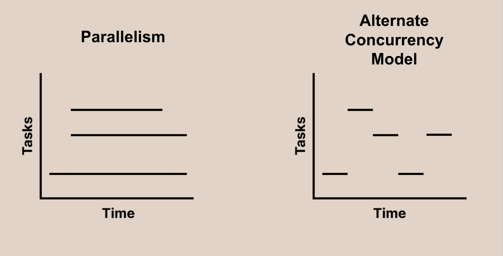

<style>
@import url('https://fonts.googleapis.com/css2?family=Noto+Sans+Mono:wght@100..900&family=Noto+Sans:ital,wght@0,100..900;1,100..900&display=swap');
section {
    font-family: "Noto Sans";
}
code {
    font-family: "Noto Sans Mono";
}
</style>

<!-- _class: communism invert  -->

## Intro to Rust Lang

# Parallelism


---


# Today: Parallelism

- Parallelism vs Concurrency
  - Workers, Processes, and Threads
- Multithreading
- Mutual Exclusion
- Atomics
- Message Passing
- `thread::scope`
- `Arc`


---


# Parallelism vs Concurrency

## Concurrency

**Problem** of handling many tasks at once


## Parallelism

**Solution** of working on multiple tasks at the same time

* **Key difference:** Parallelism utilizes **multiple** workers


---


# Workers

Parallelism divides tasks among workers.

* In hardware, we call these workers **processors** and **cores**
* In software, workers are abstracted as **processes** and **threads**
  * Processes contain many threads
* Parallelism requires **multiple** workers
  * Concurrency models can have any number of workers!

<!-- Note:
21st century relevance of parallelism is due to the slowing of Moore's Law
=> fall on software optimizations to squeeze performance out of cores

Emphasize that parallel programming is more like a workaround to hardware constraints,
rather than the inherent goal.
Don't overindex on the quirks of particular parallel programming frameworks;
the ultimate goal is still to advance technology s.t. parallel programming becomes
invisible to the programmer
-->


---


# Parallelism vs. Concurrency




---


# Designing Parallel Solutions

There are two important questions we need to ask

* Division of labour
  * Who are the workers and how do we divide the work?
* Thread communication
  * What information needs to be shared and how?
    * Approach 1: Shared Memory
    * Approach 2: Message Passing


---


# Multithreading

For today, we will simplify terminology that can be overloaded.

* Our workers are _threads_
* You can think of threads as a "stream of instructions"

<!--Speaker note:
Same principles can be applied to multiprocessing
Emphasize that "thread" can be an overloaded term
-->


---


# The Main Thread

The thread that runs by default is the main thread.

```rust
fn main() {
    for i in 1..8 {
        println!("Main thread says: Hello {i}!");
        thread::sleep(Duration::from_millis(1));
    }
}
```

* So far, we have only been running code on the main thread!


---


# Spawning a Thread

We can create (spawn) more threads using `std::thread::spawn`.

```rust
fn main() {
    let child_handle = thread::spawn(|| {
        for i in 1..=8 {
            println!("Child thread says: Hello {i}!");
            thread::sleep(Duration::from_millis(1));
        }
    });

    for i in 1..=3 {
        println!("Main thread says: Hello {i}!");
        thread::sleep(Duration::from_millis(1));
    }
}
```

<!--
Omitted some code at the top:
```
use std::thread;
use std::time::Duration;
```
-->


---


# Spawning a Thread

```rust
let child_handle = thread::spawn(|| {
    for i in 1..=8 {
        println!("Child thread says: Hello {i}!");
        thread::sleep(Duration::from_millis(1));
    }
});

for i in 1..=3 {
    println!("Main thread says: Hello {i}!");
    thread::sleep(Duration::from_millis(1));
}
```

* `thread::spawn` takes a `FnOnce` closure
  * The closure will be run on the newly-created thread
* Question: What should this program's output be?

<!--Speaker note: Ask students what they believe the output of this program is. Want to demonstrate the nondeterministic nature of threads. -->


---


# Possible Output 1

Here is one possible program output:

```
Main thread says: Hello 1!
Child thread says: Hello 1!
Child thread says: Hello 2!
Main thread says: Hello 2!
Child thread says: Hello 3!
Main thread says: Hello 3!
Child thread says: Hello 4!
Child thread says: Hello 5!
```

---


# Possible Output 2

Here is another possible program output:

```
Main thread says: Hello 1!
Child thread says: Hello 1!
Main thread says: Hello 2!
Main thread says: Hello 3
```

<!--
Note that this _probably_ won't happen, but it could!
-->


---


# Possible Output 3

And here is yet another possible program output!

```
Main thread says: Hello 1!
Child thread says: Hello 1!
Main thread says: Hello 2!
Child thread says: Hello 2!
Main thread says: Hello 3!
Child thread says: Hello 3!
```

* What's going on here?


---


# Multithreaded Code is Non-Deterministic

* Most of the code we have written this semester has been deterministic
* The only counterexamples have been when we've used random number generators or interacted with I/O
* The execution of multi-threaded code can interleave with each other in undeterminable ways!


---


# Multithreaded Code is Non-Deterministic

In this example, the child thread can interleave its prints with the main thread.

```rust
let child_handle = thread::spawn(|| {
    for i in 1..=8 {
        println!("Child thread says: Hello {i}!");
        thread::sleep(Duration::from_millis(1));
    }
});

for i in 1..=3 {
    println!("Main thread says: Hello {i}!");
    thread::sleep(Duration::from_millis(1));
}
```

* Why doesn't the child thread always print "Hello" 8 times?


---


# Process Exit `SIGKILL`s Threads

* When the main thread finishes execution, the process it belongs to exits
* Once the process exits, all threads in the process are `SIGKILL`ed
* If we want to let our child threads finish, we have to wait for them!


---


# Joining Threads

We can `join` a thread when we want to wait for it to finish.

```rust
// Spawn the child thread.
let child_handle = thread::spawn(|| time_consuming_function());

// Run some code on the main thread.
main_thread_foo();

// Wait for the child thread to finish running.
child_handle.join().unwrap();
```

* `join` will block the calling thread until the child thread finishes
  * In this example, the calling thread is the main thread

<!-- Speaker note: Ask again what students believe will happen with this program. -->


---


# Joining Threads

If we go back to our original example and add a `join` on the child's handle at the end of the program, then the child thread can run to completion!

```
Main thread says: Hello 1!
Child thread says: Hello 1!
Main thread says: Hello 2!
Child thread says: Hello 2!
Main thread says: Hello 3!
Child thread says: Hello 3!
Child thread says: Hello 4!
Child thread says: Hello 5!
Child thread says: Hello 6!
Child thread says: Hello 7!
Child thread says: Hello 8!
```


---


# Example: Multithreaded Drawing

Suppose we're painting an image to the screen, and we have eight threads.

How should we divide up the work between the threads?

* Divide image into eight regions
* Assign each thread to paint one region
* Easy! "Embarrassingly parallel"
  * Threads don't need to keep tabs on each other

<!--Speaker note:
"Embarrassingly parallel" refers to problems where
we can easily utilize our hardware in full,
usually because tasks are super independent

Each thread retires to their cave
  to paint all day,
  not too different from modern artists
-->


---


# Example: Multithreaded Drawing


What if our image is more complex?

* We could be painting semi-transparent circles
* Circles could overlap and/or could be constantly moving
* The _order_ in which we paint circles changes the colors of pixels

<!--
This is also known as the painter's algorithm
-->


---


# The Case for Communication

If we want a consistent drawings, we need a way for our threads to talk / communicate with each other!

* For each pixel:
  * Which color circle should it draw?
  * How many circles have been drawn on this pixel?
  * Do we need to wait for other circles to finish being drawn?
* Simplification for today: each pixel tracks how many circles it has to draw

<!--
For the sake of the later examples, explain here that we are supposing we just want to know
how many times a pixel has been painted over. This has nothing to do with the end result drawing.
-->


---


# Motivating Communication

**Problem:** How do threads communicate?

**Solutions:** We'll discuss two approaches...

* Approach 1: Shared Memory
* Approach 2: Message Passing

<!--Speaker note:
  Now our threads must talk to each other
-->


---


# Approach 1: Shared Memory

For each pixel, create a shared variable `x` that represents the number of circles that overlap on this pixel:

```c
static int x = 0; // One per pixel.
```

* _Note that this is C pseudocode: we'll explain the Rust way soon_
* When a thread touches a pixel, increment the pixel's associated `x`
* Now each thread knows how many layers of paint there are on that pixel

<!--
This is C code!
-->


---


# Approach 1: Shared Memory

Are we done?

* Not quite...
* Shared memory is prone to **data races**

<!--Speaker note:
We'll walk through the other ingredients
-->


---


# Shared Memory: Data Races

**Step 1**: `x` is in shared memory, and `x` must uphold some invariant to be correct.

```c
// Invariant: `x` is total number of times **any** thread has called `update_x`.
static int x = 0;

static void update_x(void) {
    x += 1;
}
```


---


# Shared Memory: Data Races

**Step 2**: `x` temporarily becomes incorrect (mid-update).

```c
// Invariant: `x` is total number of times **any** thread has called `update_x`.
static int x = 0;

static void update_x(void) {
    int temp = x;   // `x` lags the number of times `update_x` has been called by 1.
    temp += 1;      // `x` is still incorrect...
    x = temp;       // `x` is now correct!
}
```

* We don't actually write code like this
  * This is how it gets compiled to machine instructions

<!--
The `static int x` exists somewhere in memory (static region of binary). The CPU (usually) can't
just modify memory directly: it has to first copy the data into its registers, update the data, and
then write that updated data back out to memory. So you can think of the `temp` variable here as
being the register.
-->

---


# Shared Memory: Data Races

**Step 3**: Multiple threads update `x` at the same time...

```c
// Invariant: `x` is total number of times **any** thread has called `update_x`.
static int x = 0;

static void update_x(void) {
    x += 1;
}

// <!-- snip -->

for (int i = 0; i < 20; ++i) {
    spawn_thread(update_x);
}
```


---


# Shared Memory: Data Races

**Step 3**: When multiple threads update `x` at the same time... they interleave!


| Thread 1    | Thread 2    |
|-------------|-------------|
| `temp = x ` |             |
|             | `temp = x`  |
| `temp += 1` |             |
|             | `temp += 1` |
| `x = temp`  |             |
|             | `x = temp`  |


<!--
Q: Can someone tell me the outcome of this sequence?
A: Next slide

Note that this is just one possible way of incorrect interleaving.
-->


---


# Shared Memory: Data Races

We want `x = 2`, but we could get `x = 1`!


| Thread 1        | Thread 2        |
|-----------------|-----------------|
| Read `temp = 0` |                 |
|                 | Read `temp = 0` |
| Set `temp = 1`  |                 |
|                 | Set `temp = 1`  |
| Set `x = 1`     |                 |
|                 | Set `x = 1`     |


---


# Shared Memory: Atomicity

We want the update to be **atomic**. That is, other threads cannot cut in mid-update.

<style>
    .container {
        display: flex;
        gap: 16px;
    }
    .col {
        flex: 1;
    }
</style>
<div class = "container">

<div class = "col">

**Not Atomic**

| Thread 1    | Thread 2    |
|-------------|-------------|
| `temp = x`  |             |
|             | `temp = x`  |
| `temp += 1` |             |
|             | `temp += 1` |
| `x = temp`  |             |
|             | `x = temp`  |

</div>
<div class = "col">

**Atomic**

| Thread 1    | Thread 2    |
|-------------|-------------|
| `temp = x`  |             |
| `temp += 1` |             |
| `x = temp`  |             |
|             | `temp = x`  |
|             | `temp += 1` |
|             | `x = temp`  |

</div>
</div>


---


# Fixing a Data Race

We must eliminate one of the following:
1. `x` is in shared memory
2. `x` temporarily becomes incorrect (mid-update)
3. Unsynchronized updates (parties can "cut in" mid-update)


---


# **Mutual Exclusion**


---


# Approach 1: Mutual Exclusion

Take turns! No "cutting in" mid-update.

1. `x` is in shared memory
2. `x` temporarily becomes incorrect (mid-update)
3. ~~Unsynchronized updates (parties can "cut in" mid-update)~~


---


# Approach 1: Mutual Exclusion

We need to establish _mutual exclusion_.

* You can think of mutual exclusion as "Only one thread at a time"
  * Mutual exclusion means threads don't interfere with each other
* A common tool for this is a `mutex` lock


<!-- Explain what mutual exclusion is, what a mutex is, high level, verbally -->


---


# Mutual Exclusion in C

Here is how you would use a `mutex` in C:

```c
static int x = 0;
static mutex_t x_lock;

static void run_thread(void) {
    mtx_lock(&x_lock);
    x += 1;
    mtx_unlock(&x_lock);
}
```

* Only one thread can hold the mutex lock (`mutex_t`) at a time
* Other threads block / wait until they get their turn to hold the lock
* Each thread gets "mutual exclusion" over `x`


---


# Mutual Exclusion in Rust

In Rust, the `Mutex` exists in the standard library!

```rust
use std::sync::Mutex;

fn main() {
    let m: Mutex<i32> = Mutex::new(5);

    {
        let mut num = m.lock().unwrap();
        *num += 1;
    }

    println!("m = {:?}", m);
}
```


---


# `Mutex<T>`

Rust's `Mutex` is a smart pointer!

* `Mutex<T>` owns the data it protects
  * In C, you as the programmer have to ensure the mutex is locked correctly
  * In Rust, you cannot access the data unless you hold the lock!
* Rust can achieve this using a `MutexGuard<'a, T>`
  * You can think of a `Mutex` as the lock provider and the `MutexGuard` as the lock itself


---


# `MutexGuard<'a, T>`

The `MutexGuard<'a, T>` created from the `Mutex<T>` is also a smart pointer!

```rust
let m: Mutex<i32> = Mutex::new(5);
{
    // Create a `MutexGuard` that gives the current thead exclusive access.
    let guard1 = m.lock().expect("lock was somehow poisoned");

    // Dereference the guard to get to the data.
    let num = *guard1;
    println!("{num}");
}
// At the end of the scope, `guard1` gets dropped and the lock is released.

// Since the first guard was dropped, we can take the lock again!
let guard2 = m.lock().expect("lock was somehow poisoned");
```

* _Ask us after lecture if you're interested in why there is a [lifetime](https://doc.rust-lang.org/std/sync/struct.MutexGuard.html) there..._

<!--
The lifetime basically guarantees that we only hold the lock in the scope that we created the
mutex guard. This means it is impossible to "leak" out the lock unintentionally! This is part of
why it is impossible to create any data races in safe rust.
-->


---


# **Atomics**


---


# Approach 2: Atomics

One airtight, _atomic_ update! Cannot be "temporarily incorrect" mid-update.

1. `x` is in shared memory
2. ~~`x` temporarily becomes incorrect (mid-update)~~
3. Unsynchronized updates (parties can "cut in" mid-update)


---


# Code to Machine Instructions

Recall that the compiler will usually translate the following operation...

```c
x += 1;
```

...into the machine instruction equivalent of this code:

```c
int temp = x;
temp += 1;
x = temp;
```


---


# Atomics

However, we can use an atomic operation like this:

```c
__sync_fetch_and_add(&x, 1); // syntax depends on library
```

...which is implemented in hardware with just one instruction:

```c
x += 1;
```

* `fetch_and_add`: performs the operation suggested by the name, and returns the value that was previously in memory
  * Also `fetch_and_sub`, `fetch_and_or`, `fetch_and_and`, ...


---

# Aside: `compare_and_swap`

Another common atomic operation is `compare_and_swap`

* If the current value matches an old value, update the value
  * Returns whether or not the value was updated
* You can do "lock-free" programming with just CAS
  * No locks! Just `compare_and_swap` until we successfully write new value
    * _Not necessarily more performant than lock-based solutions_


<!-- Speaker note:
Skip over this slide during lecture and students can look at it if they want.

Rule of thumb: conventional wisdom is that locking code is perceived as slower than lockless code

This does NOT mean that lock-free solutions are more performant than lock-based solutions.

Lock-based solutions are slow due to _contention_ for locks, not _presence_ of locks
If multiple threads are contending for same memory location, i.e. stuck in a `compare_and_swap` loop, that can be equally slow
This is why benchmarking is important, because we can't crystal-ball the performance of our solutions!
-->


---


# Atomics

These atomic operations are also implemented in the Rust standard library.

```rust
use std::sync::atomic::{AtomicI32, Ordering};

let x = AtomicI32::new(0);

x.fetch_add(10, Ordering::Relaxed);
x.fetch_sub(2, Ordering::AcqRel);

println!("Atomic Output: {}!", x.load(Ordering::SeqCst));
```

```
Atomic Output: 8!
```

<!-- A trivial example, but gives a brief look at the atomic API in Rust. -->


---


# Atomics

```rust
let x = AtomicI32::new(0);

x.fetch_add(10, Ordering::Relaxed);
x.fetch_sub(2, Ordering::AcqRel);

println!("Atomic Output: {}!", x.load(Ordering::SeqCst));
```

* The [API](https://doc.rust-lang.org/std/sync/atomic/) is largely identical to C++20 atomics
* If you're interested in what the `Ordering` is, look up "memory ordering"

<!--
A trivial example, but gives a brief look at the atomic API in Rust.

Memory ordering has to do with memory ordering at the CPU cache level.
-->


---


# Atomic Action

Here is an example of incrementing an atomic counter from multiple threads!

```rust
static counter: AtomicUsize = AtomicUsize::new(0);

fn main() {
    // Spawn 100 threads that each increment the counter by 1.
    let handles: Vec<JoinHandle<_>> = (0..100)
        .map(|_| thread::spawn(|| counter.fetch_add(1, Ordering::Relaxed)))
        .collect();

    // Wait for all threads to finish.
    handles.into_iter().for_each(|handle| { handle.join().unwrap(); });

    assert_eq!(counter.load(Ordering::Relaxed), 100);
}
```


---


# **Message Passing**


---


# Eliminating Shared Memory

If we eliminate shared memory...

1. ~~`x` is shared memory~~
2. `x` becomes incorrect mid-update
3. Unsynchronized updates


---


# Eliminating Shared Memory

If we eliminate shared memory... any data races are trivially gone.

1. ~~`x` is shared~~
2. ~~`x` becomes incorrect mid-update~~
3. ~~Unsynchronized updates~~


---


# Message Passing

Now we'll talk about the second approach to communication, message passing!

- Approach 1: Shared Memory
- Approach 2: Message Passing
  - **Eliminates shared memory**


---


# Approach 2: Message Passing

Previously, our shared memory solution was

* For each pixel...
  * Create a shared variable `x`
  * Increment `x` when a thread draws over the pixel


---


# Approach 2: Message Passing

In our **message passing** solution, we do _not_ share `x:

* For each pixel...
  * Create a local variable `x` for each thread (not shared!)
  * Increment `x` when thread touches pixel

TODO does this make sense?


---


# Approach 2: Message Passing

When threads update their local copy, they notify other threads via **message passing**.

- For each pixel...
  - Create a local variable `x` for each thread (not shared!)
  - Increment `x` when thread touches pixel
    - Send message to other threads, so they update their copies of `x`
* Left as an exercise:
  * There's another way to divide the work with less communication costs
  * Ferris (and Clarabelle) will be proud of you if you find it


---


# Message Passing

* Threads communicate via _channels_
  * You can think of a sending thread sending a message down a river
  * Receiving thread picks up the message downstream
* Popular mechanism for concurrency and synchronization in the Go language


---


# Creating channels

Channels consist of both a transmitter and a receiver.

```rust
let (tx, rx) = mpsc::channel();
```

* **Transmitter**: Connor writes "Review the ZFOD PR" and sends it down a river
* **Reciever**: Ben finds the duck downstream and reads the message
* Each channel can only transmit/receive one type
* Communication is only one-way
* This is an `mpsc`-flavored channel...

<!-- Speaker note:
Discussion of `mpsc` incoming soon...

One-way communication plays well with Rust's ownership model,
hence why message passing emerges as a beloved choice
- this programming practice is a product of its environment
-->


---


# Message Passing Example

Here's an example of a child thread sending a message to the main thread.

```rust
let (tx, rx) = mpsc::channel();

thread::spawn(move || { // Takes ownership of `tx`.
    let val = String::from("review the ZFOD PR!");
    tx.send(val).unwrap(); // Send `val` through the transmitter.
});

let received = rx.recv().unwrap(); // Receive `val` through the receiver.
println!("I am too busy to {}!", received);
```

* After we send `val`, we no longer have ownership of it


---


# Message Passing Iterator

We can also use receivers as iterators!

```rust
let (tx, rx) = mpsc::channel();

thread::spawn(move || { // Takes ownership of `tx`.
    let val = String::from("review the ZFOD PR!");

    tx.send(val).unwrap(); // Send `val` through the transmitter.
    tx.send("buy Connor lunch".into()).unwrap(); // Send another message!
});

for msg in rx { // Iterate through messages until all transmitters are dropped.
    println!("I am too busy to {}!", msg);
}
```

* Wait, what does `mpsc` stand for?


---


# `mpsc` ⟹ Multiple Producer, Single Consumer

This means we can `clone` the transmitter to get _multiple message producers_.

```rust
let (tx, rx) = mpsc::channel();

let tx_clone = tx.clone();
thread::spawn(move || { // Takes ownership of `tx_clone`.
      tx_clone.send("yo".into()).unwrap();
      thread::sleep(Duration::from_secs(1));
});

thread::spawn(move || { // Takes ownership of `tx`.
      tx.send("hello".into()).unwrap();
      thread::sleep(Duration::from_secs(1));
});
```

<!--
This will do approximately the same thing as the previous slide, but we don't know which message
we will receive first.
-->


---


# **Parallelism in Rust**


---


# Threads in Rust

Rust uniquely provides some nice guarantees for parallel code, and at the same time introduces a few complications...

* Rust's typechecker guarantees an absence of _any data races_
  * Unless you use `unsafe`
  * This is a super powerful guarantee!
* General race conditions are not prevented (non-determinism)
  * Deadlocks are still possible

<!--
The absence of data races alone should be enough of a reason to use this language!
-->


---


# Creating Threads: Detailed

Recall that threads can be spawned with `thread::spawn`.

```rust
let child_handle = thread::spawn(|| {
    for i in 1..=8 {
        println!("Child thread says: Hello {i}!");
        thread::sleep(Duration::from_millis(1));
    }
});
```
* `thread::spawn` takes in a closure, implementing the `FnOnce` and `Send` traits
  * `FnOnce` implies we cannot spawn multiple threads of the same closure
  * `Send` is a marker trait that says the type is safe to send to another thread
    * You can read more about `Send` [here in the Rustonomicon](https://doc.rust-lang.org/nomicon/send-and-sync.html)

<!--
Closures are often used to allow capturing values, but functions work as well

A TLDR of `Send` is that it is an unsafe trait but auto-implemented trait. If you create a struct
that has only `Send` fields, then Rust will auto-implement `Send` for your struct. However, there
are non-`Send` types that you know about already: raw pointers are not `Send` and neither are
`MutexGuard`s: you can't send a lock you are holding to a different thread.

However, a common use case for interacting with the `Send` trait yourself is creating your own
type that does not have safe fields (for example, a raw pointer), and `unsafe impl Send`ing your
own type. You as the programmer have to guarantee to the compiler that your type is safe to send to
a different thread.

See the nomicon for more information, or watch this livestream: https://www.youtube.com/watch?v=yOezcP-XaIw
-->


---


# Capturing Values in Threads


What if we want to use a value from outside the closure?

```rust
let v = vec![1, 2, 3];

thread::spawn(|| {
    println!("Here's a vector: {:?}", v);
});
```


---


# Capturing Values in Threads

```
error[E0373]: closure may outlive the current function, but it borrows `v`, which is owned by the current function
 --> src/main.rs:6:19
  |
6 |     thread::spawn(|| {
  |                   ^^ may outlive borrowed value `v`
7 |         println!("Here's a vector: {:?}", v);
  |                                           - `v` is borrowed here
  |

note: function requires argument type to outlive `'static`
 --> src/main.rs:6:5
  |
6 | /     thread::spawn(|| {
7 | |         println!("Here's a vector: {:?}", v);
8 | |     });
  | |______^

help: to force the closure to take ownership of `v` (and any other referenced variables), use the `move` keyword
  |
6 |     thread::spawn(move || {
  |                   ++++
```

* In other words, what if `v` goes out of scope while the thread is still running?

<!--
Big slide, break it down and read everything!
-->


---


# Moving Values into Threads

To solve this, we can take ownership of values by _moving_ them into the closure.

```rust
let v = vec![1, 2, 3];

let handle = thread::spawn(move || {
    println!("Here's a vector: {:?}", v);
});
```


---


# Access from Different Threads


What if we want `v` to remain accessible in the main thread?

```rust
fn main() {
    let v = vec![1, 2, 3];

    thread::spawn(move || {
        println!("Vector from child: {:?}", v);
    });

    // THIS DOESN'T COMPILE!
    println!("Vector from parent: {:?}", v);
}
```


---


# Access from Different Threads

* We could clone `v` to keep it accessible in the main thread
  * But cloning can be expensive
  * And what if we actually want to share `v` between the threads?
* There are at least two alternatives to cloning here:
  * Approach 1: `thread::scope`
  * Approach 2: `Arc` and `Mutex`


---


# Local Data?

Suppose we're writing a function to process a large array in parallel:

```rust
fn main() {
    let mut data = [1, 2, 3, 4, 5, 6]; // Pretend this is much larger...
    compute_squares(data);
}
```

* The array is local to the function (stack-allocated)
  * We don't want to move ownership
  * We don't want to allocate it on the heap unnecessarily


---

# Approach 1: `thread::scope`

`thread::scope` creates a scope for spawning threads that _borrows_ local data.

```rust
fn compute_squares(numbers: &mut [i32]) {
    thread::scope(|s| {
        let mid = numbers.len() / 2;
        let (left, right) = numbers.split_at_mut(mid);

        let t1 = s.spawn(/* do stuff with `left` */);
        let t2 = s.spawn(/* do stuff with `right` */);
    });
}
```

* `thread::scope`'s closure takes a `Scope` object `s`
  * You use this `s` to spawn threads with `s.spawn`

---


# Approach 1: `thread::scope`

Threads are joined automatically when the scope exits

```rust
fn compute_squares(numbers: &mut [i32]) {
    thread::scope(|s| {
        let mid = numbers.len() / 2;
        let (left, right) = numbers.split_at_mut(mid);

        let t1 = s.spawn(/* do stuff with `left` */);
        let t2 = s.spawn(/* do stuff with `right` */);
    });
}
```
* No explicit `join` is needed
  * Very clean!


---


# Approach 1: `thread::scope`

The Rust compiler ensures that the borrowed data, `numbers`, outlives all threads.

```rust
fn compute_squares(numbers: &mut [i32]) {
    thread::scope(|s| {
        let mid = numbers.len() / 2;
        let (left, right) = numbers.split_at_mut(mid);

        let t1 = s.spawn(/* do stuff with `left` */);
        let t2 = s.spawn(/* do stuff with `right` */);
    });

    // Can still access `numbers`!
    println!("Finished computing squares: {:?}", numbers);
}
```

<!--
* `s` has a lifetime tied to the `thread::scope` call
  * References to borrowed data cannot be smuggled out of this lifetime
  * Neither can the thread handles (`t1`, `t2`)
-->


---


# Approach 2: `Arc`, `Mutex`

```rust
let data = Arc::new(Mutex::new(vec![1, 2, 3, 4, 5, 6]));
let data1 = Arc::clone(&data);
let t1 = thread::spawn(move || {
    let mut numbers = data1.lock().unwrap();
    // do stuff on left half
});
let data2 = Arc::clone(&data);
let t2 = thread::spawn(move || {
    let mut numbers = data2.lock().unwrap();
    // do stuff on right half
});
t1.join().unwrap();
t2.join().unwrap();
```

* So what's going on here?

---


# Remember `Rc<T>`?

Recall `Rc<T>` (Reference Counted) from our Smart Pointers lecture
* `Rc<T>` points to a heap-allocated value*
  * It keeps track of references to the value (*refcount*)
  * It drops the value when its *refcount* hits zero
* Key Point: Provides **shared ownership** of the value

<!-- Make sure people know about reference counts -->

---


# `Rc<T>`

But, `Rc<T>` is not thread-safe... updates to *refcount* are not atomic!

<style>
    .container {
        display: flex;
        gap: 16px;
        padding-top: 16px;
    }
    .col {
        flex: 1;

    }
</style>
<div class = "container">

<div class = "col">


| Thread 1      |   Thread 2    |
|---------------|---------------|
| temp = refcount  |               |
|               | temp = refcount      |
| temp += 1 |               |
|               | temp += 1     |
| refcount = temp      |               |
|               | refcount = temp      |

</div>
</div>

<!--Speaker Note:
That is, while Thread 1 is executing these instructions,
  Thread 2 cannot cut in.
-->

---

# `Arc<T>`

"**A**tomically **R**eference **C**ounted"
* Same functionality as `Rc<T>`, but thread safe
  * Think of the *refcount* as atomically updated with `fetch_add`
* Default to `Rc<T>` and switch to `Arc<T>` to share ownership across threads
  * The compiler will prevent you from using `Rc<T>` across threads
  * `Arc<T>` has slightly slower operations

---

# Sharing Resources in Rust
Let's attempt to implement thread resource-sharing with `Arc<T>`
```rust
let v = Arc::new(vec![1, 2, 3]);

let v_copy = v.clone();
let handle = thread::spawn(move || {
    println!("Here's a vector: {:?}", v_copy);
});

println!("Here's a vector: {:?}", v);

handle.join().unwrap(); // <- join here
```
* `v` and `v_copy` both point to the same value
  *  So the value is only dropped when *both* pointers are dropped
* Is this a data race?

---


# Sharing *Mutable* Resources in Rust

But what happens if we introduce writes?

```rust
let v = Arc::new(vec![1, 2, 3]);

let v_copy = v.clone();
let handle = thread::spawn(move || {
    v_copy.push(4); // <- added this line
    println!("Here's a vector: {:?}", v_copy);
});

v.push(5); // <- added this line
println!("Here's a vector: {:?}", v);

handle.join().unwrap();
```
* This is a data race!


---


# Sharing Mutable Resources in Rust

The compiler indeed stops us:

```
cannot borrow data in an Arc as mutable
<!-- snip -->
help: trait DerefMut is required to modify through a dereference,
but it is not implemented for Arc<Vec<i32>>
```

* Note how this check is baked into the type and traits system for `Arc<T>`
  * Rust's typechecker guarantees absence of data races!

<!-- If we allowed this, it would violate the borrowing rules of only one mutable reference at a time -->

---


# Sharing Mutable Resources in Rust
The solution to this is actually the same as in C: we introduce a **mutex**.


---

# Mutexes in Rust

```rust
let x = Mutex::new(0);
let x_data = x.lock().unwrap();
```
* Unlike in C, mutexes *wrap* values
  * This means `Mutex<T>` is also a smart pointer
* The typechecker verifies that the lock is *acquired* before accessing the value
  * If we know this, our multiple mutable references rule is not broken!
  * This eliminates an entire class of bugs

---

# Mutexes in Rust

```rust
let x = Mutex::new(0);
let x_data = x.lock().unwrap();
```
* Recall `x_data` is a `MutexGuard` type
  * It has deref coercion, so we can operate on it as if it was the true value
  * When `x_data` is dropped, the mutex will be unlocked
* `lock` may return an error if another thread panics to prevent *poisoning*


---

# C to Rust Example
Remember this C code from earlier?
```c
// Invariant: `x` is total number of times **any** thread has called `update_x`.
static int x = 0;

static void update_x(void) {
    x += 1;
}

// <!-- snip -->

for (int i = 0; i < 20; ++i) {
    spawn_thread(update_x);
}
```
* We've established this is a data race, but the C compiler does not prevent it

---

# C to Rust Example


Attempting to transfer this code *directly* to Rust won't work

```rust
let mut x = 0;

for _ in 0..20 {
    thread::spawn(|| {
        x += 1;
    });
}
```
Because we can't have multiple mutable references at once!
* And how do we solve this?


---

# C to Rust Example (with Mutexes)


Let's try to use `Mutex<T>`

```rust
let x = Mutex::new(0);

for _ in 0..20 {
    thread::spawn(|| {
        let mut data = x.lock().unwrap();
        *data += 1;
    });
}
```
* What if the main function ends?
  * It owns `x`, so the references to `x` will be invalid
* How can we have multiple owners?

---

# C to Rust Example (with Multiple Ownership)

```rust
let x = Arc::new(Mutex::new(0));

for _ in 0..20 {
    let x_clone = Arc::clone(&x);
    thread::spawn(move || {
        let mut data = x_clone.lock().unwrap();
        *data += 1;
    });
}
```
* Notice that we `move` each clone of `x` into each thread, taking ownership of it
* Each thread has a pointer to the mutex
  * The mutex is not deallocated until all of the `Arc<T>`s pointing to it are dropped (and the reference count is zero)


<!--
Q: Why not give mutex an internal Arc?
A: What if we want to have a mutex around only some values in a struct, while others are atomic?
-->
---

# The Good Slide

```rust
let x = Arc::new(Mutex::new(0));
let mut handles = vec![];

for _ in 0..20 {
    let x_clone = Arc::clone(&x);
    handles.push(thread::spawn(move || {
        let mut data = x_clone.lock().unwrap();
        *data += 1;
    }));
}

for handle in handles { handle.join().unwrap(); } // Wait for all threads
println!("Final value of x: {}", *x.lock().unwrap());
```
* `x` is 20, *every time*
  * And it is illegal for it to be anything else in safe Rust


---

# Some Other Shared State Things
* `Send` and `Sync`: **marker traits** used to enforce safety with multiple threads
  * `Send`: indicates that `T` can be safely sent between threads
  * `Sync`: indicates that `T` can be safely referenced between threads
    * *Only if `&T` implements `Send`

---
# Some Other Shared State Things
* There are shared state **primitives** other than `Arc<T>` and `Mutex<T>`
  * `RwLock<T>`: a lock which can have concurrent *readers*
  * `CondVar<T>`: blocks a thread until a condition is met
  * `Barrier`: memory barrier where threads can wait for others to reach it
  * and more...

<!-- If interested, can read more in the Rust documentation. -->
---


# Review: "Fearless Concurrency"

Today's content is referred to as "fearless concurrency" in the Rust community
* By leveraging the ownership system, we can move entire classes of concurrency bugs to compile-time
* Rather than choosing a restrictive "dogmatic" approach to concurrency, Rust supports many approaches, *safely*
* Subjectively, this may be the single best reason to use this language

---

# Next Lecture: Concurrency


Thanks for coming!

<br>

_Slides created by:_
Connor Tsui, Benjamin Owad, David Rudo,
Jessica Ruan, Fiona Fisher, Terrance Chen
