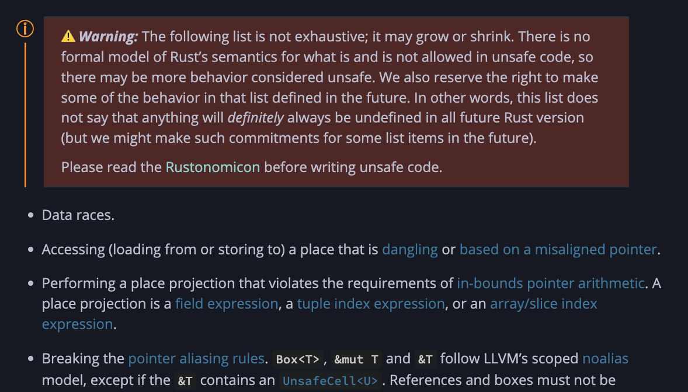

<!-- _class: communism invert  -->

## Intro to Rust Lang
# Ownership Revisited

<br>


<!--  -->


---


# The Rules

At the beginning of this course, we learned the Commandments of Rust...


---


# The Rules

At the beginning of this course, we learned the Commandments of Rust...

#### Rules of Ownership

* Each value in Rust has an _owner_
* A value can only have one owner at a time
* When the owner goes out of scope, the value will be _dropped_


---


# The Rules

At the beginning of this course, we learned the Commandments of Rust...

#### Rules of Borrowing
* Cannot access both a mutable and an immutable reference to the same object
* At any given time, may have either one mutable reference, or any number of immutable references


---


# The Catch

If we follow these rules and pass the compiler, is our code perfect?

Not quite...
* Rejected programs are not necessarily unsafe
* Passing programs are not necessarily the "best"
    * "Best" being most performant, most elegant, most robust


---


# Objective

* When my program is rejected, why might it be unsafe?

* Between multiple safe fixes, how do I choose the "best" fix?

<!-- Speaker note:
First, we have to understand what makes a program unsafe.
Why do we have these rules in the first place?
What sorts of behavior is the compiler trying to prevent?
-->


---


# Defining Unsafety


Safety is the absence of undefined behavior.


---


# Defining Unsafety

However, undefined behavior is a lot.

Definition in Rust Reference prints on five sheets...



<!-- Speaker note:
Undefined behavior can encapsulate a lot of things,
so we'll simplify it and say that
-->


---


# Defining Unsafety

Safety is the absence of undefined behavior.

However, undefined behavior is a lot.

Simplification: **invalid memory access ⇒ unsafety****


<!-- Speaker note:
Our program is unsafe if we make an invalid memory access
Double asterisk, see Rust Reference for full definition
-->


---


# Invalid Memory Access ⇒ Unsafety

Memory access can be unsafe if

* Deallocated
    * Ownership rules prevent this
* Overwritten by "someone else"
    * Borrowing rules prevent this

<!-- Speaker note:
The "someone else" will be explained in Parallelism lecture
-->

---


# Invalid Memory Access ⇒ Unsafety

Memory access can be unsafe if

- Deallocated
- Overwritten by "someone else"

⇒ Trivially safe for immutable globals


---


# Invalid Memory Access ⇒ Unsafety

Memory access can be unsafe if

- Deallocated
- Overwritten by "someone else"

⇒ Trivially safe for immutable globals

We'll focus on local variables.

---


# Local Variables

Local variables live in a function's **stack frame**

The stack frame
* Contains everything needed for the function to run
* Is allocated on function call
* Is deallocated on function return


---


# Local Variables

Here's `main`'s stack frame.

<!-- replace COMINGSOON
stack frame has x=1 -->

```rust
fn main() {
    let x = 1;
}
```


---

# Local Variables


Now we call `my_function`, and...

```rust
fn main() {
    let x = 1;
    my_function(x);
}
```


---


# Local Variables

Here's `my_function`'s stack frame.

<!-- replace COMINGSOON
stack frame has arg=1, y=2, z=3 -->

```rust
fn main() {
    let x = 1;
    my_function(x);
}

fn my_function(arg: i32) {
    let y = 2;
    let z = 3;
}
```

<!-- Speaker note:
Emphasize that `x` is copied to create `arg`
-->


---


# Local Variables

Finally, we return from `my_function`.

<!-- replace COMINGSOON
remove my_function stack frame -->

```rust
fn main() {
    let x = 1;
    my_function(x);
}
```


---


# Motivating the Heap


What if instead of an integer `x = 1`,

```rust
fn main() {
    let x = 1;
    my_function(x);
}
```

---


# Motivating the Heap


<!-- replace COMINGSOON
Replace x=1 with x = [ 15GB of 0xdeadbeef ]
-->

We have a 15GB's worth of `Vector<u32>`?

```rust
fn main() {
    let x = vec![0xdeadbeef; 4_000_000];
    my_function(x);
}
```

---


# Motivating the Heap


<!-- replace COMINGSOON
add `my_function` stack frame
-->

When we call `my_function`,

```rust
fn main() {
    let x = vec![0xdeadbeef; 4_000_000];
    my_function(x);
}

fn my_function(arg : Vec<u32>) {
    ...
}
```


---


# Motivating the Heap


<!-- replace COMINGSOON
add `my_function` stack frame
add `arg`
-->

When we call `my_function`,

```rust
fn main() {
    let x = vec![0xdeadbeef; 4_000_000];
    my_function(x);
}

fn my_function(arg : Vec<u32>) {
    ...
}
```

We must allocate `arg` for its stack frame!


---


# Motivating the Heap


<!-- replace COMINGSOON
add `my_function` stack frame
add `arg`
fill `arg`
-->

When we call `my_function`,

```rust
fn main() {
    let x = vec![0xdeadbeef; 4_000_000];
    my_function(x);
}

fn my_function(arg : Vec<u32>) {
    ...
}
```

We must allocate `arg` for its stack frame!
⇒ Copy 15GB of `0xdeadbeef`'s

---


# Motivating the Heap

Unsustainable!

```rust
fn main() {
    let x = vec![0xdeadbeef; 4_000_000];
    my_function(x);
    my_function(x);
    my_function(x);
    my_function(x);
    my_function(x);
    my_function(x);
    my_function(x);
    my_function(x);
    my_function(x);
    my_function(x);
}
```


---


# The Heap


<!-- replace COMINGSOON
cross out "x = [ 15GB of 0xdeadbeef ] in main's stack frame"
-->

Fortunately, our `Vector` does not live in the stack.


---


# The Heap


<!-- replace COMINGSOON
add rectangle for heap
draw arrow from x to heap alloc
-->

Fortunately, our `Vector` does not live in the stack.

It lives in the **heap**.


---


# The Heap


<!-- replace COMINGSOON
highlight heap alloc
-->

Value lives in the heap,


---


# The Heap


<!-- replace COMINGSOON
highlight x
-->

Value lives in the heap,

**Pointer** lives in the stack.


---


# The Heap


<!-- add my_function's stack frame -->

When we call `my_function`,

```rust
fn main() {
    let x = vec![0xdeadbeef; 4_000_000];
    my_function(x);
}

fn my_function(arg : Vec<u32>) {
    ...
}
```


---


# The Heap


<!-- add my_function's stack frame -->
<!-- draw arrow from arg to heap -->

We can copy the pointer `x` into `arg`,

```rust
fn main() {
    let x = vec![0xdeadbeef; 4_000_000];
    my_function(&x);
}

fn my_function(arg : &Vec<u32>) {
    ...
}
```


---


# The Heap


<!-- add my_function's stack frame -->
<!-- draw arrow from arg to heap -->

Much better!

**Before:** 15GB per `Vector`

**After:** 8 bytes per pointer

```rust
fn main() {
    let x = vec![0xdeadbeef; 4_000_000];
    my_function(x);
    my_function(x);
    my_function(x);
    my_function(x);
    my_function(x);
    my_function(x);
    my_function(x);
    my_function(x);
    my_function(x);
    my_function(x);
}
```


---


# Recap


Variable placement:
* **Stack-allocated:** Value on stack
* **Heap-allocated:** Value on heap, **pointer** on stack

Stack:
* Allocated on function call, deallocated on return
* Stores pointers and fixed-size data (like integers, floats)

Heap:
* Allocated on programmer request
* For dynamically sized or long-lived data (like `String`, `Vector`)


---


# Motivating Ownership

Recall that accessing **deallocated** memory is unsafe.


---


# Motivating Ownership

When do we deallocate memory?

* Stack: deallocated when function returns
    * Valid, unless dangling pointer ✅
    * We'll discuss more in Lifetimes lecture
* Heap: deallocated when ???
    * ⚠️


---


# Motivating Ownership


Heap: deallocated when ???

* C's proposal: leave it to the programmer
    * Manual malloc / free <!-- "but this is prone to MANY bugs" -->
* Java's proposal: leave it to runtime
    * Garbage collector <!-- "but runtime processes are inefficient" -->
* Rust's proposal: prevent it at compile time
    * Borrow checker
<!--
Speaker Note:
    Emphasize that we're accepting longer compile times
    for enhanced runtime performance
-->

---


# Motivating Ownership


How can we be confident that heap memory is deallocated safely?


---


# Motivating Ownership


How can we be confident that heap memory is deallocated safely?

Inspired by the stack
* Local variable lives in function's **stack frame**
* Allocated on function call
* Deallocated on function return

---


# Motivating Ownership


How can we be confident that heap memory is deallocated safely?

Inspired by the stack
- Local variable "owned by" stack frame
- One stack frame per variable
- Dropped on function return


<!-- Speaker notes:
We draw inspiration from stack memory!
Why are stack deallocations safe?
Well, do you notice that in stack allocations,
each value on the stack has an "owner"?
Each value is allocated when we enter the function,
and each value is deallocated when we exit the function?
You can think of it as the value being "owned" by the function,
    and it's valid when we're in the function,
    and dropped when we exit the function!
-->


---


# Motivating Ownership

How can we be confident that heap memory is deallocated safely?

Inspired by the stack
- Local variables "owned by" stack frame
- One stack frame per variable
- Dropped on function return

Now we apply this to the heap!


<!-- Speaker notes:
What if we take this idea of ownership for stacks,
    and apply it to the heap?
Before, in C-land, heap memory is laissez-faire for the programmer.
Now we impose the following rules:
-->


---


# Motivating Ownership


How can we be confident that heap memory is deallocated safely?

#### Rules of Ownership

* Each value in Rust has an _owner_
* A value can only have one owner at a time
* When the owner goes out of scope, the value will be _dropped_
    * Deallocate the value here
    * Safe because value has only one owner

<!-- Speaker note:
Q: Given these rules, pretend you're the compiler.
    You're marking out places in the programmer's code where you can deallocate heap memory.
    Can someone tell me, under these rules, when is it safe to free memory?
        And how do you know it's safe?
-->


---


# Motivating Borrowing Rules

Recall that accessing **overwritten** memory is unsafe.


---


# Pop Goes X


Suppose we have a `Vector` like this:

```rust
fn x_shouldnt_exist() {
    let mut v = vec![1, 2, 3, 4];
}
```

<!--
This is review problem 3 from Lecture 3, animated out
-->


---


# Pop Goes X


We take a reference `x` to its last element,

```rust
fn x_shouldnt_exist() {
    let mut v = vec![1, 2, 3, 4];
    let x = &v[3];
}
```


---


# Pop Goes X


We take a reference `x` to its last element, remove the last element,

```rust
fn x_shouldnt_exist() {
    let mut v = vec![1, 2, 3, 4];
    let x = &v[3];
    v.pop(); // Removes last element in `v`
}
```


---


# Pop Goes X


We take a reference `x` to its last element, remove the last element, and print `x`.

```rust
fn x_shouldnt_exist() {
    let mut v = vec![1, 2, 3, 4];
    let x = &v[3];
    v.pop(); // Removes last element in `v`
    println!("{}", x); // What is `x`?
}
```


---


# Pop Goes X


We take a reference `x` to its last element, remove the last element, and print `x`.

```rust
fn x_shouldnt_exist() {
    let mut v = vec![1, 2, 3, 4];
    let x = &v[3];
    v.pop(); // Removes last element in `v`
    println!("{}", x); // What is `x`?
}
```

`x` is invalid! `v[3]` can be any value ⇒ undefined behavior


---


# Pop Goes X


Thankfully, our borrowing rules prevent this

```
error[E0502]: cannot borrow `v` as mutable because it is also borrowed as immutable
 --> src/main.rs:4:5
  |
3 |     let x = &v[3];
  |              - immutable borrow occurs here
4 |     v.pop(); // Removes last element in `vec`
  |     ^^^^^^^ mutable borrow occurs here
5 |     println!("{}", x); // What is `x`?
  |                    - immutable borrow later used here
```

* We cannot mutably borrow a value with an existing immutable borrow
* Without the borrowing rules, `x` would point to invalid memory!


---


# Push Comes to Shove


Instead of removing the last element,

```rust
fn please_dont_move() {
    let mut v = vec![1, 2, 3, 4];
    let x = &v[3];
    v.pop(); // Remove last element in `v`
}
```


---


# Push Comes to Shove


Instead of removing the last element, let's add a new element!

```rust
fn please_dont_move() {
    let mut v = vec![1, 2, 3, 4];
    let x = &v[3];
    v.push(5); // Add an element to the end of `v`
}
```


---


# Push Comes to Shove


Surely nothing will happen to `x` this time?

```rust
fn please_dont_move() {
    let mut v = vec![1, 2, 3, 4];
    let x = &v[3];
    v.push(5); // Add an element to the end of `v`
    println!("{}", x); // What is `x`?
}
```


---


# Push Comes to Shove


Quandary!

```
error[E0502]: cannot borrow `v` as mutable because it is also borrowed as immutable
 --> src/main.rs:4:5
  |
3 |     let x = &v[2];
  |              - immutable borrow occurs here
4 |     v.push(5);
  |     ^^^^^^^^^ mutable borrow occurs here
5 |     println!("{}", x); // What is `x`?
  |                    - immutable borrow later used here
```


---


# Push Comes to Shove


The compiler isn't paranoid! It's prudent.

```
error[E0502]: cannot borrow `v` as mutable because it is also borrowed as immutable
 --> src/main.rs:4:5
  |
3 |     let x = &v[2];
  |              - immutable borrow occurs here
4 |     v.push(5);
  |     ^^^^^^^^^ mutable borrow occurs here
5 |     println!("{}", x); // What is `x`?
  |                    - immutable borrow later used here
```

* What if pushing `5` onto `v` triggers a resize?
    * Resizing means allocating new memory for `v`, copying data, and deallocating old `v`
* `x` would no longer point to valid memory!


<!--
What if you, as the programmer, knew that this push doesn't resize?
    e.g. vector is power of 2

You can calm the compiler with a special keyword, `unsafe`
We will talk about `unsafe` in the later weeks.
-->


---


# Unveiling the Borrow Checker

> "His blade works so smoothly that the ox does not feel it." - The Dextrous Butcher

Understand the borrow checker, and you'll
- Fix errors with ease
- Craft elegant, efficient solutions

<!-- Work so smoothly the borrow checker does not feel it :-) -->


---


# Permissions of Places

Denote the left side of assignments as **places**.

```rust
let x = &v[3];
    ^ place
```

The borrow checker checks permissions of **places**.


---


# Permissions of Places


Places include:
* Variables, like `a`
* Dereferences of places, like `*a`
* Array accesses of places, like `a[0]`
* Fields of places, like `a.0`, `a.field`
* Any combination of the above, like `*((*&a[2].field)[5].0.1)`


---


# Permissions of Variables

When declared, a variable has the permissions
* Read: can be copied
* Own: can be moved or dropped


If `mut`,
* Write: can be mutated


---


# References Change Permissions

Variables have permissions Read, Own, Write.

References **temporarily remove these permissions**.


---


# Example: Immutable References


Let's revisit our vector example.

We declare `v`, giving it
- .
- .

<style>
    .container {
        display: flex;
        gap: 16px;
    }
    .col {
        flex: 1;
    }
</style>
<div class = "container">
<div class = "col">

```rust
let mut v = vec![1, 2, 3, 4];
```

</div>

<div class = "col">

Place | R | W | O
-----|-----|-----|-----:
v | - | - | -

</div>
</div>


---


# Example: Immutable References


Let's revisit our vector example.

We declare `v`, giving it
- R, O by default
- .

<div class = "container">
<div class = "col">

```rust
let mut v = vec![1, 2, 3, 4];
```

</div>

<div class = "col">

Place | R | W | O
-----|-----|-----|-----:
v | +R | - | +O

</div>
</div>


---


# Example: Immutable References


Let's revisit our vector example.

We declare `v`, giving it
- R, O by default
- W because `mut`

<div class = "container">
<div class = "col">

```rust
let mut v = vec![1, 2, 3, 4];
```

</div>

<div class = "col">

Place | R | W | O
-----|-----|-----|-----:
v | +R | +W | +O

</div>
</div>


---


# Example: Immutable References

We take a reference to `v`, which
- .
- .

<div class = "container">
<div class = "col">

```rust
let mut v = vec![1, 2, 3, 4];
let x = &v[3];
```

</div>

<div class = "col">

Place | R | W | O
-----|-----|-----|-----:
v | R | W | O
x | - | - | -

</div>

</div>


---


# Example: Immutable References

We take a reference to `v`, which
- Declares `x` with R, O
- .

<div class = "container">
<div class = "col">

```rust
let mut v = vec![1, 2, 3, 4];
let x = &v[3];
```

</div>

<div class = "col">

Place | R | W | O
-----|-----|-----|-----:
v | R | W | O
x | +R | - | +O

</div>

</div>


---


# Example: Immutable References

We take a reference to `v`, which
- Declares `x` with R, O
- **Moves** `v` into `x`.

<div class = "container">
<div class = "col">

```rust
let mut v = vec![1, 2, 3, 4];
let x = &v[3];
```

</div>

<div class = "col">

Place | R | W | O
-----|-----|-----|-----:
v | R | W | O
x | R | - | O

</div>

</div>


---


# Example: Immutable References

This move changes `v`:
- .
- .

<div class = "container">
<div class = "col">

```rust
let mut v = vec![1, 2, 3, 4];
let x = &v[3];
```

</div>

<div class = "col">

Place | R | W | O
-----|-----|-----|-----:
v | R | W | O
x | R | - | O

</div>

</div>


---


# Example: Immutable References

This move changes `v`:
- Removes O, gives to `x`
- .

<div class = "container">
<div class = "col">

```rust
let mut v = vec![1, 2, 3, 4];
let x = &v[3];
```

</div>

<div class = "col">

Place | R | W | O
-----|-----|-----|-----:
v | R | W | -
x | R | - | O

</div>

</div>


---


# Example: Immutable References

This move changes `v`:
- Removes O, gives to `x`
- Removes W

<div class = "container">
<div class = "col">

```rust
let mut v = vec![1, 2, 3, 4];
let x = &v[3]; // <- v loses W
```

</div>

<div class = "col">

Place | R | W | O
-----|-----|-----|-----:
v | R | - | -
x | R | - | O

</div>

</div>


---


# Example: Immutable References

We can no longer mutate `v`, since we have a reference to it.

When does `v` regain W?
* Case 1: All references become unused.
* Case 2: Mutate `v` before _any_ reference is used.
    * Revokes permissions of references


<div class = "container">
<div class = "col">

```rust
let mut v = vec![1, 2, 3, 4];
let x = &v[3]; // <- v loses W
```

</div>

<div class = "col">

Place | R | W | O
-----|-----|-----|-----:
v | R | - | -
x | R | - | O

</div>

</div>


---


# Example: Immutable References

So, this is safe.

* `v` requests W
* All references are unused
* `v` regains W
* Can mutate `v`

<div class = "container">
<div class = "col">

```rust
let mut v = vec![1, 2, 3, 4];
let x = &v[3]; // <- v loses W
v.pop(); // <- v regains W
```

</div>

<div class = "col">

Place | R | W | O
-----|-----|-----|-----:
v | R | - | -
x | R | - | O

</div>

</div>


---


# Example: Immutable References

However, this is not.
* Reference `x` used in `println`
* `v` regains W *after* `println`
* Can't mutate `v`

<div class = "container">
<div class = "col">

```rust
let mut v = vec![1, 2, 3, 4];
let x = &v[3]; // <- v loses W
v.pop(); // Requires W, R on v
println!("{}", x);
// <- v regains W
```

</div>

<div class = "col">

Place | R | W | O
-----|-----|-----|-----:
v | R | - | -
x | R | - | O

</div>

</div>


---


# Recap: Immutable References

* Declaring a variable `v` gives it R, O permissions
    * W if `mut`
* Creating a reference to `v` removes O, W permissions
    * Permissions are restored when
        * References become **unused**, OR
        * Mutate `v` *before* any reference is used
    * We'll discuss "unused" in Lifetimes lecture


---


# Mutable References

When we take a reference `x = &v`,
* We dereference with `*x`
* **`x` and `*x` have different permissions**
    * Mutable references illustrate this


---


# Example: Mutable References

First, here's our immutable reference.

<div class = "container">
<div class = "col">

```rust
let mut v = vec![1, 2, 3, 4];
let x = &v[3];
```

</div>

<div class = "col">

Place | R | W | O
-----|-----|-----|-----:
v | R | - | -
x | R | - | O

</div>

</div>


---


# Example: Mutable References

Since it's immutable, `*x` only has R permissions.
* `*x` can only take R if `v` has R
* More on this later

<div class = "container">
<div class = "col">

```rust
let mut v = vec![1, 2, 3, 4];
let x = &v[3];
```

</div>

<div class = "col">

Place | R | W | O
-----|-----|-----|-----:
v | R | - | -
x | R | - | O
*x | R | - | -

</div>

</div>


---


# Example: Mutable References

Now we mark it mutable.

<div class = "container">
<div class = "col">

```rust
let mut v = vec![1, 2, 3, 4];
let x = &mut v[3];
```

</div>

<div class = "col">

Place | R | W | O
-----|-----|-----|-----:
v | R | - | -
x | R | - | O
*x | R | - | -

</div>

</div>


---


# Example: Mutable References

Differences:
- .
- .

<div class = "container">
<div class = "col">

```rust
let mut v = vec![1, 2, 3, 4];
let x = &mut v[3];
```

</div>

<div class = "col">

Place | R | W | O
-----|-----|-----|-----:
v | R | - | -
x | R | - | O
*x | R | - | -

</div>

</div>


---


# Example: Mutable References

Differences:
- `v` loses _all_ permissions, including R
- .

<div class = "container">
<div class = "col">

```rust
let mut v = vec![1, 2, 3, 4];
let x = &mut v[3];
```

</div>

<div class = "col">

Place | R | W | O
-----|-----|-----|-----:
v | - | - | -
x | R | - | O
*x | R | - | -

</div>

</div>


---


# Example: Mutable References

Differences:
- `v` loses _all_ permissions, including R
- `*x`, but _not_ `x`, gains W permissions

<div class = "container">
<div class = "col">

```rust
let mut v = vec![1, 2, 3, 4];
let x = &mut v[3];
```

</div>

<div class = "col">

Place | R | W | O
-----|-----|-----|-----:
v | - | - | -
x | R | - | O
*x | R | W | -

</div>

</div>


---


# Example: Mutable References

This is important!
- `v` loses _all_ permissions, including R
    * Avoids simultaneous **aliasing** and mutation
    * Hence, `*x` can only take R if `v` has R
- `*x`, but _not_ `x`, gains W permissions
    * Can't reassign `x`

<!--Speaker note:
Aliasing: accessing same data through different variables
 -->

<div class = "container">
<div class = "col">

```rust
let mut v = vec![1, 2, 3, 4];
let x = &mut v[3];
```

</div>

<div class = "col">

Place | R | W | O
-----|-----|-----|-----:
v | - | - | -
x | R | - | O
*x | R | W | -

</div>

</div>


---


# Recap: Mutable References


Immutable references `x` of `v`
* `*x` can only take R if `v` has R

Mutable reference `x` to `v`
* Removes _all_ permissions for `v`, including R
* `*x`, but _not_ `x`, has W permission


---


# Fixing a Safe Program

Let's apply what we've learned!

```rust
let mut v = vec![];
```


---


# Fixing a Safe Program

Say we're holding numbers in a line.

```rust
let mut v = vec![1, 2, 3, 4];
```


---


# Fixing a Safe Program

For each person in line,

```rust
let mut v = vec![1, 2, 3, 4];
                 ^
```


---


# Fixing a Safe Program

For each person in line, we want to add their neighbor's number.

```rust
let mut v = vec![1, 2, 3, 4];
                    ^
```


---


# Fixing a Safe Program

We'll take a mutable reference for the first person,

```rust
let mut v = vec![1, 2, 3, 4];
                 ^
let person1 = &mut v[0];
```


---


# Fixing a Safe Program

An immutable reference for the second person,

```rust
let mut v = vec![1, 2, 3, 4];
                    ^
let person1 = &mut v[0];
let person2 = &v[1];
```


---


# Fixing a Safe Program

And add them together.

```rust
let mut v = vec![1, 2, 3, 4];
let person1 = &mut v[0];
let person2 = &v[1];
*person1 += *person2;
```


---


# Fixing a Safe Program

This does not compile! Let's break down the permissions.

```rust
let mut v = vec![1, 2, 3, 4];
let person1 = &mut v[0];
let person2 = &v[1];
*person1 += *person2;
```


---


# Fixing a Safe Program

Recall when we create a mutable reference,

<div class = "container">
<div class = "col">

```rust
let mut v = vec![1, 2, 3, 4];
let person1 = &mut v[0];
```

</div>

<div class = "col">

Place | R | W | O
-----|-----|-----|-----:
v | R | W | O

</div>

</div>


---


# Fixing a Safe Program

Recall when we create a mutable reference, `v` loses all permissions.

<div class = "container">
<div class = "col">

```rust
let mut v = vec![1, 2, 3, 4];
let person1 = &mut v[0];
```

</div>

<div class = "col">

Place | R | W | O
-----|-----|-----|-----:
v | - | - | -

</div>

</div>


---


# Fixing a Safe Program

When do we use our references?
- .
- .

<div class = "container">
<div class = "col">

```rust
let mut v = vec![1, 2, 3, 4];
let person1 = &mut v[0];
let person2 = &v[1];
*person1 += *person2;
```

</div>

<div class = "col">

Place | R | W | O
-----|-----|-----|-----:
v | - | - | -

</div>

</div>


---


# Fixing a Safe Program

When do we use our references?
- Mutating `*person1` requires W, R ✓
- .

<div class = "container">
<div class = "col">

```rust
let mut v = vec![1, 2, 3, 4];
let person1 = &mut v[0];
let person2 = &v[1];
*person1 += *person2;
```

</div>

<div class = "col">

Place | R | W | O
-----|-----|-----|-----:
v | - | - | -
*person1 | R | W | -

</div>

</div>


---


# Fixing a Safe Program

When do we use our references?
- Mutating `*person1` requires W, R ✓
- Reading `*person2` requires R

<div class = "container">
<div class = "col">

```rust
let mut v = vec![1, 2, 3, 4];
let person1 = &mut v[0];
let person2 = &v[1];
*person1 += *person2;
```

</div>

<div class = "col">

Place | R | W | O
-----|-----|-----|-----:
v | - | - | -
*person1 | R | W | -
*person2 | - | - | -

</div>

</div>


---


# Fixing a Safe Program

Reading `*person2` requires R
* `*person2` can only take R if `v` has R
* `v` gave R to `person1`!
* Chicken-and-egg

<!--Speaker note:
v regains R after person1 becomes unused, BUT
person1 becomes unused after reading *person2
-->

<div class = "container">
<div class = "col">

```rust
let mut v = vec![1, 2, 3, 4];
let person1 = &mut v[0];
let person2 = &v[1];
*person1 += *person2;
```

</div>

<div class = "col">

Place | R | W | O
-----|-----|-----|-----:
v | - | - | -
*person1 | R | W | -
*person2 | - | - | -

</div>

</div>


---


# Fixing a Safe Program

**Issue:** Single place `v` represents _all_ indices
* Borrow checker can't know it's safe
* But we do

<!--Speaker note: -->

<div class = "container">
<div class = "col">

```rust
let mut v = vec![1, 2, 3, 4];
let person1 = &mut v[0];
let person2 = &v[1];
*person1 += *person2;
```

</div>

<div class = "col">

Place | R | W | O
-----|-----|-----|-----:
v | - | - | -
*person1 | R | W | -
*person2 | - | - | -

</div>

</div>


---


# Fixing a Safe Program

Solution: `unsafe` block

```rust
let mut v = vec![1, 2, 3, 4];
let person1 = &mut v[0] as *mut i32; // raw pointer
let person2 = &v[1] as *const i32; // raw pointer
unsafe { *person1 += *person2; } // because *we* know it's safe
```

<!-- Speaker note:
Alternate solution is `split_at_mut`, which uses `unsafe` under the hood

-->

---


# Recap

- Ownership rules prevent access to deallocated memory
    - "Owner" is stack frame
    - "Owned" are variable values, allocated in stack or heap
- Borrowing rules prevent access to overwritten memory
    - Understand Pop Goes X example
- Borrow checker checks **permissions** of **places**
    - References temporarily remove permissions
    - Draw RWO table to fix ownership errors

---


# Next Lecture: Error Handling and Traits


* Thanks for coming!