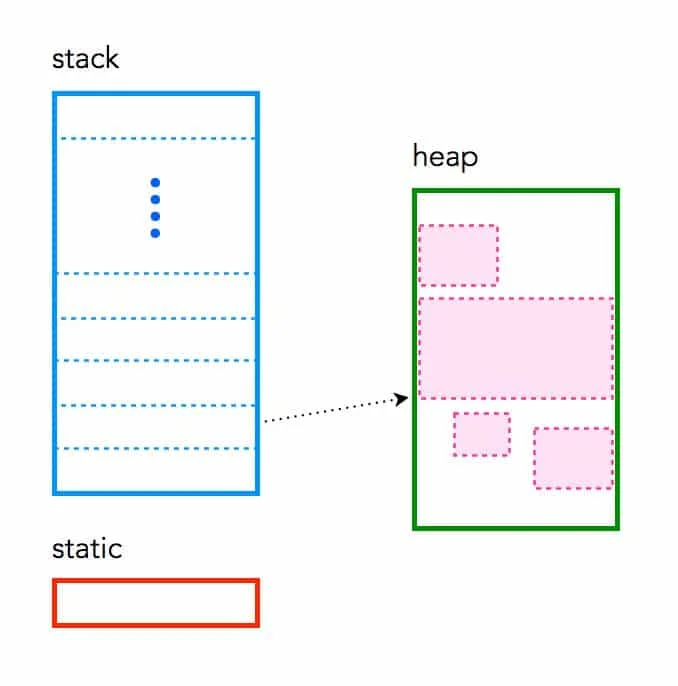

<!-- _class: communism invert  -->

## Intro to Rust Lang
# Ownership Revisited

<br>


<!--  -->


---


# The Rules

At the beginning of this course, we learned the Commandments of Rust...


---


# The Rules

At the beginning of this course, we learned the Commandments of Rust...

#### Rules of Ownership

* Each value in Rust has an _owner_
* A value can only have one owner at a time
* When the owner goes out of scope, the value will be _dropped_


---


# The Rules

At the beginning of this course, we learned the Commandments of Rust...

#### Rules of Ownership

- Each value in Rust has an _owner_
- A value can only have one owner at a time
- When the owner goes out of scope, the value will be _dropped_

#### Rules of Borrowing
* Thou shalt not access both a mutable and an immutable reference to the same object
* At any given time, thou may have either one mutable reference, or any number of immutable references


---


# The Catch

Follow the rules, pass the compiler, done? Not quite

* Rejected programs are not necessarily unsafe
* Passing programs are not necessarily the best
* "Best" being most performant, most elegant, most robust


---


# Objective

* When my program is rejected, why might it be unsafe?

* Between multiple safe fixes, how do I choose the "best" fix?


---


# Defining Unsafety

<!-- Speaker note:
First, we have to understand what makes a program unsafe.
Why do we have these rules in the first place?
What sorts of behavior is the compiler trying to prevent?
-->

Safety is the absence of undefined behavior


---


# Defining Unsafety


<!-- Speaker note:
Undefined behavior can encapsulate a lot of things,
so we'll simplify it and say that
-->

Safety is the absence of undefined behavior

However, undefined behavior is a lot


---


# Defining Unsafety


<!-- Speaker note:
Undefined behavior can encapsulate a lot of things,
so we'll simplify it and say that unsafety is when
we make a memory access that we weren't supposed to.
-->

Safety is the absence of undefined behavior

However, undefined behavior is a lot

Simplification: **invalid memory access ⇒ unsafety**


---


# Memory

<!-- Speaker note:
Since we identify unsafe programs
by their memory accesses,
the next natural question to ask is,
"Where can memory live?"
-->

Memory can live in one of three places
* Static
* Stack
* Heap




---


# Memory

<!-- Speaker note:
The first, most fundamental difference between these three
types of memory is *when* they are allocated.
-->

When are they allocated?

* Static: allocated at compilation time

* Stack: allocated at runtime

* Heap: allocated at runtime


<!-- Speaker note:
Q: Going off of this info, can you guess which type of allocation is the most reliable?
A: Static allocations are the most reliable.
    If there's insufficient memory for the allocation, then
    the program will fail to load, and the program won't run at all.
    => runs iff allocation succeeds
-->


---


# Memory


Where are they allocated?

<!-- may shorten to "directly in the executable file,"
    since they haven't learned how binary files are laid out
-->
* Static: directly in the data section of the compiled binary file
    * Example: global variables, string literals
* Stack: allocated on function call, deallocated on function return
    * Example: local variables
* Heap: allocated on programmer request
    * Example: strings, dynamic arrays, anything you don't know the size of beforehand


<!-- [Optional] Speaker note:
Q: Going off of this info, can you guess which type of allocation is the *second most* reliable?
A: Stack allocations are the second most reliable.
    This is because unlike heap allocations, stack allocations are contiguous.
        (point at diagram on slide)
    You can draw a line and clearly say,
        this is the side of memory that's free,
        and this is the side of memory that's in use.
    So the rare case that a stack allocation fails is if the side of free memory is not enough
        to serve the request.
    
    Stack allocations are simple and uniform across languages,
        there's pretty much one way that stack allocations can fail.
    Meanwhile, heap allocations are more complicated; no two heap allocators are the same,
        each language has its own memory management model for heap memory,
        so heap allocations can fail in many more ways.
-->


---


# Memory


Example: `String`s are heap-allocated.

`s1` is on the stack, `"hello"` is on the heap
```
fn return_a_string() -> String {
    let s1 = String::from("hello");
}
```


---


# Memory

Example: String literals are statically allocated.

`s2` is on the stack, `"hello"` is in the read-only data section of the binary
<!-- may shorten this to "hello is statically allocated,"
    since they haven't learned how binary files are laid out
 -->
```
fn return_a_string() -> &'static str {
    let s2 = "Hello world";
}
```

<!-- TODO insert diagram -->


---

# Memory

When we access memory, what can be unsafe?

We accessed memory that was

* Deallocated
    * Ownership rules prevent this
* Overwritten by "someone else" <!-- need clearer way of explaining this -->
    * Borrowing rules prevent this


---


# Motivation for Ownership

When is memory deallocated?

* Static: deallocated when program ends
    * Valid for entirety of program execution ✅
* Stack: deallocated when function returns
    * Valid, unless dangling pointer ✅
    * We'll discuss more in Lifetimes lecture
* Heap: deallocated when ???
    * ⚠️


---


# Motivation for Ownership


Heap: deallocated when ???

* C's proposal: leave it to the programmer
    * Manual malloc / free
* Java's proposal: leave it to runtime
    * Garbage collector
* Rust's proposal: prevent it at compilation time
    * Borrow checker


---


# Motivation for Ownership


How can we be confident that heap memory is deallocated safely?

<!--
[Optional] We draw inspiration from stack memory!
Why are stack deallocations safe?
Well, do you notice that in stack allocations,
each value on the stack has an "owner"?
Each value is allocated when we enter the function,
and each value is deallocated when we exit the function?
You can think of it as the value being "owned" by the function,
    and it's valid when we're in the function,
    and dropped when we exit the function!
Rust's ownership model is like, what if we take this idea of
ownership for stacks, and apply it to heap memory?
Before, in C-land, heap memory is laissez-faire for the programmer.
Now we impose the following rules:
-->


---


# Motivation for Ownership


How can we be confident that heap memory is deallocated safely?

#### Rules of Ownership

* Each value in Rust has an _owner_
* A value can only have one owner at a time
* When the owner goes out of scope, the value will be _dropped_
    * deallocate the value here
    * safe because value has only one owner

<!-- Speaker note:
Q: Given these rules, pretend you're the compiler.
    You're marking out places in the programmer's code where you can deallocate memory.
    Can someone tell me, under these rules, when is it safe to free memory?
        And how do you know it's safe?

A: Yes! With these rules in place, you know that you can free memory
    whenever the owner goes out of scope.
    Because each value can only have one owner at a time,
        you know that at the time the owner goes out of scope,
        nobody else needs this value anymore, so we can deallocate it.
-->


---


# Motivation for Borrowing


<!--
High-level sketch:
    Revisit ownership review problem
    "what if we don't want to clone()"
    "we create a reference instead"
    => references are non-owning pointers
    => introduce diagrams with RWO permissions

After taking through Motivation for Borrowing,
    this answers our first question, "When my program is rejected, why might it be unsafe?"

Then we address the second question "Between multiple safe fixes, how do I choose the 'best' fix?"
    - heuristic: most performant is minimize copying via references
        - however, don't always want this
        - example: in FP, prevent side effects, avoid argument mutation
    - 
-->

<!--
    - Do we want to talk about Slices anywhere?
        I'm writing the lecture as-is first, then see if we have a place for Slices
-->