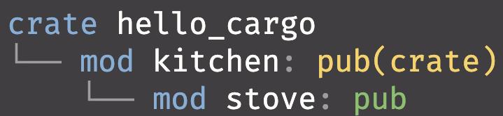
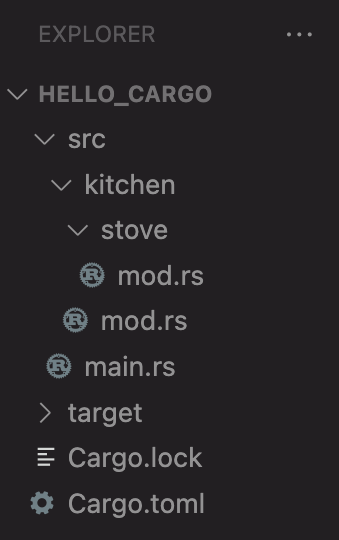

<!-- _class: communism invert  -->

## Intro to Rust Lang
# Modules and Testing

<br>

Benjamin Owad, David Rudo, and Connor Tsui


---


# Today: Modules and Testing


* Packages and Crates
* Modules
    * The `use` keyword
    * Module Paths and File System
* Unit Testing
* Integration Testing


---


# Large Programs

When we write large programs, organizing code becomes increasingly important.

It is generally good practice to:

- Split code into multiple folders and files
- Group related functionality
- Separate code with distinct features
- Encapsulate implementation details
- _Modularize_ your program


---


# Module System

Rust has organizational features collectively referred to as the _module system_.

* Packages: A Cargo feature that lets you build, test, and share crates
* Crates: A tree of modules that produces a library or executable
* Modules: Lets you control the organization, scope, and privacy of paths
* Paths: A way of naming an item, such as a struct, function, or module


---


# **Packages and Crates**


---


# Crate

A _crate_ is the smallest amount of code that the Rust compiler considers at a time.

- The equivalent in C/C++ is a _compilation unit_
- Running `rustc` on a single file also creates a crate
- Crates contain modules
    - Modules can be defined in other files


---


# Crate

There are two types of crates: a _binary_ crate or a _library_ crate.

* A binary crate is a program you can compile to an executable that contains a `main` function
    * These executables can be run, like a command-line program or server
* A library crate has no `main` function, and does not compile to an executable
    * Defines functionality intended to be shared with multiple projects
* There is also a special crate called the _crate root_
    * _The Rust compiler looks at this first, and it makes up the root module of the crate (more on modules later)_

---


# Package

A package is a bundle of one or more crates.

- A package is defined by a `Cargo.toml` file at the root of your directory
    - `Cargo.toml` describes how to build all of the crates
- A package can contain as many binary crates as you like!
- But it can only have at most 1 library crate


---


# `cargo new`

Let’s walk through what happens when we create a package with `cargo`.

```
$ cargo new my-project
     Created binary (application) `my-project` package
$ ls my-project
Cargo.toml
src
$ ls my-project/src
main.rs
```

* Creates a new package called `my-project`
* A `src/main.rs` file that prints `"Hello, world!"`
* `Cargo.toml` in the root directory


---


# `Cargo.toml`

Let's take a look inside the `Cargo.toml`.

```toml
[package]
name = "my-project"
version = "0.1.0"
edition = "2021"

[dependencies]
```

* File written in `toml`, a file format for configuration files
* Notice how there's no mention of `src/main.rs`!
* Cargo follows the convention that `src/main.rs` is the crate root and builds a binary crate
* Similarly, if you create a `src/lib.rs` file, the package will build a library crate!


---


# Example: `cargo`

Cargo is actually a Rust package!

* Contains the binary crate that compiles to the executable `cargo`
* Contains a library crate that the `cargo` binary depends on


---


# Aside: Package vs Project vs Program

* "Package" is the only term with a formal definition in Rust.
* "Project" can mean a lot of different things, and is a formal term in an _IDE_
* "Program" - ask the mathemeticians

<!-- TODO idk what to say for that last one -->


---


# Modules

In Rust, *modules* are used to hierarchically split code into separate units.

* A module is a collection of functions, structs, traits, etc
* Used to manage visibility (public/private)
* Mitigates name collisions
* More explicit and flexible than importing files directly


---


# Root Module

The root module is in our `main.rs` (for a binary crate) or `lib.rs` (for a library crate).

###### main.rs
```rust
// `main` is defined implicitly the root module
fn main() {
    println!("Hello, world!");
}
```

---


# Declaring Modules

We can declare a new module inline, in the same file as our crate root.


###### main.rs
```rust
fn main() {
    kitchen::cook();
}

mod kitchen {
    // `cook` is defined in the module `kitchen`
    fn cook() {
        println!("I'm cooking");
    }
}
```

* Can we call `cook` from `main`?


---


# Declaring Modules

We need to explicitly declare `cook` as `pub`—everything is private by default in Rust.
###### main.rs
```rust
fn main() {
    kitchen::cook();
}

mod kitchen {
    pub fn cook() { println!("I'm cooking"); }

    // Only those internal to the kitchen should be able to do this
    fn examine_ingredients() {}
}
```

<!-- Private by default is very very good -->


---


# Declaring Submodules


Modules are a tree! We can declare submodules inside of modules.
###### main.rs
```rust
fn main() {
    kitchen::stove::cook();
}

mod kitchen {
    pub mod stove {
        pub fn cook() { println!("I'm cooking"); }
    }

    fn examine_ingredients() {}
}
```

* Submodules also have to be declared as `pub` to be accessible.

---


# Modules in Different Files

Let's move the `kitchen` module to its own file.
###### main.rs
```rust
mod kitchen; // The compiler will look for kitchen.rs

fn main() {
    kitchen::stove::cook();
}

```

###### kitchen.rs
```rust
pub mod stove {
    pub fn cook() { println!("I'm cooking"); }
}

fn examine_ingredients() {}
```

* Can we separate `stove`, while maintaining that it is a submodule of `kitchen`?


---

# Submodules in Different Folders

We can put `stove.rs` in the `kitchen` folder to indicate the hierarchy.
###### kitchen.rs
```rust
pub mod stove; // note this still has to be `pub`

fn examine_ingredients() {}
```

###### kitchen/stove.rs
```rust
pub fn cook() {
    println!("I'm cooking");
}
```


* `main.rs` is unchanged (omitted for room on the slide)


---


# Alternate Submodule File Naming

`kitchen.rs` can be moved into the kitchen folder as well, if we wanted
###### kitchen/mod.rs
```rust
pub mod stove;

fn examine_ingredients() {}
```

###### kitchen/stove.rs
```rust
pub fn cook() {
    println!("I'm cooking");
}
```


* The other style is newer and generally preferred
* Often this style is used if `mod.rs` only contains other `mod` declarations


---


# The Module Tree, Visualized

- Does this look familiar?
&nbsp;
&nbsp;

---


# The Module Tree, Visualized




- Does this look familiar?

* The module tree corresponds to the filesystem tree


---


# Paths for Referring to Modules

You may have noticed a path from the previous sequence:

```rust
kitchen::stove::cook();
```

This is saying:
* In the module `kitchen`
    * In the submodule `stove`
        * call the function `cook`


---


# Paths for Referring to Modules

You may have noticed a path from the previous sequence:

```rust
kitchen::stove::cook();
```

* This is a relative path, relative to the module of `main.rs` (which is the root).
* Another example of a relative path is `stove::cook()`, valid from within the `kitchen` module.
* We can also express this absolutely, as `crate::kitchen::stove::cook()`.
* There also exists a `super` keyword for paths relative to parent modules.


---


# Bringing Paths into Scope with `use`

###### main.rs
```rust
mod kitchen;

fn main() {
    kitchen::stove::cook();
}
```

* Programmers are lazy, and this is a lot to type


---


# Bringing Paths into Scope with `use`

###### main.rs
```rust
mod restaurant;

fn main() {
    restaurant::back::kitchen::stove::stovetop::burner::gasknob::cook();
    restaurant::back::kitchen::stove::stovetop::burner::gasknob::cook();
    restaurant::back::kitchen::stove::stovetop::burner::gasknob::cook();
}
```

- Programmers are lazy, and this is a lot to type
    - Especially if the hierarchy is deep, and we are using it multiple times

---


# Bringing Paths into Scope with `use`

###### main.rs
```rust
mod restaurant;

// The path must be absolute
use crate::restaurant::back::kitchen::stove::stovetop::burner::gasknob;

fn main() {
    gasknob::cook();
    gasknob::cook();
    gasknob::cook();
}
```

- Programmers are lazy, and this is a lot to type
    - Especially if the hierarchy is deep, and we are using it multiple times
- We can bring `gasknob` into scope with `use` to eliminate the need to fully qualify this function call
&nbsp;


---


# Bringing Paths into Scope with `use`

###### main.rs
```rust
mod restaurant;

// The path must be absolute
use crate::restaurant::back::kitchen::stove::stovetop::burner::gasknob::cook;

fn main() {
    cook();
    cook();
    cook();
}
```

- Programmers are lazy, and this is a lot to type
    - Especially if the hierarchy is deep, and we are using it multiple times
- We can bring `gasknob` into scope with `use` to eliminate the need to fully qualify this function call
- Or, we can bring the function itself into scope


---


# More `use` syntaxes

We can also import items from the standard library.

```rust
use std::io::Bytes;
use std::io::Write;
use std::io;
```
* `Bytes` is a struct, and `Write` is a trait.


---


# More `use` syntaxes

We can combine those 3 imports into one statement:

```rust
use std::io::{Bytes, Write, Self};
```

* One could also write `use std::io::*`
    * Called the "glob operator"
    * Generally not recommended to avoid this

<!--
The one case where glob is idiomatic is with the prelude pattern
-->


---


