<style>
@import url('https://fonts.googleapis.com/css2?family=Noto+Sans+Mono:wght@100..900&family=Noto+Sans:ital,wght@0,100..900;1,100..900&display=swap');
section {
    font-family: "Noto Sans";
}
code {
    font-family: "Noto Sans Mono";
}
</style>

<!-- _class: communism invert  -->

## Intro to Rust Lang

# Crates, Closures, and Iterators


---

# Today: Crates, Closures, and Iterators

- Crate Highlights
- Closures
- Iterators


---


# **Crate Highlights**


---


# `rand`

The standard library includes many things... but a random number generator isn't one of them*.

Here's an example of using the `rand` crate:

```rust
use rand::prelude::*;

let mut rng = rand::thread_rng();
let y: f64 = rng.gen(); // generates a float between 0 and 1

let mut nums: Vec<i32> = (1..100).collect();
nums.shuffle(&mut rng);
```


---


# `rand`

```rust
use rand::prelude::*;

let mut rng = rand::thread_rng();
let y: f64 = rng.gen(); // generates a float between 0 and 1

let mut nums: Vec<i32> = (1..100).collect();
nums.shuffle(&mut rng);
```

* `rand` is the de facto crate for:
    * Generating random numbers
    * Creating probabilistic distributions
    * Providing randomness related algorithms (like vector shuffling)


---


# `clap`

Often, we want our binary to take in command line arguments.

A very popular argument parser used in Rust programs is `clap`.

```rust
use clap::Parser;

#[derive(Parser, Debug)]
#[command(version, about, long_about = None)]
struct Args {
    #[arg(short, long)]
    name: String, // Name of the person to greet

    #[arg(short, long, default_value_t = 1)]
    count: u8, // Number of times to greet
}
```

* Makes use of Rust's macro system to generate boilerplate code for us!


---


# `clap`

Here's how you would use a `clap` struct called `Args`:

```rust
use clap::Parser;

// <-- snip -->
struct Args {
    // <-- snip -->
}

fn main() {
    let args = Args::parse(); // get-opt could never
    for _ in 0..args.count {
        println!("Hello {}!", args.name)
    }
}
```


---


# `clap`

If we run the binary called `demo`:

```
$ demo --help
A simple to use, efficient, and full-featured Command Line Argument Parser

Usage: demo[EXE] [OPTIONS] --name <NAME>

Options:
  -n, --name <NAME>    Name of the person to greet
  -c, --count <COUNT>  Number of times to greet [default: 1]
  -h, --help           Print help
  -V, --version        Print version

$ demo --name Me
Hello Me!
```

* Note that `clap` is not the only 3rd-party crate option!

<!--
clap can be pretty heavyweight if you don't need too much functionality
-->


---


# `anyhow`

Have code that can throw multiple error types that you wish was one? Use this!
```rust
use anyhow::Result;

fn get_cluster_info() -> Result<ClusterMap> {
    let config = std::fs::read_to_string("cluster.json")?;
    let map: ClusterMap = serde_json::from_str(&config)?;
    Ok(map)
}

```

* Both lines return different error types, but `anyhow` allows us to return both!
* Makes errors more dynamic and ergonomic


---


# `anyhow`

Another example:

```rust
use anyhow::{Context, Result};

fn main() -> Result<()> {
    // <-- snip -->
    it.detach().context("Failed to detach the important thing")?;

    let content = std::fs::read(path)
        .with_context(|| format!("Failed to read instrs from {}", path))?;
}
```

Other `anyhow` features include:
* Downcasting to the original error types
* Attaching custom context / error messages
* More expressive custom errors


---


# `flamegraph`


Rust powered flamegraph generator with Cargo support!

With a bit of setup, you can generate this with `cargo flamegraph`

* Can support non-Rust projects too
* Relies on perf/dtrace


---


# **Closures**


---


# What Is A Closure?

Closures are anonymous functions that can capture values from the scope in which they're defined.

* Known as lambdas in "lesser languages" 😉
* You can save closures in variables or pass them as arguments to other functions


---


# Closure Syntax

```rust
let annotated_closure = |num: i32| -> i32 {
    num
};
```

* This should feel very similar to functions we've seen...
* Like normal variables, Rust can derive closure type annotations from context!


---


# Closures Simplified

```rust
fn  add_one_v1   (x: i32) -> i32 { x + 1 }
let add_one_v2 = |x: i32| -> i32 { x + 1 };
let add_one_v3 = |x|             { x + 1 };
let add_one_v4 = |x|               x + 1  ;

let _ = add_one_v3(3);
let _ = add_one_v4(4);
```

* `v1` is the equivalent function
* We can remove type parameters in `v3`
  * This is similar to eliding the type parameter in `let v = Vec::new()`
* For `v4`, we can remove the `{}` since the body is only one line

<!--
Bad formatting on purpose to show similarities
-->


---


# How about this?


```rust
let example_closure = |x| x;

let s = example_closure(String::from("hello"));
let n = example_closure(5);
```

* How would we describe the type of `example_closure`?


---


# Closure Types

```rust
let example_closure = |x| x;
let s = example_closure(String::from("hello"));
let n = example_closure(5);
```

```
error[E0308]: mismatched types
 --> src/main.rs:5:29
  |
5 |     let n = example_closure(5);
  |             --------------- ^- help: try using a conversion method: `.to_string()`
  |             |               |
  |             |               expected struct `String`, found integer
  |             arguments to this function are incorrect
note: closure parameter defined here
 --> src/main.rs:2:28
  |
2 |     let example_closure = |x| x;
  |                            ^
```


---


# Closure Types

```rust
let example_closure = |x| x;

let s = example_closure(String::from("hello"));
let n = example_closure(5);
```

* The first time we called `example_closure` with a `String`
* Rust inferred the type of `example_closure` to be `String -> String`
* Those types are now bound to the closure
    * `example_closure(5)` will not type check

<!--
This is one of the main differences between Rust and a functional language like SML or OCaml, things generally are always ONE type, not fully polymorphic.
-->


---


# Capturing References

Closures can capture values from their environment in three ways:
* Borrowing immutably
* Borrowing mutably
* Taking ownership
    * _**Moving**_ the value into the closure


---


# Immutable Borrowing in Closures

```rust
let list = vec![1, 2, 3];
println!("Before defining closure: {:?}", list);

let only_borrows = || { println!("From closure: {:?}", list); };

println!("Before calling closure: {:?}", list);
only_borrows(); // Prints "From closure: [1, 2, 3]"
println!("After calling closure: {:?}", list);
```

```
Before defining closure: [1, 2, 3]
Before calling closure: [1, 2, 3]
From closure: [1, 2, 3]
After calling closure: [1, 2, 3]
```


---


# Immutable Borrowing in Closures

```rust
let list = vec![1, 2, 3];
println!("Before defining closure: {:?}", list);

let only_borrows = || { println!("From closure: {:?}", list); };

println!("Before calling closure: {:?}", list);
only_borrows(); // Prints "From closure: [1, 2, 3]"
println!("After calling closure: {:?}", list);
```

* Note how once a closure is defined, it's invoked in the same manner as a function
* Because we can have many immutable borrows, Rust allows us to to print, even with the closure holding a reference

<!--
Make sure to state that `println!` implicitly takes references to anything passed in,
that's why it doesn't move the list
-->


---


# Mutable Borrowing in Closures


What happens if we mutate captured variables from inside the closure?

```rust
let mut list = vec![1, 2, 3];
println!("Before defining closure: {:?}", list);

let borrows_mutably = || { list.push(7); };

borrows_mutably();
println!("After calling closure: {:?}", list);
```

* This seems like it should work...


---


# Mutable Borrowing in Closures

```
error[E0596]: cannot borrow `borrows_mutably` as mutable, as it is not declared as mutable
 --> src/main.rs:7:5
  |
5 |     let borrows_mutably = || { list.push(7); };
  |                                ---- calling `borrows_mutably` requires mutable
  |                                     binding due to mutable borrow of `list`
6 |
7 |     borrows_mutably();
  |     ^^^^^^^^^^^^^^^ cannot borrow as mutable
```

* A closure mutating its captured state is _equivalent_ to mutating _itself_
  * Calling `borrows_mutably` mutates the closure's internal state
    * We'll discuss in the next section...


---


# Mutable Borrowing in Closures

```
help: consider changing this to be mutable
  |
5 |     let mut borrows_mutably = || { list.push(7); };
  |         +++
```

* As always, the compiler tells us how to fix our mistake!


---


# Mutable Borrowing in Closures

```rust
let mut list = vec![1, 2, 3];
println!("Before defining closure: {:?}", list);

let mut borrows_mutably = || { list.push(7); };

borrows_mutably();
println!("After calling closure: {:?}", list);
```

```
Before defining closure: [1, 2, 3]
After calling closure: [1, 2, 3, 7]
```


---


# Closure Borrowing Rules

```rust
let mut list = vec![1, 2, 3];

let mut borrows_mutably = || { list.push(7); };

// println!("Before calling closure: {:?}", list); <-- Compiler error!
borrows_mutably();
println!("After calling closure: {:?}", list);
```

* Note how we can't have a `println!` before invoking `borrows_mutably`
* Rust only considers the **invocation** a borrow, not the definition
  * Closures are lazy in this sense

<!--
The lecturer should spell this out:

* `borrows_mutably` isn't called again, so Rust knows the borrowing has ended
  * This is why we are allowed to call `println!` after
-->


---


# Giving Closures Ownership


```rust
let mystery = {
    let x = rand::random::<u32>();
    |y: u32| -> u32 { x + y }
};

println!("Mystery value is {}", mystery(5));
```

<!--
Make sure people understand that we're trying to bind a closure to `mystery`
-->


---


# Giving Closures Ownership

```
error[E0373]: closure may outlive the current block, but it borrows `x`,
 which is owned by the current block
 --> src/main.rs:6:9
  |
6 |         |y: u32| -> u32 { x + y }
  |         ^^^^^^^^^^^^^^^   - `x` is borrowed here
  |         |
  |         may outlive borrowed value `x`
  |
  |
4 |     let mystery = {
  |         ^^^^^^^
help: to force the closure to take ownership of `x`, use the `move` keyword
  |
6 |         move |y: u32| -> u32 { x + y }
  |
```

---


# Giving Closures Ownership

```rust
let mystery = {
    let x = rand::random::<u32>();
    move |y: u32| -> u32 { x + y }
//  ^^^^ Add the `move` keyword!
};

println!("Mystery value is {}", mystery(5));
```

* We can `move` values into closures instead of capturing references (borrowing)
  * Note that you can't selectively `move` parameters, it's all or nothing
* `move` semantics with closures are important for thread safety!


---


# Threads Sneak Peek

Let's briefly explore spawning a new thread with a closure.

```rust
fn main() {
    let list = vec![1, 2, 3];
    println!("Before defining closure: {:?}", list);

    std::thread::spawn(move || println!("From thread: {:?}", list))
        .join()
        .unwrap();
}
```


---


# Case for `move`: Thread Safety

```rust
fn main() {
    let list = vec![1, 2, 3];
    println!("Before defining closure: {:?}", list);

    std::thread::spawn(move || println!("From thread: {:?}", list))
        .join()
        .unwrap();
}
```

* Why do we `move` instead of borrow?
  * Child thread's `println!` only needs a reference to `list`...
* Parent might drop `list` before the child thread runs
  * Use after free in child thread! ☠️

<!--
It is super easy to make this mistake in other languages!
-->


---


# Handling Captured Values

* A closure body can do any of the following to a value:
  * Move a captured value out of the closure
  * Mutate a captured value
  * Neither of the above
* It could also have captured nothing to begin with!
* The properties a closure has determines the function _trait_ it implements


---


# **The `Fn` traits**


---


# The `Fn` traits

What do you mean, function _**trait**_???

* Rust has 3 special traits that define the _kind_ of closure we want to use
* The 3 traits are:
  * `FnOnce`
  * `FnMut`
  * `Fn`
* Rust auto-implements these for closures and functions


---


# The `Fn` Traits: Visualized



* `FnMut` is also `FnOnce`
* `Fn` is also `FnMut` _and_ `FnOnce`


---


# The `Fn` traits


* `FnOnce`: Closures that can be called once
* `FnMut`: Closures that can mutate the captured values
* `Fn`: Everything else!


---


# The `Fn` traits

- `FnOnce`: Closures that can be called once
  * All closures and functions implement this, since all closures can be called _at least_ once
  * However, closures that are exclusively `FnOnce` can _only_ be called once
    * e.g. A closure that moves captured values out of its body
- `FnMut`: Closures that can mutate the captured values
  * Can be called more than once
- `Fn`: Everything else!
  * Don't move values out, don't mutate, don't capture anything


---


# `FnOnce`

A closure that moves captured values **out** of its body will _only_ implement `FnOnce`, and not `FnMut` or `Fn`:

```rust
let my_str = String::from("x");

// Returns `my_str`, moving it out of the closure
let consume_and_return = move || my_str;
```

* Why can this closure only be called once?
  * It takes ownership of `my_str`, then gives ownership back to the caller
  * `my_str` is no longer accessible to our closure after it's called!
* `move` keyword specifies that the closure takes ownership when it's created, _not_ when it's called

<!--
Rust never implicitly clones `my_str`, cannot be reused after move

Use case for moving captured values out:
  Transactions that should happen exactly once,
  but the underlying resource can be reused for multiple transactions

Think of the resource as a database connection, socket connection, or file handle
-->


---


# `unwrap_or_else`

All closures implement `FnOnce`, since all closures can be called once.

* This does not mean they can _only_ be called once!
* One example is the `unwrap_or_else` method on `Result`


---


# `unwrap_or_else`

`unwrap_or_else` processes the `Result<T, E>` of a function.

```rust
let count = |s: &str| s.len();

assert_eq!(Ok(2).unwrap_or_else(count), 2);
assert_eq!(Err("foobar").unwrap_or_else(count), 6);
```

* If successful, it unwraps the value from `Ok(T)` into `T`
* Otherwise, it takes `E` as input to the closure


---


# `unwrap_or_else`

Let's look at the definition of the `unwrap_or_else` method on `Result<T>`.

```rust
impl<T, E> Result<T, E> {
    pub fn unwrap_or_else<F>(self, f: F) -> T
    where
        F: FnOnce(E) -> T
    {
        match self {
            Some(x) => x,
            None => f(e),
        }
    }
}
```

<!--
Copied and pasted (and modified very slightly) from the standard library:
https://doc.rust-lang.org/src/core/result.rs.html#1460-1465
-->


---


# `unwrap_or_else`

First let's observe the function definition.

```rust
pub fn unwrap_or_else<F>(self, f: F) -> T
where
    F: FnOnce(E) -> T
// <-- snip -->
```

* This method is generic over `F`
* `F` is the type of the closure we provide when calling `unwrap_or_else`
* `F` must be able to be called once, take no arguments, and return a `T` for `Option<T>`

<!--
Requiring `F: FnOnce(E) -> T` is **MORE GENERAL** than requiring one of the other function traits
-->


---


# `unwrap_or_else`

Now let's observe the function body.

```rust
{
    match self {
        Some(x) => x,
        None => f(),
    }
}
```

* If the `Option` is `Some`, then extract the inner value
* Otherwise, call `f` once and return the value
* Note that `f` is not _required_ to only be `FnOnce` here
  * It is valid for `f` to be `FnMut` or `Fn`


---


# `FnMut`

`FnMut` applies to closures that might mutate the captured values.

```rust
let mut x: usize = 1;
let mut add_two_to_x = || x += 2;
add_two_to_x();
```

* Use cases: Stateful operations on some shared resource
  * Imagine `x` were a score on a scoreboard
* Note that this will not compile without the second `mut`
  * `mut` signals that we are mutating our closure's environment

<!--
Key idea: how variables within scope at invocation change between calls

Use case: Stateful operation to some shared resource
  The captured variable is some shared resource, like a score on a scoreboard,
  a message queue, etc.
-->


---


# `FnMut`

Another simple example:

```rust
let mut base = String::from("");
let mut build_string = |addition| base.push_str(addition);

build_string("Ferris is ");
build_string("happy!");

println!("{}", base);
```

```
Ferris is happy!
```


---


# `FnMut`

We can pass an `FnMut` closure as an argument to a function.

```rust
fn do_twice<F>(mut func: F)
where
    F: FnMut(),
{
    func();
    func();
}
```

* Would `do_twice` accept a closure that's exclusively `FnOnce`?
  * No, because we call our closure twice
* How about an `Fn` closure?
  * Yes!


---


# `Fn`

The `Fn` trait is a superset of `FnOnce` and `FnMut`.

* `Fn` applies to closures that:
  * Don't move captured values out of their body
  * Don't mutate captured values
  * Don't capture anything from their environment
* Can be called more than once without mutating the environment
* Use cases:
  * Stateless operations without side effects
    * Logging, pretty printing
    * Predicates* for sorting, searching, filtering

<!--
Use case: Stateless operation without side effects
  Example is logging

BIG asterisk for predicates:
They are usually `FnMut` in the standard library because that is more general,
but in most cases we're passing in something that is `Fn`
-->


---


# `Fn`

`Fn` applies to closures that don't capture anything from their environment:

```rust
let double = |x| x * 2; // captures nothing

assert!(double(2) == 4);
```

---

# `Fn`

`Fn` also applies to closures that don't mutate captured variables:

```rust
let mascot = String::from("Ferris");
let is_mascot = |guess| guess == mascot; // `mascot` immutably borrowed

assert!(is_mascot("Ferris"));    // true
assert!(!is_mascot("Ferrari"));  // false
```


---

# `Fn`

TODO FIX (this example doesn't work with non-`Copy` types)

Finally, `Fn` applies to closures that don't move captured values out of their body:

```rust
let my_sanity = ();
let cmu = move || {my_sanity;}; // captures sanity and never gives it back...

assert!(cmu() == ());
```

* When is `my_sanity` dropped?
  * `my_sanity` is _not_ dropped when we call and return from our closure!
  * It's dropped when our closure goes out of scope


---


# `Fn`

TODO FIX (this example doesn't work with non-`Copy` types)

`my_sanity` is dropped when our closure goes out of scope:

```rust
fn main() {
  let my_sanity = ();
  let cmu = move || {my_sanity;};
  cmu(); // `my_sanity` is NOT dropped here
  cmu(); // `my_sanity` is NOT dropped here
} // `my_sanity gets dropped here`
```

* Again, to reiterate: `my_sanity` is _not_ dropped when we call and return from our closure!


---


# `Fn`

TODO (the next line is not specific to just `Fn`)

The `Fn` trait allows you to define functions that accept other functions as arguments:

```rust
fn reduce<F, T>(reducer: F, data: &[T]) -> Option<T>
where
    F: Fn(T, T) -> T,
{
    // <-- snip -->
}
```

* We can specify the arguments and return types for `Fn`
* While this example is generic, we could've replaced `T` with a concrete type


---


# `fn`?

Rust also has function pointers, denoted `fn` (instead of `Fn`).

```rust
fn add_one(x: i32) -> i32 {
    x + 1
}

fn do_twice(f: fn(i32) -> i32, arg: i32) -> i32 {
    f(arg) + f(arg)
}

fn main() {
    let answer = do_twice(add_one, 5);
}
```

* `fn` is a **type*** that implements all 3 closure traits `Fn`, `FnMut`, and `FnOnce`

<!--
It's not really a type, they are just function pointers that know the signatures of the code they
are pointing to
-->


---


# Recap: Closure Traits

* `Fn`, `FnMut`, `FnOnce` describe different groups of closures
  * You don't `impl` them, they apply to a closure automatically if appropriate
  * A single closure can implement one or multiple of these traits
* `FnOnce` - call at least once, environment may be consumed
* `FnMut` - call multiple times, environment may change
* `Fn` - call multiple times, environment doesn't change


---


# **Iterators**

* Sorry functional haters... it's show time!


---


# What is an Iterator?

* Iterators allow you to perform some task on a sequence of elements
* Iterators manage iterating over each item and determining termination
* Rust iterators are *lazy*
  * This means we don't pay a cost until we consume the iterator


---


# The `Iterator` Trait

All iterators must implement the `Iterator` trait:

```rust
pub trait Iterator {
    type Item;

    fn next(&mut self) -> Option<Self::Item>;

    // methods with default implementations elided
}
```

* Keep generating `Some(item)`
* When the `Iterator` is finished, `None` is returned


---


# `type Item`

What's going on with the `type Item`?

```rust
pub trait Iterator {
    type Item;

    fn next(&mut self) -> Option<Self::Item>;

    // <-- methods with default implementations elided -->
}
```

* This is an _associated type_
* To define `Iterator` you must define the `Item` you're iterating over
* _Different from generic types!_
  * There can only be one way to iterate over something

<!--
For example, if I have a vector / list of `i32` integers, the only way I should be able to iterate
over them is by `i32`s. It doesn't make sense to also allow iterating via strings or something like that.
-->


---


# Custom Iterator Example

Let's say we want to implement an iterator that generates the Fibonacci sequence.

```rust
struct Fibonacci {
    curr: u32,
    next: u32,
}
```

* First need to declare the `struct` that can implement `Iterator`
* We need to store two numbers to compute the next element


---


# Fibonacci Example

```rust
impl Iterator for Fibonacci {
    type Item = u32;

    fn next(&mut self) -> Option<Self::Item> {
        let current = self.curr;

        self.curr = self.next;
        self.next = current + self.next;

        // No endpoint to a Fibonacci sequence - `Some` is always returned.
        Some(current)
    }
}
```
* Notice `Self::Item` is aliased to `u32`


---


# Iterating Explicitly

```rust
let v1 = vec![1, 2, 3];

let mut v1_iter = v1.iter();

assert_eq!(v1_iter.next(), Some(&1));
assert_eq!(v1_iter.next(), Some(&2));
assert_eq!(v1_iter.next(), Some(&3));
assert_eq!(v1_iter.next(), None);
```

* Here we see how the `next` method is used
* Notice how `v1_iter` is mutable
  * When we call `next()` we've **consumed** that iterator element
  * The iterator's internal state has changed
  * Note that `iter()` provides immutable borrows to `v1`'s elements


---


# `Vec` Iterators

```rust
let v1 = vec![1, 2, 3];

for val in v1.iter() {
    println!("Got: {}", val);
}

for val in &v1 {
    println!("Got: {}", val);
}
```

* These do the same thing!
  * Note that this is _not_ syntax sugar
* We saw this code before in lecture 4
  * Except now we explicitly create the iterator that Rust did for us

<!--
Be clear that `val` has type `&i32`, NOT `i32`.

Students can think about this like syntactic sugar, but it is actually not identical.

`.iter()` is an actual method on `Vec` that returns an `Iter` object that can iterate over references
to the vector.

At the same time, `IntoIterator` is implemented for `&'a Vec<T>` which also iterates over references
to the vector.
-->


---


# Syntactic Sugar: `for` loops

```rust
let v1 = vec![1, 2, 3];

for val in v1.iter() {
    println!("Got: {}", val);
}

let mut v1_iter = v1.iter();
while let Some(val) = v1_iter.next() {
    println!("Got: {}", val);
}
```

* The `for` loop _is_ syntax sugar


---


# Iterators and Mutable Borrows

We can use the `iter_mut()` on `Vec` to get an iterator over mutable references.

```rust
let mut vec = vec![1, 2, 3]; // Note that we need `vec` to be mutable
let mut mutable_iter = vec.iter_mut();

while let Some(val) = mutable_iter.next() {
    *val += 1;
}

println!("{:?}", vec);
```

```
[2, 3, 4]
```

* Before we saw that `v1.iter()` gave us an iterator over `&i32`
* Now, we see that `v1.iter_mut()` gives us an iterator over `&mut i32`


---


# More Mutable Iteration

```rust
let mut vec = vec![1, 2, 3];

let mut mutable_iter = vec.iter_mut();
while let Some(val) = mutable_iter.next() {
    *val += 1;
}

for val in vec.iter_mut() {
    *val += 1;
}

for val in &mut vec {
    *val += 1;
}
```

* All of these do the same thing!

<!--
Again, be clear that the very last example with `&mut vec` is NOT syntax sugar for the two things
above. You can _think_ of it like syntax sugar, but they are different.
-->


---


# Iterators and Ownership

If we want an iterator to iterate over _owned_ values, we usually use `into_iter()`.

```rust
let mut vec = vec![1, 2, 3];

let owned_iter = vec.into_iter(); // vec is *consumed*
for val in owned_iter {
    println!("I own {}", val);
}

// owned_iter has been consumed
```

* To make an iterator that owns its values we have `into_iter()`
* `into_iter()` is the sole method on the `IntoIterator` trait
* This is what the `for` loops are actually consuming


---


# Consuming Iterators

The standard library has many functions for using iterators.

```rust
let v1 = vec![1, 2, 3];

let v1_iter = v1.iter();

let total: i32 = v1_iter.sum(); // `.sum()` consumes `v1_iter`

assert_eq!(total, 6);
```

* Most of these functions _consume_ iterators


---


# Other consuming functions

- `fn max(self)`
- `fn count(self)`
- `fn map(self, f: F)`
- `fn filter(self, predicate: P)`
- `fn fold(self, init: B, f: F)`
- `fn collect(self)`
  - Coming soon...
- Many, many more!


---


# Producing Iterators


```rust
let v1: Vec<i32> = vec![1, 2, 3];

v1.iter().map(|x| x + 1);
```

* This code seems fine...

<!--
Mention that ferris is not confused but is trying to point out something to us...
-->


---


# Producing Iterators

```
warning: unused `Map` that must be used
 --> src/main.rs:4:5
  |
4 |     v1.iter().map(|x| x + 1);
  |     ^^^^^^^^^^^^^^^^^^^^^^^^
  |
  = note: iterators are lazy and do nothing unless consumed
  = note: `#[warn(unused_must_use)]` on by default
```

* Zero-cost abstractions at work
* Rust won't make us pay for our iterator until we use it
  * It will compile and warn us of unused data


---


# Producing Iterators

```rust
let v2: Vec<i32> = (1..4).map(|x| x + 1).collect();

println!("{:?}", v2);
```

```
[2, 3, 4]
```

* We use `collect()` to tell Rust we're done modifying our iterator and want to convert our changes to a `Vec`
* `collect` is a super common method on iterators
  * If you don't use `collect`, no computation is performed
  * `collect` is the method that executes all of the desired operations!


---


# Filter


```rust
fn filter_by(list: Vec<i32>, val: i32) -> Vec<i32> {
    list.into_iter().filter(|x| x == val).collect()
}
```

```
--> src/main.rs:2:35
  |
2 |     list.into_iter().filter(|x| x == val).collect()
  |                                   ^^ no implementation for `&i32 == i32`
  |
```

* Some iterator functions take a reference instead of ownership
* _Note how our filter closure captures the input `val` for our filtering needs!_


---


# Filter


```rust
list.into_iter().filter(|&x| x == val).collect()
```

or

```rust
list.into_iter().filter(|x| *x == val).collect()
```
* We either explicitly match on the reference or dereference


---


# Chaining It Together

```rust
let iter = (0..100).map(|x| x*x).skip(1).filter(|y| y % 3 == 0);

for x in iter.take(5) {
    print!("{}, ", x);
}
```

* You can read this as:
  * Print first 5 square numbers
  * Skipping 0
  * Only divisible divisible by 3
* _Note that `filter` doesn't need a dereference for `%`_


---


# Chaining It Together

```rust
let iter = (0..100).map(|x| x*x).skip(1).filter(|y| y % 3 == 0);
println!("{:?}", iter);

for x in iter.take(5) {
    print!("{}, ", x);
}
```

```
Filter { iter: Skip { iter: Map { iter: 0..100 }, n: 1 } }
9, 36, 81, 144, 225,
```

* Notice how `iter` is just a bunch of metadata
  * Lazy iterators on display!


---


# Iterator Recap

* Iterators is an extremely powerful structure in Rust
* View the [`std` library](https://doc.rust-lang.org/std/iter/trait.Iterator.html) for more info on `Iterator` methods
* Rules regarding closures and ownership still apply
* Iterators are _lazy_
  * Remember to use `.collect()`!


---


# Next Lecture: Ownership Revisited


Thanks for coming!

<br>

_Slides created by:_
Connor Tsui, Benjamin Owad, David Rudo,
Jessica Ruan, Fiona Fisher, Terrance Chen
