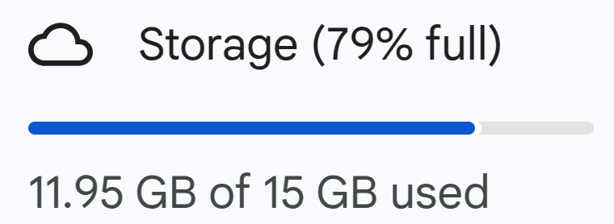

<!-- _class: communism invert  -->

## Intro to Rust Lang
# Ownership Revisited

<br>


<!--  -->


---


# Ownership Revisited

Today, we'll provide another way of thinking about ownership:

* Not just avoiding compile errors, but uncovering how the borrow checker works
* Write safer code, unblock the borrow checker


---


# The Rules

At the beginning of this course, we learned two sets of rules...
* Ownership Rules
* Borrowing Rules


---


# Rules of Ownership

* Each value in Rust has an _owner_
* A value can only have one owner at a time
* When the owner goes out of scope, the value will be _dropped_


---


# Rules of Borrowing

* Cannot access both a mutable and an immutable reference to the same object
* At any given time, may have either
    * One mutable (exclusive) reference
    * Any number of immutable (shared) references


---


# The Catch

Getting code to compile is one thing. Understanding why is another...

* Sometimes we follow the rules blindly
    * When we break the rules, we may not fully understand why it is a problem
* The compiler can be overly cautious
    * Rejects code that seems safe
    * Makes us prove safety, even when we "know" it's safe


---


# Today's Objective

Today we're going to address these questions:

* How do ownership rules prevent memory safety issues?
* What makes the borrow checker reject seemingly safe code?

<!-- Speaker note:
First, we have to understand what makes a program unsafe.
Why do we have these rules in the first place?
What sorts of behavior is the compiler trying to prevent?
-->


---


# Defining Safety

What is safety?

* Safety is the absence of _undefined behavior_


---


# Defining Unsafe

However, undefined behavior can mean many things.


Definition in Rust Reference prints on five sheets...

<!-- Speaker note:
Undefined behavior can encapsulate a lot of things,
so we'll simplify it and say that
-->


---


# Defining Unsafe

Simplification: **invalid memory access ⇒ unsafe**


<!-- Speaker note:
Our program is unsafe if we make an invalid memory access
Double asterisk, see Rust Reference for full definition
-->


---


# Invalid Memory Access ⇒ Unsafe

Memory access can be unsafe if we access memory that is:

* Deallocated
    * Ownership rules prevent this
* Overwritten by "someone else"
    * Borrowing rules prevent this

<!-- Speaker note:
The "someone else" will be further explained in Parallelism lecture
-->


---


# Invalid Memory Access ⇒ Unsafe

Memory access can be unsafe if we access **deallocated** or **overwritten** memory.

* Trivially safe for immutable globals
    * `static` variables are read-only and valid for program's lifetime
* We'll focus on local variables


---


# Local Variables

Local variables live in a function's **stack frame**.

The stack frame:
* Contains everything needed for the function to run
* Is allocated on function call
* Is deallocated on function return


---


# Local Variables


Here is a representation of `main`'s stack frame.

```rust
fn main() {
    let x = 1;
}
```


---


# Local Variables


Now we call `my_function`, constructing its stack frame.

```rust
fn main() {
    let x = 1;
    my_function(x);
}

fn my_function(arg: i32) {
    let y = 2;
    let z = 3;
}
```

<!-- For `my_function`'s stack frame, we
- Copy `x` to create `arg`
- Create the locals `y`, `z`
Emphasize the copying of `x`
-->


---


# Motivating the Heap


What if instead of an integer on the stack (`x = 1`)...

```rust
fn main() {
    let x = 1;
    my_function(x);
}
```

---


# Motivating the Heap


We have a 15 GB array?

```rust
fn main() {
    let beef = [0xdeadbeef; 4_000_000];
    my_function(beef);
}
```

* 15 GB = your Google Drive storage 

---


# Motivating the Heap


When we call `my_function`, we must allocate `arg` for its stack frame!

```rust
fn my_function(arg : [u32; 4_000_000]) {
    ...
}
```
* Copy 15 GB of `0xdeadbeef`'s

---


# Motivating the Heap

```rust
let beef = [0xdeadbeef; 4_000_000];
my_function(beef);
my_function(beef);
my_function(beef);
my_function(beef);
my_function(beef);
my_function(beef);
my_function(beef);
my_function(beef);
my_function(beef);
my_function(beef);
```

* Unsustainable!

<!--Speaker note:
If we call this function 10 times, we're copying 10 Google Drives! Unsustainable!

To transition to next slide, emphasize that
this inefficiency is not just with function calls.
What if we resize our vector?
-->


---


# Motivating the Heap

Our `beef` array is **long-lived** data.

* We want other functions to use this array, instead of just a single stack frame
* How do we persist this data across function calls?


---


# The Heap


Instead of storing our array buffer on the stack...


---


# The Heap


Instead of storing our array buffer on the stack...

Let's put it on the **heap**.


---


# The Heap


* Value lives in the heap...

* **Pointer** lives on the stack.


---


# The `Box<T>`

The simplest form of heap allocation is `Box<T>`.

Moving a value from stack to heap:
```rust
let val: u8 = 5;
let boxed: Box<u8> = Box::new(val);
```

* Can access value by dereferencing box as `*boxed`
* Value is automatically dropped when `boxed` goes out of scope


---


# The `Box<T>`

Let's put our `beef` array in a `Box`:

```rust
fn main() {
    let beef = Box::new([0xdeadbeef; 4_000_000]);
    my_function(beef);
}

fn my_function(arg : Box<[u32]>) {
    ...
}
```

* In practice, this allocates `beef` on the stack and then copies it to the heap
    * We recommend creating `Vec<T>` instead

<!-- Speaker note:
If students ask about type annotation of `arg`:
    * `beef` is coerced from a fixed-size array `Box<[u32; 4_000_000]>` to a boxed slice `Box<[u32]>`
If students ask when we'd use `Box`, seeing as this is not recommended:
    * We use `Box` when defining recursive types, like tree nodes that have nodes for children. Rust needs to know the size of every type at compile time, but recursive types have an unknown, potentially infinite size. `Box` is used to break the infinite size problem, since its size is always a fixed pointer size
-->

---


# The Heap


When we call `my_function`, we can copy the pointer into `arg`!

```rust
let beef = Box::new([0xdeadbeef; 4_000_000]);
my_function(beef);
```


---


# The Heap


Much better!

**Before:** 15 GB per vector

**After:** 8 bytes per pointer

```rust
let beef = Box::new([0xdeadbeef; 4_000_000]);
my_function(beef);
my_function(beef);
my_function(beef);
my_function(beef);
my_function(beef);
my_function(beef);
my_function(beef);
my_function(beef);
my_function(beef);
my_function(beef);
```


---


# Recap


Variable placement:
* **Stack-allocated:** Value on stack
* **Heap-allocated:** Value on heap, **pointer** on stack


---

# Recap

Area of Comparison | Stack | Heap
-----|-----|-----|
Stores | Pointers and fixed-size data (integers, floats) | Dynamically sized or long-lived data (`String`, `Vec`) 
Allocated on    | Function call     | Programmer request
Deallocated on  | Function return   | ???


---


# Motivating Ownership

Recall that accessing **deallocated** memory is unsafe.


---


# Motivating Ownership

When do we deallocate memory?

* Stack: deallocated when function returns
    * Valid, unless dangling pointer ✅
    * We'll discuss more in Lifetimes lecture
* Heap: deallocated when ???
    * ⚠️
    * How can we be confident that heap memory is deallocated safely?

---


# Motivating Ownership


Inspired by the stack's management of local variables:
* Local variable lives in function's **stack frame**
* Allocated on function call
* Deallocated on function return
    * Sound familiar?


---


# Motivating Ownership


What if we say that data is "owned" by the stack frame?
* One stack frame (owner) per variable
* Data is dropped on function return
* Very similar to our previous model!


<!-- Speaker notes:
We draw inspiration from stack memory!
Why are stack deallocations safe?
Well, do you notice that in stack allocations,
each value on the stack has an "owner"?
Each value is allocated when we enter the function,
and each value is deallocated when we exit the function?
You can think of it as the value being "owned" by the function,
    and it's valid when we're in the function,
    and dropped when we exit the function!

What if we take this idea of ownership for stacks,
    and apply it to the heap?
Before, in C-land, heap memory is laissez-faire for the programmer.
Now we impose the following rules:
-->


---


# Rules of Ownership

Another way to think about ownership in Rust, different from our previous model:

* Each value in Rust has an _owner_
    * Owner is stack frame
* A value can only have one owner at a time
* When the owner goes out of scope, the value will be _dropped_
    * Deallocate the value here
    * Safe because only one owner


---


# Rules of Ownership


* Note the ownership transfer:
    * Original `v` is invalidated (grayed out)
    * New stack frame becomes owner
* Value will be dropped when *current* owner exits scope


---


# Rules of Ownership

* In part 1, we told you owners were variables
* Now you know: owners are _stack frames_


---


# Motivating Borrowing Rules

Recall that accessing **overwritten** memory is unsafe.


---


# Vector Pop


Suppose we have a `Vector` like this.

We take a reference `x` to its last element, remove the last element, and print `x`.

```rust
fn x_shouldnt_exist() {
    let mut v = vec![1, 2, 3, 4];
    let x = &v[3];
    v.pop(); // Removes last element in `v`
    println!("{}", x); // What is `x`?
}
```

* What do you think the compiler will say?

<!--Speaker note: Ask audience!! -->


---


# Vector Pop


```
error[E0502]: cannot borrow `v` as mutable because it is also borrowed as immutable
 --> src/main.rs:4:5
  |
3 |     let x = &v[3];
  |              - immutable borrow occurs here
4 |     v.pop(); // Removes last element in `vec`
  |     ^^^^^^^ mutable borrow occurs here
5 |     println!("{}", x); // What is `x`?
  |                    - immutable borrow later used here
```

* `x` is invalid! `v[3]` can be any value ⇒ undefined behavior
* We cannot mutably borrow a value with an existing immutable borrow

---


# Vector Push


Instead of removing the last element...

```rust
fn x_shouldnt_exist() {
    let mut v = vec![1, 2, 3, 4];
    let x = &v[3];
    v.pop(); // Removes last element in `v`
    println!("{}", x); // What is `x`?
}
```


---


# Vector Push


Instead of removing the last element, let's add a new element!

```rust
fn please_dont_move() {
    let mut v = vec![1, 2, 3, 4];
    let x = &v[3];
    v.push(5); // Add an element to the end of `v`
    println!("{}", x); // What is `x`?
}
```

* Surely nothing will happen to `x` this time?

<!--Speaker note: Ask audience!! -->


---


# Vector Push


The compiler isn't paranoid! It's prudent.

```
error[E0502]: cannot borrow `v` as mutable because it is also borrowed as immutable
 --> src/main.rs:4:5
  |
3 |     let x = &v[2];
  |              - immutable borrow occurs here
4 |     v.push(5);
  |     ^^^^^^^^^ mutable borrow occurs here
5 |     println!("{}", x); // What is `x`?
  |                    - immutable borrow later used here
```

* What if pushing `5` onto `v` triggers a resize?
    * Resizing means allocating new memory for `v`, copying data, and deallocating old `v`
* `x` would no longer point to valid memory!


---


# Vector Push: `unsafe`

What if you knew that this push doesn't resize?

`unsafe` block: "Trust me, I'll take care of safety in here"

```rust
fn please_dont_move() {
    let mut v = vec![1, 2, 3, 4];
    let x = unsafe { v.as_ptr().add(3) }; // Get a raw pointer to the last element
    v.push(5);
    let x = unsafe { *x }; // Dereference the raw pointer
    println!("{}", x);
}
```

<!--
What if you, as the programmer, knew that this push doesn't resize?
    e.g. vector is power of 2

You can calm the compiler with a special keyword, `unsafe`
We will talk about `unsafe` in the later weeks.

-->


---


# Vector Push: `unsafe`

`unsafe` should be used sparingly, which is why...

* We must understand the borrow checker!
* How do I know if my program is unsafe?
    * How did the borrow checker conclude this?
* How can I tell if my program is safe, but borrow checker can't know?

---


# Unveiling the Borrow Checker

> "His blade works so smoothly that the ox does not feel it." - The Dextrous Butcher

* Understand the borrow checker, and you'll speak its language fluently:
    * "My program is unsafe, and here's how I'll fix it"
    * And occasionally...
        * "My program is actually safe, let me tell you why"

<!-- Work so smoothly the borrow checker does not feel it :-) -->


---


# Permissions of Places

Denote the left side of assignments as **places**.

```rust
let x = &v[3];
    ^ place
```

The borrow checker checks permissions of **places**.


---


# Permissions of Places


Places include:
* Variables, like `a`
* Dereferences of places, like `*a`
* Array accesses of places, like `a[0]`
* Fields of places, like `a.0`, `a.field`
* Any combination of the above, like `*((*&a[2].field)[5].0.1)`


---


# Permissions of Variables

When declared, a variable has the permissions:
* Read: can be copied
* Own: can be moved or dropped
* Write: can be mutated (if declared with `mut`)


---


# References Change Permissions

Variables have permissions Read, Own, Write.

References **temporarily remove these permissions**.


---


# Example: Immutable References


Let's revisit our vector pop example.

We declare `v`, giving it
- .
- .

<style>
    .container {
        display: flex;
        gap: 16px;
    }
    .col {
        flex: 1;
    }
</style>
<div class = "container">
<div class = "col">

```rust
let mut v = vec![1, 2, 3, 4];
```

</div>

<div class = "col">

Place | R | W | O
-----|-----|-----|-----:
v | - | - | -

</div>
</div>


---


# Example: Immutable References


Let's revisit our vector pop example.

We declare `v`, giving it
- R, O due to variable declaration
- .

<div class = "container">
<div class = "col">

```rust
let mut v = vec![1, 2, 3, 4];
```

</div>

<div class = "col">

Place | R | W | O
-----|-----|-----|-----:
v | +R | - | +O

</div>
</div>


---


# Example: Immutable References


Let's revisit our vector pop example.

We declare `v`, giving it
- R, O due to variable declaration
- W because `mut`

<div class = "container">
<div class = "col">

```rust
let mut v = vec![1, 2, 3, 4];
```

</div>

<div class = "col">

Place | R | W | O
-----|-----|-----|-----:
v | +R | +W | +O

</div>
</div>


---


# Example: Immutable References

When we create a reference `x` to `v`, we
- .
- .

<div class = "container">
<div class = "col">

```rust
let mut v = vec![1, 2, 3, 4];
let x = &v[3];
```

</div>

<div class = "col">

Place | R | W | O
-----|-----|-----|-----:
v | R | W | O
x | - | - | -

</div>

</div>


---


# Example: Immutable References

When we take a reference to `v`, we
- Give `x` R, O due to variable declaration
- .

<div class = "container">
<div class = "col">

```rust
let mut v = vec![1, 2, 3, 4];
let x = &v[3];
```

</div>

<div class = "col">

Place | R | W | O
-----|-----|-----|-----:
v | R | W | O
x | +R | - | +O

</div>

</div>


---


# Example: Immutable References

When we take a reference to `v`, we
- Give `x` R, O due to variable declaration
- **Move** `v` into `x`

<div class = "container">
<div class = "col">

```rust
let mut v = vec![1, 2, 3, 4];
let x = &v[3];
```

</div>

<div class = "col">

Place | R | W | O
-----|-----|-----|-----:
v | R | W | O
x | R | - | O

</div>

</div>


---


# Example: Immutable References

This move changes `v`:
- .
- .

<div class = "container">
<div class = "col">

```rust
let mut v = vec![1, 2, 3, 4];
let x = &v[3];
```

</div>

<div class = "col">

Place | R | W | O
-----|-----|-----|-----:
v | R | W | O
x | R | - | O

</div>

</div>


---


# Example: Immutable References

This move changes `v`:
- Removes O, gives to `x`
- .

<div class = "container">
<div class = "col">

```rust
let mut v = vec![1, 2, 3, 4];
let x = &v[3];
```

</div>

<div class = "col">

Place | R | W | O
-----|-----|-----|-----:
v | R | W | -
x | R | - | O

</div>

</div>


---


# Example: Immutable References

This move changes `v`:
- Removes O, gives to `x`
- Removes W

<div class = "container">
<div class = "col">

```rust
let mut v = vec![1, 2, 3, 4];
let x = &v[3]; // <- v loses W
```

</div>

<div class = "col">

Place | R | W | O
-----|-----|-----|-----:
v | R | - | -
x | R | - | O

</div>

</div>


---


# Example: Mutable References

We can access our reference `x` by dereferencing it as `*x`.
* `*x`'s permissions are different from `x`'s!
* Can only dereference if `*x` has R permissions
* `*x` can only take R if `v` has R

<div class = "container">
<div class = "col">

```rust
let mut v = vec![1, 2, 3, 4];
let x = &v[3];
// println!("{}", x) has implicit `*x`
```

</div>

<div class = "col">

Place | R | W | O
-----|-----|-----|-----:
v | R | - | -
x | R | - | O
*x | R | - | -

</div>

</div>


---


# Example: Immutable References

We can no longer mutate `v`, since we created a reference `x` to it.

* When does `v` regain W, O?
    * Case 1: All references become unused.
    * Case 2: Mutate `v` before _any_ reference is used.
        * Revokes permissions of references


<div class = "container">
<div class = "col">

```rust
let mut v = vec![1, 2, 3, 4];
let x = &v[3];
```

</div>

<div class = "col">

Place | R | W | O
-----|-----|-----|-----:
v | R | - | -
x | R | - | O
*x | R | - | -

</div>

</div>


---


# Example: Immutable References

So, this `v.pop()` is safe  (Case 2).

* `v` requests W while all references are unused (Case 2)
* `v` regains W, O, _revokes permissions of all references_
    * `x` loses O, `*x` loses R

<div class = "container">
<div class = "col">

```rust
let mut v = vec![1, 2, 3, 4];
let x = &v[3]; // <- v loses W, O
v.pop(); // <- v regains W, O
```

</div>

<div class = "col">

Place | R | W | O
-----|-----|-----|-----:
v | R | +W | +O
x | R | - | -
*x | - | - | -

</div>

</div>


---


# Example: Immutable References

However, we cannot access `*x` anymore, as its permissions have been revoked.
* `println!("{}", x)` causes panic

<div class = "container">
<div class = "col">

```rust
let mut v = vec![1, 2, 3, 4];
let x = &v[3];
v.pop(); // Revokes permissions
println!("{}", x); // Requires R on *x
```

</div>

<div class = "col">

Place | R | W | O
-----|-----|-----|-----:
v | R | W | O
x | R | - | -
*x | - | - | -

</div>

</div>


---


# Recap: Immutable References

* Declaring a variable `v` gives it R, O permissions
    * W if `mut`
* Creating an immutable reference `x` to `v`
    * Gives `x` R, O permissions because it's a variable declaration
        * Additionally gives `*x` R permission if `v` has R
    * Removes `v`'s O, W permissions
    * Permissions are restored when
        * Case 1: References become **unused**
        * Case 2: Mutate `v` *before* any reference is used
            * Revokes permissions of all references


<!-- Speaker note: "unused" will be clarified in Lifetimes lecture -->

---


# Mutable References

* **`x` and `*x` have different permissions**
    * Note how revoking permissions removes R from `*x`, but keeps R on `x`
    * Can create as many references as we want, just can't _access_ them invalidly
* Mutable references further illustrate this


---


# Example: Mutable References

Recall that when we create an immutable reference `x = &v[3]`,
* `v` loses W and O permissions
* `*x` only has R permissions

<div class = "container">
<div class = "col">

```rust
let mut v = vec![1, 2, 3, 4];
let x = &v[3];
```

</div>

<div class = "col">

Place | R | W | O
-----|-----|-----|-----:
v | R | - | -
x | R | - | O
*x | R | - | -

</div>

</div>


---


# Example: Mutable References

However, when `x` is a mutable reference:
- .
- .

<div class = "container">
<div class = "col">

```rust
let mut v = vec![1, 2, 3, 4];
let x = &mut v[3];
```

</div>

<div class = "col">

Place | R | W | O
-----|-----|-----|-----:
v | R | - | -
x | R | - | O
*x | R | - | -

</div>

</div>


---


# Example: Mutable References

However, when `x` is a mutable reference:
- `v` loses _all_ permissions, including R
- .

<!-- Speaker note:
Losing R is equivalent to "locking" other references from taking R
    => no more immutable references
-->

<div class = "container">
<div class = "col">

```rust
let mut v = vec![1, 2, 3, 4];
let x = &mut v[3];
```

</div>

<div class = "col">

Place | R | W | O
-----|-----|-----|-----:
v | - | - | -
x | R | - | O
*x | R | - | -

</div>

</div>


---


# Example: Mutable References

However, when `x` is a mutable reference:
- `v` loses _all_ permissions, including R
- `*x`, but _not_ `x`, gains W permissions

<div class = "container">
<div class = "col">

```rust
let mut v = vec![1, 2, 3, 4];
let x = &mut v[3];
```

</div>

<div class = "col">

Place | R | W | O
-----|-----|-----|-----:
v | - | - | -
x | R | - | O
*x | R | W | -

</div>

</div>


---


# Example: Mutable References

This is important!
* `v` loses _all_ permissions, including R
    * Avoids simultaneous **aliasing** and mutation
    * Hence, `*x` can only take R if `v` has R
        * Prevents creation of other references, both mutable and immutable
* `*x`, but _not_ `x`, gains W permissions
    * Can't reassign `x`, pointing it somewhere else

<!--Speaker note:
Aliasing: accessing same data through different variables

Removing R permission is like to "locking" other references from taking R
Combined with "*x can only take R if v has R",
    => no more immutable references
 -->


---


# Recap: Mutable References


* Immutable references `x` of `v`
    * Removes W and O permissions for `v`
    * `*x` can only take R if `v` has R

* Mutable reference `x` to `v`
    * Removes _all_ permissions for `v`, including R
        * Prevents creation of other references
    * `*x`, but _not_ `x`, has W permission


---


# Fixing a Safe Program

Suppose we have a vector of numbers:

```rust
let mut v = vec![1, 2, 3, 4];
```


---


# Fixing a Safe Program

We want to take this number `2`...

```rust
let mut v = vec![1, 2, 3, 4];
                    ^
```


---


# Fixing a Safe Program

We want to take this number `2`...and add it to `1`'s slot.

```rust
let mut v = vec![1, 2, 3, 4];
                 ^
```


---


# Fixing a Safe Program


Looks reasonable:

```rust
let mut v = vec![1, 2, 3, 4];
let slot1 = &mut v[0];
let slot2 = &v[1];
*slot1 += *slot2;
```

---

# Fixing a Safe Program

```
error[E0502]: cannot borrow `v` as immutable because it is also borrowed as mutable
  --> src/main.rs:9:18
   |
8  |     let slot1 = &mut v[0];
   |                      - mutable borrow occurs here
9  |     let slot2 = &v[1];
   |                  ^ immutable borrow occurs here
10 |     *slot1 += *slot2;
   |     ---------------- mutable borrow later used here
   |
   = help: use `.split_at_mut(position)` to obtain two mutable non-overlapping sub-slices
```

* Yet it looks safe to us?
* Let's break down the permissions

---


# Fixing a Safe Program

Recall when we create a mutable reference `slot1 = &mut v[0]`,
* `v` loses all permissions
* `*slot1` gains W, R permissions

<div class = "container">
<div class = "col">

```rust
let mut v = vec![1, 2, 3, 4];
let slot1 = &mut v[0];
let slot2 = &v[1];
*slot1 += *slot2;
```

</div>

<div class = "col">

Place | R | W | O
-----|-----|-----|-----:
v | - | - | -
*slot1 | R | W | -

</div>

</div>


---


# Fixing a Safe Program

Next, let's look at whether our references are accessed safely:
* Mutating `*slot1` requires W, R
    * ✓
* Reading `*slot2` requires R

<div class = "container">
<div class = "col">

```rust
let mut v = vec![1, 2, 3, 4];
let slot1 = &mut v[0];
let slot2 = &v[1];
*slot1 += *slot2;
```

</div>

<div class = "col">

Place | R | W | O
-----|-----|-----|-----:
v | - | - | -
*slot1 | R | W | -
*slot2 | - | - | -

</div>

</div>


---


# Fixing a Safe Program

Reading `*slot2` requires R
* `*slot2` can only take R if `v` has R
* `v` gave R to `slot1`!
* Chicken-and-egg

<!--Speaker note:
v regains R after slot1 becomes unused, BUT
slot1 becomes unused after reading *slot2
-->

<div class = "container">
<div class = "col">

```rust
let mut v = vec![1, 2, 3, 4];
let slot1 = &mut v[0];
let slot2 = &v[1];
*slot1 += *slot2;
```

</div>

<div class = "col">

Place | R | W | O
-----|-----|-----|-----:
v | - | - | -
*slot1 | R | W | -
*slot2 | - | - | -

</div>

</div>


---


# Fixing a Safe Program

**Issue:** Single place `v` represents _all_ indices
* Borrow checker does not see each index as a different place
* Borrow checker can't know it's safe, but we do

<!--Speaker note: -->

<div class = "container">
<div class = "col">

```rust
let mut v = vec![1, 2, 3, 4];
let slot1 = &mut v[0];
let slot2 = &v[1];
*slot1 += *slot2;
```

</div>

<div class = "col">

Place | R | W | O
-----|-----|-----|-----:
v | - | - | -
*slot1 | R | W | -
*slot2 | - | - | -

</div>

</div>


---


# Fixing a Safe Program

Solution: `unsafe` block

```rust
let mut v = vec![1, 2, 3, 4];
let slot1 = &mut v[0] as *mut i32; // raw pointer
let slot2 = &v[1] as *const i32; // raw pointer
unsafe { *slot1 += *slot2; } // because *we* know it's safe
```

* Alternate: `split_at_mut`, which use unsafe under the hood


---


# Recap

* Ownership rules prevent access to deallocated memory
    * Think of owner as **stack frame** instead of variable
        * Helpful when dealing with composite data types like structs
    * Draw stack frame diagrams: when are values copied, moved, freed?
* Borrow checker checks **permissions** of **places**
    * References temporarily remove permissions
    * Draw RWO table to fix ownership errors
* Sometimes, borrow checker can't know your program is safe
    * If you conclude it's safe after reasoning about stack frames and RWO permissions...
        * Calm the compiler with `unsafe` block

---


# Next Lecture: Error Handling and Traits


* Thanks for coming!